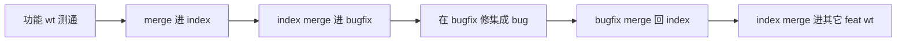

# ChatAIO worktree：index / bugfix 工作流

本 worktree（`ChatAIO/feat/bugfix`）的章程。在本树上修 bug、从 index 同步、或把修复合回 index 之前，先按本文检查。合进 `ChatAIO/feat/index` 之后，其它 ChatAIO worktree 同样遵守角色表，不要各写一套流程。

## 一句话结论

功能线测通后只合进 **index**；index 再合进 **bugfix**；集成后的 bug 只在 **bugfix** 修，再合回 index。`main` 是发布线，不在这条环里。

## 拓扑

物理目录都在 `Z:\electron-reaxes-react-worktrees\`，与主 checkout `Z:\electron-reaxes-react` 并列。每个 worktree 绑定一条 `ChatAIO/feat/*` 分支，**不要在已占用该分支的树上 checkout 别的分支**。

| 角色 | 目录 | 分支 | 职责 |
|------|------|------|------|
| 发布 | `Z:\electron-reaxes-react` | `main` | 可发布快照。不在本环里收功能、不在这里修集成 bug。 |
| 集成母线 | `...\worktrees\index` | `ChatAIO/feat/index` | 只收已测通的功能线 merge。不在这里开发功能，也不在这里修 bug。 |
| 集成修复 | `...\worktrees\bugfix` | `ChatAIO/feat/bugfix` | 基于 index。只修合进 index 之后暴露的集成 / 回归问题。 |
| 功能线 | `...\worktrees\<name>` | `ChatAIO/feat/<name>` | 开发 + 单线测试。测通后合进 index，**禁止直合 bugfix**。 |

当前功能线（会随任务增减，以 `git worktree list` 为准）：`custom_ui_refactor`、`floating_zoom_ratio`、`local_agent_mcp`、`playwright_demo_record`。

编码在 `projects\ChatAIO`；git 一律在该 worktree 的 **monorepo 根**（`projects\ChatAIO\..\..`），禁止把子工程目录当仓库根。

## 主路径



1. 功能 wt 开发完成并测试通过。
2. 在 **index** worktree 里 `git merge` 该功能分支。
3. 在 **bugfix** worktree 里 `git merge ChatAIO/feat/index`。
4. 在集成结果上发现 bug，在 **bugfix** 修复（用户明确要求才 commit）。
5. 在 **index** worktree 里 `git merge ChatAIO/feat/bugfix`。
6. 用户要求把 index 同步给其它 worktree 时：按下面「口令」把 index **merge 进**各功能 wt（以及若需要则合回后的 bugfix）。**不是**把功能线半成品合进 index。

合回前若 index 又往前走了：先在 bugfix 再 merge 一次 index，解决冲突、确认修复仍成立，再合回。不要拿过期快照硬合。

## 口令：同步 index 和其他 wt

用户说「同步 index 和其他 wt 分支」「同步index和其他wt分支」或同义句时，**自动做完整这套**，不要再问要不要 stash / 要不要合 bugfix。全文步骤如下。git 一律在各树 **monorepo 根**执行；只 merge、禁止 rebase；不要碰 `main`；未经用户再说一遍 push 不要 push。

目标：让 `ChatAIO/feat/index` 含有最新 `ChatAIO/feat/bugfix`，再让其它 `ChatAIO/feat/*` worktree 都 merge 进这份 index。功能线未提交的 WIP 留在本树：先 stash 躲开 merge，merge 完再 apply 回**同一棵树**。本口令禁止 `git stash pop`。

### 0. 盘点

```text
git worktree list
# 每个 ChatAIO feat 树：
git status --porcelain
git rev-parse --abbrev-ref HEAD
```

以 `git worktree list` 为准。跳过 `main` 所在树。不要在占用中的分支上 `checkout` 另一条已绑定 worktree 的分支。

### 1. 脏树先 stash（stash 命令必须按树串行）

某树 `git status --porcelain` 非空（含未跟踪文件）时，**先 stash 再 merge**，不要在脏树上硬 merge。忽略文件（`node_modules` 等）不要进 stash。

各 worktree 共用同一个 `.git`，**stash 栈也只有一份**（`refs/stash`）。`stash@{0}` 永远是整仓最新一条，不是「我正站着的这棵树自己的 stash」。`stash@{n}` 的序号在每次 push / drop 之后都会变。

2026-09-23：对多棵树同时 `stash push` / `stash pop`。各树的 `pop` 都去取当时的全局 `stash@{0}`，playwright 的 WIP 被套进 `custom_ui_refactor` 和 `local_agent_mcp`。

本口令分三段，顺序固定。不要理解成「一棵树 stash+merge+还原做完再做下一棵」——那样其它脏树还没躲开，index 也还没合完。

**A. 所有脏树先 stash。** `stash push` **一次只做一棵树**。禁止在同一次同步里对多棵树并行跑任何 `git stash`（不要并行开多条终端，也不要一次回复里同时对多树发 stash 调用）。

```text
# cwd = 这一棵树的 monorepo 根。做完再去下一棵脏树。
git stash push --include-untracked -m "wt-sync: ChatAIO/feat/<本树分支名> before merge ChatAIO/feat/index"
git stash list -1
git log -1 --format='%h' 'stash@{0}'
```

message 必须含**本树分支全名**（例如 `ChatAIO/feat/local_agent_mcp`）。`git stash list` 默认不打印 hash，所以再记一条 9 位短 hash。PowerShell 里 `'stash@{0}'` 必须加引号，否则 `{}` 会被拆开。

**B. stash 全部结束后才 merge。** 见第 2、3 步。不同树的 `git merge` 不碰 stash 栈，**可以**并行；但必须发生在 A 完成之后、C 开始之前。

**C. merge 全部结束后才还原。** `stash apply` / `drop` 同样 **一次只做一棵树**，禁止并行。对本树：

1. 在**这棵树**的根执行 `git stash list`。用 A 记下的分支名和 hash 认人，找到**这一刻** list 上对得上的 `'stash@{n}'`（不要沿用几分钟前的 n）。
2. `git stash apply 'stash@{n}'`。看工作区是不是这棵树的 WIP。
3. 对上了才 `git stash drop 'stash@{n}'`。drop 前再 `git stash list` 一次，确认 n 仍指向同一 hash。
4. **禁止 `git stash pop`。** `pop` = apply 全局栈顶再删除那条。多树、冲突、序号变化时会套错或删错。即使只脏一棵树，本口令也用 apply + drop，不要 pop。

### 2. 先把 bugfix 合进 index

在 **index 树**（`Z:\electron-reaxes-react-worktrees\index`）：

1. 若 index 相对 bugfix 也有独有提交：先到 **bugfix 树** `git merge ChatAIO/feat/index`，冲突解完再回来。
2. `git merge ChatAIO/feat/bugfix`。
3. 若刚才 stash 了 index：**不要在这一步还原。** 等第 3 步所有 merge 结束后，和第 1 步 C 一起还原。提前 apply 会把 WIP 搅进随后的 merge。

能快进就快进。不要把功能线 WIP commit 进 index。

### 3. 把 index 扇出到其它 feat wt

对 `git worktree list` 里每棵 `ChatAIO/feat/*` 树，**跳过 index 自己和 `main`**：

1. 若该树 HEAD 已经包含 index（`git merge-base --is-ancestor ChatAIO/feat/index HEAD` 成功）：跳过 **merge**。跳过 merge 不等于跳过还原：第 1 步 A 若 stash 过，仍要走下面第 3 条。
2. 否则在该树根：`git merge ChatAIO/feat/index`。
3. **所有树的 merge 都结束后**，若第 1 步 A 曾 stash：按第 1 步 C，一次一棵树 apply 分支名 / hash 对得上的那条。禁止 `stash pop`，禁止对多棵树同时 apply / drop。

包括 **bugfix**：合回 index 若产生了 merge commit，再把 index merge 回 bugfix，避免只差一个合并提交。快进则两边已重合，跳过。

包括活着的功能线：这是让它们吃到最新集成母线，**不是**把它们合进 index，也不是把 bugfix 直合进功能线。

### 4. 冲突

- **merge 冲突**：两边意图都留。index 带来的集成修复 / 文档要进来；功能线已提交的本线改动也要留。解完 `git add` 后 `git commit` 完成这次 merge（不要 rebase、不要 `--abort` 了事除非用户要求停）。
- **stash apply 冲突**：同样两边留。这是 WIP，**不要**为了清干净而去 commit 功能线半成品。
- stash apply 报 untracked 已存在：对比后决定保留工作区还是 stash 里那份，不要丢用户 WIP。
- 工作区出现**另一条功能线**的文件（例如 playwright 的 `demo/` 出现在 `local_agent_mcp`）：立刻停。这是套错了 stash。不要 `stash drop`，不要把错套的改动提交进任何分支。各树的 WIP 仍在 stash 里。把该树已跟踪文件恢复成 HEAD（`git restore --source=HEAD --staged --worktree -- .`），再删掉不该出现的未跟踪文件，然后按第 1 步 C apply 本树那条。不要用 `reset --hard` 当默认手段（它不区分「这是不是本树的 WIP」）。
- 解不了就停在冲突状态，按树汇报路径和原因，不要丢掉任何 stash。

### 5. 回报

按树列出：干净 / 曾 stash（写下 hash 与分支） / merge 快进或产生合并提交 / stash apply 是否有冲突 / 9 位短 hash。不要擅自 push、不要在功能线上把 WIP 做成提交。

## 不变量

1. **流向单向分层**：功能线 → index → bugfix → index。功能线不直进 bugfix；bugfix 不收新功能。
2. **先同步再动手**：每次在 bugfix 开始修、以及把 bugfix 合回 index 之前，若 index 已移动，必须先 `merge ChatAIO/feat/index`。
3. **所有权**：原功能线还活着时，该线引入的 bug 优先在功能线上修（或把 bugfix 的修复再合/摘回功能线）。否则下次 `功能线 → index` 会把同一处再打一遍，或直接冲突。
4. **bugfix 只接这三类**：跨多条功能线的集成问题；合进 index 之后才暴露的回归；原功能线已经收工、无处可归的缺陷。
5. **index 不做热修**：发现 bug 不要在 index 上顺手改。先同步到 bugfix，修完再合回。否则两边会各修各的。
6. **只 merge、禁止 rebase**（含 `pull --rebase`）。保留合并提交。短 hash 用 9 位。见仓库根 git 提交策略。
7. **各 wt 独立 `node_modules`**，禁止跨树 junction / 软链共用。新树先 `yarn setup:git-symlinks` 再 `yarn`。
8. **本机同一时间只跑一个 unpackaged Electron**（单实例 / 同一 userData）。不要一边在 index 起应用、一边在 bugfix 起应用。各树的 **webpack-dev-server 可以同时开**：端口按 [worktree-dev-server.md](../architecture/worktree-dev-server.md) 从 4444 起被占则 +1，Electron 读本树 `dist/.webpack-build-state.json`。
9. **index 合回 ≠ 其它功能 wt 已更新。** 活着的功能线要吃到最新 index，必须在各功能树 `git merge ChatAIO/feat/index`（口令见上）。禁止为此 rebase，禁止把未测通功能线 merge 进 index。
10. **stash 栈是整仓一份。** 跨 worktree 的任何 `git stash` 必须按树串行。禁止并行。本口令禁止 `stash pop`；还原只用 apply + drop，且必须用这一刻 list 上对得上的分支名 / hash。

## 按当前分支做什么

先看 `git rev-parse --abbrev-ref HEAD`。

### `ChatAIO/feat/bugfix`（本树）

做：从 index 同步 → 修集成 / 回归 → 在 index 树合回。  
不做：新功能、从功能线直 merge、在过期快照上改。

开始一轮修复前：

```text
# cwd = Z:\electron-reaxes-react-worktrees\bugfix
git merge ChatAIO/feat/index
```

合回（在 **index** 树执行，因为 index 分支被那棵树占用）：

```text
# cwd = Z:\electron-reaxes-react-worktrees\index
git merge ChatAIO/feat/bugfix
```

### `ChatAIO/feat/index`

做：`git merge` 已测通的 `ChatAIO/feat/<name>`；接收 bugfix 的合回。  
不做：在这棵树上写功能、写 bugfix。需要修时切到 bugfix 树（或让那边的 agent 做）。

### `ChatAIO/feat/<feature>`

做：开发、单线测试；测通后请 index 树 merge 本分支。用户要求同步 index 时走上面口令（脏则本树 stash → 等各树 merge 完 → apply 本树那条 stash；禁止 pop）。  
不做：merge 进 bugfix；把本线未完成的半成品合进 index。

本线还活着时，属于本线的 bug 在本线修，再重新合进 index（index 再同步到 bugfix）。

### `main`

不接收本环的日常 merge。发布时另做 `index → main`，不在本文展开。

## 检查清单

在 bugfix 动手修之前：

- [ ] 当前 HEAD 是 `ChatAIO/feat/bugfix`，cwd 的 git 根是 `...\worktrees\bugfix`
- [ ] 已 `git merge ChatAIO/feat/index`（index 没动也确认一次，避免漏同步）
- [ ] 已判断所有权：原功能线仍在开发 → 回到那条线修，或计划把本修复摘回那条线
- [ ] 这是集成 / 回归 / 无主缺陷，不是新功能

把 bugfix 合回 index 之前：

- [ ] 若 index 在修复期间有新 merge，bugfix 已再次 merge index，冲突已解，修复仍成立
- [ ] 只含修复，不含功能线半成品
- [ ] 在 **index** 树执行 `git merge ChatAIO/feat/bugfix`，不要试图在 bugfix 树 checkout index

口令「同步 index 和其他 wt」：

- [ ] 脏树已按树**串行** `stash push --include-untracked`（message 含本树分支全名，已记下 9 位 hash）；未对多树并行跑 `git stash`
- [ ] 各树 merge 都结束后，才按分支名 / hash apply **该树自己**那条；未使用 `stash pop`；未对多树同时 apply / drop
- [ ] 已在 index 树 merge `ChatAIO/feat/bugfix`（若 index 超前则先反向 merge）
- [ ] 已对每棵其它 `ChatAIO/feat/*` wt merge `ChatAIO/feat/index`；跳过 `main`
- [ ] 冲突已解或按树汇报；未 push；未把功能线 WIP commit 进 index

## 禁止项

- 功能线直合 `ChatAIO/feat/bugfix`
- 在 index 或 `main` 上修本环该由 bugfix 处理的缺陷
- 在 bugfix 上开新功能、或把功能分支 merge 进来「顺便修」
- 漏掉「index → bugfix」就在旧快照上改，再硬合回 index
- `git rebase` / `pull --rebase` / 在占用中的分支上 `checkout` 另一条已绑定 worktree 的分支
- 跨 worktree 共用 `node_modules`
- 同时启动两棵树的 unpackaged Electron
- 在脏工作区上硬 merge（会拒合并或把 WIP 搅进 merge）。先按第 1 步 A 串行 stash `-u`，各树 merge 完再按 C apply
- 对两棵及以上 worktree 并行执行任何 `git stash` 子命令（共用一个 stash 栈，A 树的 WIP 会被套到 B 树）
- 在本口令里执行 `git stash pop`（`pop` 永远动全局栈顶再删除；即使只脏一棵树也改用 apply + drop）
- 不看这一刻的 `git stash list`、不对分支名 / hash，就 apply 或 drop `stash@{0}` / 过期的 `stash@{n}`
- 把「同步 index → 功能 wt」做成「把功能线合进 index」
- 同步进 `main`，或为这套口令擅自 push

## 与现有文档的关系

- 提交 / 禁止 rebase / 9 位短 hash：仓库根 git 提交策略，本文不重复全文。
- 设计文档与关键注释：[`feature-design-and-comments.md`](./feature-design-and-comments.md)。bugfix 若改了已有能力，更新原文的禁止项 / 关键文件，不要另起空文。
- 本文件不是产品功能说明；用户可见行为的设计仍按症状去 `docs/features/` 与 `docs/issues/`。
