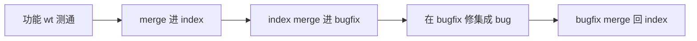

# ChatAIO worktree：index / bugfix 工作流

本 worktree（`ChatAIO/feat/bugfix`）的章程。在本树上修 bug、从 index 同步、或把修复合回 index 之前，先按本文检查。合进 `ChatAIO/feat/index` 之后，其它 ChatAIO worktree 同样遵守角色表，不要各写一套流程。

## 一句话结论

功能线测通后只合进 **index**；index 再合进 **bugfix**；集成后的 bug 只在 **bugfix** 修，再合回 index。`main` 是发布线，不在这条环里。

## 拓扑

物理目录都在 `Z:\electron-reaxes-react-worktrees\`，与主 checkout `Z:\electron-reaxes-react` 并列。每个 worktree 绑定一条 `ChatAIO/feat/*` 分支，**不要在已占用该分支的树上 checkout 别的分支**。

| 角色 | 目录 | 分支 | 职责 |
|------|------|------|------|
| 发布 | `Z:\electron-reaxes-react` | `main` | 可发布快照。不在本环里收功能、不在这里修集成 bug。 |
| 集成母线 | `...\worktrees\index` | `ChatAIO/feat/index` | 只收已测通的功能线 merge。不在这里开发功能，也不在这里修 bug。 |
| 集成修复 | `...\worktrees\bugfix` | `ChatAIO/feat/bugfix` | 基于 index。只修合进 index 之后暴露的集成 / 回归问题。 |
| 功能线 | `...\worktrees\<name>` | `ChatAIO/feat/<name>` | 开发 + 单线测试。测通后合进 index，**禁止直合 bugfix**。 |

当前功能线（会随任务增减，以 `git worktree list` 为准）：`custom_ui_refactor`、`floating_zoom_ratio`、`local_agent_mcp`、`playwright_demo_record`。

编码在 `projects\ChatAIO`；git 一律在该 worktree 的 **monorepo 根**（`projects\ChatAIO\..\..`），禁止把子工程目录当仓库根。

## 主路径



1. 功能 wt 开发完成并测试通过。
2. 在 **index** worktree 里 `git merge` 该功能分支。
3. 在 **bugfix** worktree 里 `git merge ChatAIO/feat/index`。
4. 在集成结果上发现 bug，在 **bugfix** 修复（用户明确要求才 commit）。
5. 在 **index** worktree 里 `git merge ChatAIO/feat/bugfix`。

合回前若 index 又往前走了：先在 bugfix 再 merge 一次 index，解决冲突、确认修复仍成立，再合回。不要拿过期快照硬合。

## 不变量

1. **流向单向分层**：功能线 → index → bugfix → index。功能线不直进 bugfix；bugfix 不收新功能。
2. **先同步再动手**：每次在 bugfix 开始修、以及把 bugfix 合回 index 之前，若 index 已移动，必须先 `merge ChatAIO/feat/index`。
3. **所有权**：原功能线还活着时，该线引入的 bug 优先在功能线上修（或把 bugfix 的修复再合/摘回功能线）。否则下次 `功能线 → index` 会把同一处再打一遍，或直接冲突。
4. **bugfix 只接这三类**：跨多条功能线的集成问题；合进 index 之后才暴露的回归；原功能线已经收工、无处可归的缺陷。
5. **index 不做热修**：发现 bug 不要在 index 上顺手改。先同步到 bugfix，修完再合回。否则两边会各修各的。
6. **只 merge、禁止 rebase**（含 `pull --rebase`）。保留合并提交。短 hash 用 9 位。见仓库根 git 提交策略。
7. **各 wt 独立 `node_modules`**，禁止跨树 junction / 软链共用。新树先 `yarn setup:git-symlinks` 再 `yarn`。
8. **本机同一时间只跑一个 unpackaged Electron**（单实例 / 同一 userData）。不要一边在 index 起应用、一边在 bugfix 起应用。各树的 **webpack-dev-server 可以同时开**：端口按 [worktree-dev-server.md](../architecture/worktree-dev-server.md) 从 4444 起被占则 +1，Electron 读本树 `dist/.webpack-build-state.json`。

## 按当前分支做什么

先看 `git rev-parse --abbrev-ref HEAD`。

### `ChatAIO/feat/bugfix`（本树）

做：从 index 同步 → 修集成 / 回归 → 在 index 树合回。  
不做：新功能、从功能线直 merge、在过期快照上改。

开始一轮修复前：

```text
# cwd = Z:\electron-reaxes-react-worktrees\bugfix
git merge ChatAIO/feat/index
```

合回（在 **index** 树执行，因为 index 分支被那棵树占用）：

```text
# cwd = Z:\electron-reaxes-react-worktrees\index
git merge ChatAIO/feat/bugfix
```

### `ChatAIO/feat/index`

做：`git merge` 已测通的 `ChatAIO/feat/<name>`；接收 bugfix 的合回。  
不做：在这棵树上写功能、写 bugfix。需要修时切到 bugfix 树（或让那边的 agent 做）。

### `ChatAIO/feat/<feature>`

做：开发、单线测试；测通后请 index 树 merge 本分支。  
不做：merge 进 bugfix；把本线未完成的半成品合进 index。

本线还活着时，属于本线的 bug 在本线修，再重新合进 index（index 再同步到 bugfix）。

### `main`

不接收本环的日常 merge。发布时另做 `index → main`，不在本文展开。

## 检查清单

在 bugfix 动手修之前：

- [ ] 当前 HEAD 是 `ChatAIO/feat/bugfix`，cwd 的 git 根是 `...\worktrees\bugfix`
- [ ] 已 `git merge ChatAIO/feat/index`（index 没动也确认一次，避免漏同步）
- [ ] 已判断所有权：原功能线仍在开发 → 回到那条线修，或计划把本修复摘回那条线
- [ ] 这是集成 / 回归 / 无主缺陷，不是新功能

把 bugfix 合回 index 之前：

- [ ] 若 index 在修复期间有新 merge，bugfix 已再次 merge index，冲突已解，修复仍成立
- [ ] 只含修复，不含功能线半成品
- [ ] 在 **index** 树执行 `git merge ChatAIO/feat/bugfix`，不要试图在 bugfix 树 checkout index

## 禁止项

- 功能线直合 `ChatAIO/feat/bugfix`
- 在 index 或 `main` 上修本环该由 bugfix 处理的缺陷
- 在 bugfix 上开新功能、或把功能分支 merge 进来「顺便修」
- 漏掉「index → bugfix」就在旧快照上改，再硬合回 index
- `git rebase` / `pull --rebase` / 在占用中的分支上 `checkout` 另一条已绑定 worktree 的分支
- 跨 worktree 共用 `node_modules`
- 同时启动两棵树的 unpackaged Electron

## 与现有文档的关系

- 提交 / 禁止 rebase / 9 位短 hash：仓库根 git 提交策略，本文不重复全文。
- 设计文档与关键注释：[`feature-design-and-comments.md`](./feature-design-and-comments.md)。bugfix 若改了已有能力，更新原文的禁止项 / 关键文件，不要另起空文。
- 本文件不是产品功能说明；用户可见行为的设计仍按症状去 `docs/features/` 与 `docs/issues/`。
