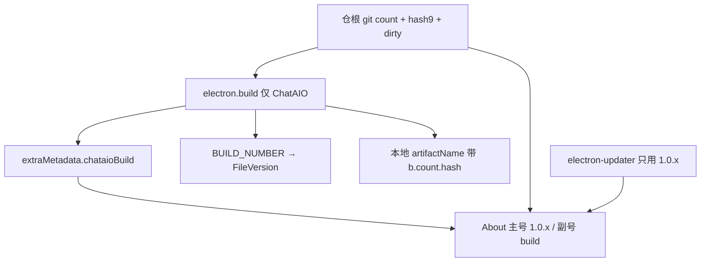

# 两层版本身份

Dev 阶段打出来的安装包不再共用同一个「看起来都是 1.0.5」。**发行 SemVer 只给正式版和 electron-updater**；每次构建另盖 git commit 计数 + 9 位 hash。

## 不变量

1. **`projects/ChatAIO/package.json` 的 `version` 只在发正式版时手改**（`1.0.x`）。禁止为区分 dev 包去改 git 里的 version。
2. **`app.getVersion()` / `get-app-version` / changelog tag / `latest.yml` 只用营销号**。不要把 `+hash`、`-dev.N`、`git describe` 写进这把钥匙。
3. **Build 身份** = `git rev-list --count HEAD` + `git rev-parse --short=9 HEAD` + dirty。复制/About 形如 `v1.0.5 (build 1234 · ddebc2c82)`，脏树再加 ` · dirty`。
4. **Windows FileVersion / macOS CFBundleVersion** 走 electron-builder `BUILD_NUMBER`（第四段，≤ 65535）。真实 count 仍写进 `chataioBuild.count`。
5. **本地包文件名**带 `b{count}.{hash}`；**`CHATAIO_RELEASE=1` 时文件名保持** `ChatAIO-${version}-${os}-${arch}.${ext}`，身份仍进 exe / About。
6. 未打包（`yarn start:electron`）没有 extraMetadata：Main 对 webpack 注入的 `__REPO_ROOT__` 当场跑 git。Electron cwd 是 `projects/ChatAIO`，不要用 `process.cwd()` 当仓根。

## 入口

- 正式发版：改 `package.json` version，再 `CHATAIO_RELEASE=1 yarn build`（或 `CHATAIO_RELEASE=true`）。
- 内部包：普通 `yarn build` / `yarn build:electron`。

## 关键文件

| 路径 | 职责 |
|------|------|
| [`src/shared/build-identity.utility.ts`](../../src/shared/build-identity.utility.ts) | About / 运行时：格式化、coerce |
| [`scripts/utils/git-build-identity.ts`](../../../scripts/utils/git-build-identity.ts) | 仓根 ESM：git 采集 + electron-builder 注入（不要从 ChatAIO CJS named import） |
| [`src/Main/services/build-identity/collect-git.ts`](../../src/Main/services/build-identity/collect-git.ts) | unpackaged Main 再导出仓根采集 |
| [`src/Main/services/build-identity/index.ts`](../../src/Main/services/build-identity/index.ts) | 打包读 package.json；未打包读 git |
| [`scripts/electron.build/index.ts`](../../../scripts/electron.build/index.ts) | 注入 `BUILD_NUMBER` / extraMetadata / 本地 artifactName |
| [`electron-builder.yml`](../../electron-builder.yml) | 默认发行文件名 |
| [`src/Main/reaxels/electron-updater/index.ts`](../../src/Main/reaxels/electron-updater/index.ts) | `State.buildIdentity`；`currentVersion` 仍是 `app.getVersion()` |
| [`src/Views/SettingsView/components/About/index.tsx`](../../src/Views/SettingsView/components/About/index.tsx) | 展示 / 复制完整串 |
| [`tests/build-identity.test.ts`](../../tests/build-identity.test.ts) | 格式与 stamp 契约 |

## 禁止项

- 不要用 `1.0.5+ghash`：SemVer build metadata **不参与**新旧比较，electron-updater 会当成同一版。
- 不要用 `1.0.5-dev.N`：prerelease **小于** `1.0.5`，装了本地包的人检查更新会被拉回 GitHub 正式包。
- 不要把原始 `git describe`（`1.0.5-12-gabc`）当 version：会被解析成 prerelease，排序颠倒。
- 不要只靠 hash：不能回答「哪包更新」；不同分支还可能撞 `rev-list --count`，所以 **count + hash 一起用**。
- 不要改 `appId`、不要拆 insider 通道。
- 不要把 identity 写回 git 里的 `package.json`。
- 不要让仓根 ESM（`scripts/electron.build`）named import `projects/ChatAIO`（该包 `"type": "commonjs"`，tsx 会报 `does not provide an export named`）。采集/注入只放 `scripts/utils/git-build-identity.ts`。

## 与现有文档

- 构建流水线：[build-pipeline-and-dev-refresh.md](./build-pipeline-and-dev-refresh.md)、[worktree-dev-server.md](./worktree-dev-server.md)
- 出包命令：[scripts.md](../../scripts.md)
- 更新器仍发到 `ChatAIO-Releases`；changelog 按营销 version 找 GitHub tag。
