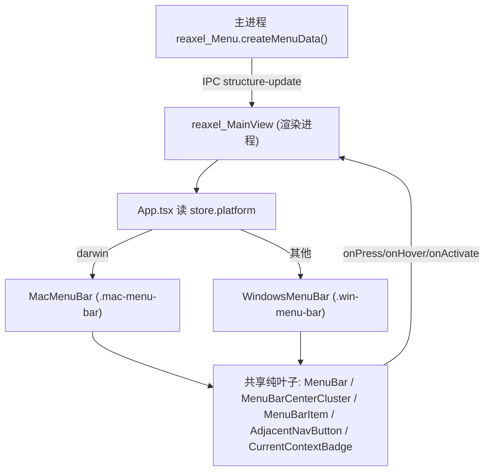

# MainView Menubar — 平台渲染路径与内容差异

## 背景

MainView 作为 `mainWindow` 的 HTML 壳层渲染菜单栏。得益于 Reaxes 的视图/逻辑分离，
菜单结构（数据）由主进程生成并通过 IPC 下发，渲染进程只负责把 structure 渲染为视图。
macOS 与 Windows 的菜单栏在**内容**与**视图**两个层面都不同，本文沉淀这些差异，
作为重构后的回归基线。

相关文件：
- 主进程结构生成：`src/Main/reaxels/Menu/index.ts`（`createMenuData()` / `createMenu()` / `rebuildMenu()`）
- 渲染进程 reaxel：`src/Views/MainView/reaxels/main-view/index.ts`
- 渲染进程根分叉：`src/Views/MainView/App.tsx`
- 两条平台路径：`src/Views/MainView/components/MacMenuBar/`、`src/Views/MainView/components/WindowsMenuBar/`
- 样式：`src/Views/MainView/index.less`
- 几何契约：`src/shared/menubar-geometry.ts`

## A. 菜单「内容」差异（最关键）

两平台 MainView 展示的顶级菜单项本身就不同，源头在主进程
`reaxel_Menu.createMenuData()` 的 `if( process.platform !== 'darwin' )` 分支，
以及 `rebuildMenu()` 对原生菜单的处理。

### macOS

- 有原生系统菜单栏：`rebuildMenu()` 调 `Menu.setApplicationMenu( createMenu() )`，
  Application / Edit / View / Window 等**基础功能全部由原生菜单承载**。
- 推给 MainView 的 `structure` **只有**：
  - `switch-ai`（切换 AI，含 AI 列表 + Prev/Next Opened + Prev/Next Page 子菜单）
  - 可选 `prev-instantiated` / `next-instantiated`（中区 Prev/Next 导航按钮）
- 视觉结果：MainView 左区仅「切换 AI」，中区仅 Prev/Next。

### Windows（及其他非 darwin）

- 无原生菜单栏：`rebuildMenu()` 调 `mainWindow.setMenu( null )`，
  **MainView 完整取代原生菜单栏**。
- 推给 MainView 的 `structure` 在 `switch-ai` 之前额外 `unshift` 了两个顶级菜单：
  - `application`：Settings / Check for Updates / Exit
  - `view`：Reload / Force Reload / Developer Tools / PromptView 左右开关 /
    Wipe and Reload / Actual Size / Zoom In/Out / Toggle Fullscreen / Close This AI
- 之后同样接 `switch-ai` + 可选 `prev-instantiated` / `next-instantiated`。

### 渲染层约束

渲染层两条路径必须保持**数据驱动**：
- Mac 路径天然少左区项、Win 路径天然多；
- `partition-structure.utility.ts` 与布局组件**不得写死项数或假设两平台内容一致**；
- 该内容差异属主进程职责，渲染层重构不改其生成逻辑，只需保证两条视图路径都能正确渲染各自 structure。

## B. 视图/样式差异

### 共通（两平台一致）

- 栏高 36 / item 高 28 / marginY 4（`menubar-geometry.ts`；禁止 macOS 抬到 42，
  相对窗口顶边会整体下沉）。
- 左区菜单项、`drag-tail`（**布局占位，no-drag**）、中区 Prev/Brand/Next 簇、`CurrentContextBadge`。
- `data-theme` light/dark 主题；键盘导航。
- **窗口拖拽（窄 drag 面，见 `menubar-drag-region-leak-below-content.md` §5.2）**：
  `.main-view-root::before`（6px）+ badge +（macOS）traffic-light spacer；
  栏本体 / center 容器 / drag-tail / right 均为 `no-drag`。

### macOS 专属（`.mac-menu-bar`）

- 左侧 `main-view-traffic-light-spacer`（宽 `TRAFFIC_LIGHT_SPACER_WIDTH = 78`，
  `-webkit-app-region: drag`，背景 = `--menu-view-bg`），为原生红绿灯留位。
- Prev/Next 导航按钮为「扁平」：`box-shadow:none; border-color:transparent; background:transparent`，
  hover 使用 `--menu-view-hover-bg`。
- nav 无 `margin-top` 偏移。

### Windows 专属（`.win-menu-bar`）

- 无 traffic-light spacer。
- Prev/Next 导航按钮为「凸起」：有 border / 白底 / box-shadow（base 样式）。
- `.win-menu-bar .main-view-bar-item--nav { margin-top: 2px; }` 垂直偏移。

## 渲染层架构（重构后）

- **根部分叉**：`App.tsx` 按 `reaxel_MainView.store.platform` 一次性分叉为
  `<MacMenuBar/>` 或 `<WindowsMenuBar/>`，不再做 OS 条件渲染或 `[data-platform]` 条件 CSS。
- **共享纯叶子**：`MenuBar`、`MenuBarCenterCluster`、`MenuBarItem`、`AdjacentNavButton`、
  `CurrentContextBadge` 为跨平台纯视图，被两条路径复用；交互只把事件抛回 reaxel。
- **平台差异只在**：布局结构（Mac 多一个 traffic-light spacer）+ 作用域 CSS
  （`.mac-menu-bar` / `.win-menu-bar`）。
- **几何/样式变量**：`getMenuBarRootStyleVars()`（`menubar-geometry.ts`）为两条路径提供统一的
  高度与 CSS 变量，避免重复。

## 架构原则

- **视图 = 应用的输入**：组件只维护自身状态/生命周期，并调用 `reaxel_MainView` 的 API /
  读取其 reactive store，不承载业务逻辑。
- **逻辑在 reaxel**：菜单交互逻辑（顶级项按下、hover 切换、构造并触发 action）集中在
  `reaxel_MainView`（`pressTopMenuItem` / `hoverTopMenuItem` / `activateItem` / `triggerAction`），
  IPC 判断（如 `api.isDropdownVisible()`）也在 reaxel 内，组件不直接触碰 `window.api`。
- **平台专属逻辑（若出现）**：目前菜单业务逻辑不随平台分支（平台差异只在内容与视图/CSS）。
  若日后出现平台专属**逻辑**，应以 `reaxels/main-view/rehancer_<OS>/` 增强器注入到 reaxel
  （遵循 `rehancer_ipcReceive` 模式），而非在组件内条件分支。

## 回归清单

- [ ] macOS：左区仅「切换 AI」；原生菜单栏 Application/Edit/View/Window 正常。
- [ ] Windows：MainView 含 Application / View / 切换 AI；无原生菜单栏。
- [ ] 两平台：顶级菜单开合、hover 切换、Prev/Next 动作、拖拽区、light/dark 主题、键盘导航一致可用。
- [ ] macOS：traffic-light spacer 为红绿灯留位；Prev/Next 扁平样式。
- [ ] Windows：无 spacer；Prev/Next 凸起样式且有 2px 垂直偏移。
- [ ] `tsc -p projects/ChatAIO/tsconfig.json --noEmit` 不因本次改动新增错误；`yarn build:webpack` 通过。
