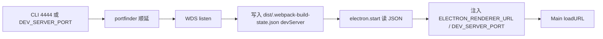

# Worktree 开发服务器端口

每个 git worktree 可以独立起 webpack-dev-server；`yarn start:electron` 从**本树** `dist/.webpack-build-state.json` 的 `devServer` 读取**实际 bind 口**，再注入 env。不要用编译期 `__DEV_PORT__` 当 Electron 的连线依据。

## 一句话结论

所有树（主 checkout 和 linked worktree）都从 **4444 / 9229 / 9222** 起找空闲口；被占则 +1。WDS `listen` 成功后把**本树真实口**写入本树 build-state；Electron 只信这份 JSON。

## 不变量

1. **JSON 是会合点**。`projects/<app>/dist/.webpack-build-state.json` → `devServer.port` / `origin` / `pid` 是 Electron 连 renderer 的唯一运行时事实源。
2. **起点就是 4444**。不要按 worktree 路径 hash 跳到两万档。首选口被占必须 +1 / portfinder。
3. **主 checkout 与 linked worktree 同一套起点**。隔离靠各树自己的 `dist/`，不靠「每树一个遥远端口」。
4. **inspect / CDP 仍从 9229 / 9222 起**，被占再顺延。不要用 `WDS 口 + 1` 把 inspect 拖到 renderer 旁边。
5. **Main 优先 env**：`ELECTRON_RENDERER_URL` / `DEV_SERVER_PORT` 高于 DefinePlugin `__DEV_PORT__`。
6. **各树各写各的 dist**。禁止跨 worktree 共用 `node_modules` 或把另一树的 build-state 当本树端口。
7. **unpackaged Electron 仍建议同一时间只开一份**（`ChatAIO-dev` userData / 单实例锁尚未按树拆）。WDS 可以多树并行。

## 入口与数据流

1. `yarn start:webpack`（cwd = 该 worktree monorepo 根）。
2. `engine/toolkit/entrance.ts` 解析首选口（env > CLI `4444`），`getPort` 找到空闲口，编进 webpack `devServer.port` 和 `__DEV_PORT__`。
3. WDS `start()` 成功后读取 `server.address().port`，写入 `devServer`。
4. `yarn start:electron` 校验 webpack pid 仍活着，读 `devServer.origin`，注入 env；`--inspect` 从 9229 起 portfinder。
5. ChatAIO Main `getDevRendererOrigin()` 用 env 拼 `https://localhost:<actual>/<entry>/`。

覆盖 env：

| 变量 | 谁写 | 谁读 |
|------|------|------|
| `DEV_SERVER_PORT` | 人手（覆盖首选）或 electron.start（实际口） | webpack 入口 / Main |
| `ELECTRON_RENDERER_URL` | electron.start | Main loadURL |
| `ELECTRON_INSPECT_PORT` | 人手或 electron.start | spawn `--inspect` |
| `ELECTRON_CDP_PORT` | 人手或 electron.start | `CHATAIO_REMOTE_DEBUG=1` 时的 CDP |

## 端口怎么算

| 角色 | renderer 起点 | inspect 起点 | CDP 起点 |
|------|---------------|--------------|----------|
| 主 checkout | CLI `4444` 或默认 4444 | 9229 | 9222 |
| linked worktree | 同上 | 同上 | 同上 |

第一棵树通常拿到 4444；第二棵树 4444 被占则 4445，以此类推。实际口以 JSON 为准。

## 关键文件

| 路径 | 职责 |
|------|------|
| `engine/toolkit/worktree-dev-scope.ts` | 首选口（4444/9229/9222）、是否 linked worktree |
| `engine/toolkit/entrance.ts` | server 模式 portfinder；build 模式不探测 |
| `scripts/webpack.start/index.ts` | listen 后写 `devServer` |
| `scripts/utils/build-artifacts.ts` | `writeBuildStateDevServer` / `assertDevServerRendezvous` |
| `scripts/electron.start/index.ts` | 读 JSON、注入 env、动态 `--inspect` |
| `src/Main/services/dev/renderer-entry.ts` | `getDevRendererOrigin()` |
| `src/Main/foundation/electron.conf.ts` | CDP 读 `ELECTRON_CDP_PORT` |

## 禁止项

- 不要按路径 hash 把 WDS 映射到 `20000+` 这种口。
- 不要在 `electron.start` 里用猜的口去 `loadURL`，绕过 JSON。
- 不要把首选口被占当成致命错误。
- 不要跨树读另一份 `dist/.webpack-build-state.json`。
- 不要把 `port: 'auto'` 当唯一来源（HMR / 文档 / 附着需要可复述的起点）。
- 不要假设 unpackaged 的 inspect 永远是 9229（被占会变）。探活前看 electron.start 日志里的 `inspect :`。

## 与现有文档的关系

- 构建管线：[`build-pipeline-and-dev-refresh.md`](./build-pipeline-and-dev-refresh.md) 仍描述 renderer entry / HMR；本文只管 **多 worktree 端口会合**。
- 日常命令：[`../../scripts.md`](../../scripts.md)。
- 单实例 / userData：[`../features/single-instance.md`](../features/single-instance.md)。本方案不拆 `ChatAIO-dev`。
- worktree 角色：[`../agent/worktree-bugfix-workflow.md`](../agent/worktree-bugfix-workflow.md)。
- main inspect vs renderer CDP：[`../issues/google-ai-studio-available-regions-redirect.md`](../issues/google-ai-studio-available-regions-redirect.md)。默认仍从 9229/9222 起；被占以启动日志为准。
