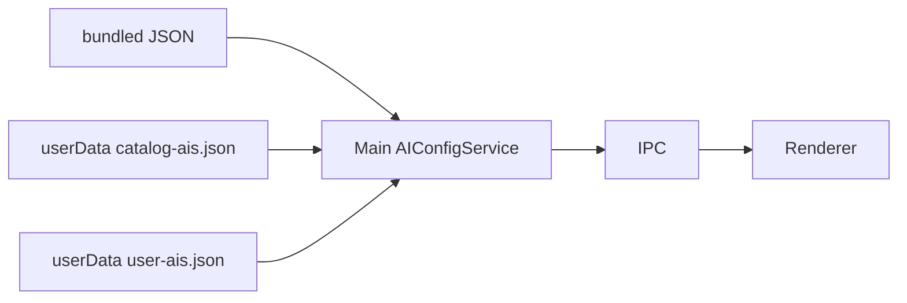

# 提案：AI 目录单一事实源

**状态：未落地。** 一次只做一批；做下一批前先读该批「范围 / 不改 / 完成标准」。落地完成后把规范迁入 [`architecture/ai-config.md`](./architecture/ai-config.md)，本文改为过时并链过去。

一句话：`default-ais.json` 成为目录唯一事实源；main 启动加载并作为 runtime 唯一 AI 信息源；renderer 只走 IPC；仓库打一份、[ChatAIO-Releases](https://github.com/Kane-Kuroneko/ChatAIO-Releases) 再挂一份可独立更新的 **Ed25519 签名**副本；Settings 手动检查，**预览 diff 后确认再智能合并**。

不要在一批里同时搬文件、删并行源、接远程、做验签、改 Settings。那会把上下文撑爆。

## 怎么执行

工作分支：`feat/ai-catalog-single-source`。中途停工时，下一个人只读「当前进度」+ 该批完成标准 + 该批执行记录。

### 批次状态（硬闸）

| 状态 | 含义 | 下一步 |
|------|------|--------|
| 未开始 | 还没动 | 上一批必须已是「已确认」 |
| 进行中 | 正在改代码/文档 | 做完后立刻进入 review，不要开下一批 |
| **已完成，待校验** | agent 已自审，文档已更新 | **停下来等用户确认**。未确认不得开下一批，也不得擅自 commit |
| 已确认 | 用户点头 | 才能开下一批 |
| 需返工 | 用户否决或 review 发现问题 | 修完再标回「已完成，待校验」 |

每批执行完必须走完这四步，缺一不可：

1. **只动该批「范围」**，「不改」里的文件碰都不要碰。
2. **跑该批完成标准**（测试、grep、手动路径）。
3. **agent 自审**（见下），把该批标题状态改成 **已完成，待校验**，并填写「执行记录」。
4. **停下来等用户确认。** 用户说「这批 OK / 确认 / 继续下一批」之后，才把状态改成「已确认」并开下一批。

可同一 PR 里连续提交，但提交按批切开；**确认 ≠ 授权 commit**，commit 仍要用户另说。

### 每批 review 必须覆盖

- **行为**：完成标准是否真过；用户可见路径有没有变（本批不该变的，必须没变）。
- **方向**：有没有越出「范围 / 不改」；有没有把下一批的事提前做了。
- **Bug / 债**：回归、漏改、静默失败；本批允许留下的债必须写进「本批已知债」，不要口头带过。

当前进度：**批次 0 已确认。** 批次 1 进行中。

| 批次 | 层 | 交付 | 依赖 | 状态 |
|------|----|------|------|------|
| 0 | docs | 本文 + 索引 | 无 | 已确认 |
| 1 | data + main 加载 | JSON 搬家、schema、main 用 fs 读 bundled | 0 | 进行中 |
| 2 | main + renderer 读路径 | 删并行 URL 表；renderer 不再 import 目录 | 1 | 未开始 |
| 3 | main 纯函数 | catalog 校验 + 三路 merge + 单测（不联网） | 2 | 未开始 |
| 4 | main 安全 + 脚本 | Ed25519 验签模块 + 发布脚本 | 3 | 未开始 |
| 5 | ipc + Settings UI | 手动检查、预览、确认写入 | 3 + 4 | 未开始 |

批次 3 不依赖远程，App 升级带新 bundled 时也能复用 merge。批次 4 不接 UI，可先本地签一条假数据验证。批次 5 才碰用户可见行为。

## 目标架构（各批共用，改代码时对照）

三层，不要再发明第四层：

1. **Bundled catalog**：安装包内 `statics/ai-catalog/default-ais.json`，离线兜底。
2. **Catalog cache**：`userData/catalog-ais.json`，用户确认过的已验签目录。
3. **User AIs**：`userData/user-ais.json`，用户整表（继续 `replaceAllAIs`，本提案不改成纯 delta）。

Runtime 目录 = bundled 与 cache 里 `revision` 较高者。Effective AIs = 该目录与 user 表按批次 3 规则合并。只在 main 的 `AIConfigService` 里算；renderer 只拿 IPC 结果。

远程只作为 **cache 的输入**，不是第四事实源。启动不拉网。

## 已拍板（各批不要重开讨论）

- 文件放 [`statics/ai-catalog/`](../statics/)（已有 extraResources 打包 `statics/`），不放 `src/shared`。
- 远程用现成 ChatAIO-Releases，滚动 tag `ai-catalog`，不新开仓，不挂源码仓 GitHub Pages。
- **签名不加密**。目录是公开 URL；密钥打进安装包的加密是安全剧场。Ed25519 签 **文件原始 UTF-8 字节**，sidecar `default-ais.json.sig`，公钥进 App，私钥只在本机或 Releases 仓库 secret。
- Family 行为（UA、partition、WebAuthn）留在 TS。远程不能发明新 family；未知 family 或 host 不在白名单 → 降为 `custom`。
- `dev-proxy-test` 只在 `dev()` 注入，生产和远程目录都不带。
- 检查更新：Settings → Manage AIs；验签后出 diff，确认才写盘。
- 现有 `reorder-ais` / 立即持久化顺序契约不动。改配置后仍跑 `yarn test:ai-order`。

---

## 批次 0 — 文档与分支

**状态：已确认**  
**层**：docs  
**目标**：后人能按批开工，不必从聊天里挖决策。

### 范围

- 本文件
- [`AGENTS.md`](../AGENTS.md) 索引
- [`architecture/ai-config.md`](./architecture/ai-config.md) 顶部指向本文（不改现行双层描述）

### 不改

任何 `src/`、`statics/` 业务文件、IPC、测试。

### 步骤

1. 分支 `feat/ai-catalog-single-source`（已切）。
2. 写入本提案。
3. 索引。

### 完成标准

- 从 [`AGENTS.md`](../AGENTS.md) 能点到本文。
- `ai-config.md` 标明「目标模型见提案」，避免按过时 delta 描述实现。

### 执行记录（2026-08-26）

改动（尚未 commit）：

- 新文件：本提案
- [`AGENTS.md`](../AGENTS.md)：症状表 + 「其它」表各加一条索引
- [`architecture/ai-config.md`](./architecture/ai-config.md)：顶部加「改造中，现行实现仍以本文为准」
- [`fixme.md`](../fixme.md) P2-01 / P2-02：指向本提案（原范围未写，属于索引延伸）

自审：

- **行为**：完成标准两条都过。从 AGENTS 能点到本文；`ai-config.md` 明确现行双层仍有效、目标模型见提案。无 `src/` / IPC / 测试改动。
- **方向**：文档与分批闸门一致；本轮只补「每批做完 → review → 待校验 → 停等确认」，没有提前做批次 1。
- **Bug / 债**：无运行时行为。`fixme.md` 略超出原「范围」三文件，但只加指针、未改问题正文。未 commit（需用户另说）。

用户已于 2026-08-26 确认。下一批：批次 1。

---

## 批次 1 — Bundled 加载路径

**状态：进行中**  
**层**：data + main 读盘  
**目标**：目录文件有固定位置和 schema；**只有 main** 用 fs 读 bundled。行为与现在一致（effective AIs 不变）。

### 范围（只这些）

- 新增 `projects/ChatAIO/statics/ai-catalog/default-ais.json`（从 `src/shared/statics/default-ais.json` 挪过来）
- 删除旧路径 `src/shared/statics/default-ais.json`
- [`src/Main/services/settings/ai-config-service.ts`](../src/Main/services/settings/ai-config-service.ts)
- 新增小工具，建议：`src/Main/services/settings/ai-catalog-path.utility.ts`（dev / packaged 路径）
- 若 webpack 有 json import 声明，只改 main 侧不再 `import default-ais.json`

### 不改

- `ai-family-defaults.ts`、`AI-family.ts`、`AI-Views/data.ts`、ManageAIs、GuidingView
- 任何 IPC schema、Settings UI
- 远程 URL、签名、`user-ais.json` 格式（除读到的 catalog `version` 字段迁移）
- `electron-builder.yml` 的 extraResources（已复制整个 `statics/`）

### Schema 增量（本批必做）

根对象：

- `schemaVersion`：整数，本批定为 `1`
- `revision`：整数，本批定为 `1`（以后每次改目录条目 +1）
- `ais`：保持现有 `AIItem` 字段
- 去掉从未 bump 的 `"version": "1.0.0"` 字符串（`user-ais.json` 里旧 `version` 读到则忽略，写入时不要再抄 catalog 的 semver）

`user-ais.json` 本批仍可带任意 `version` 字符串；不要做 delta 改造。

### 步骤

1. 复制 JSON 到 `statics/ai-catalog/`，补 `schemaVersion` / `revision`，删 `version`。
2. 写 `resolveBundledCatalogPath()`：packaged → `process.resourcesPath/statics/ai-catalog/default-ais.json`；dev → 相对项目 `statics/ai-catalog/default-ais.json`。启动读失败则抛错并 log，不要静默空列表。
3. `AIConfigService` 构造里 `JSON.parse(fs.readFileSync(...))`，校验 `schemaVersion === 1` 且 `ais` 为数组。
4. 全仓搜 `default-ais.json`，确认只剩新路径。
5. 手动：dev 启动 Settings → Manage AIs 列表与改前一致。

### 完成标准

- 源码中没有 `src/shared/statics/default-ais.json`。
- main 不再 webpack-import 该 JSON。
- 不改用户数据的情况下，effective 列表 id/url/disabled 与改前相同。
- `yarn test:ai-order` 绿。

### 本批已知债（留给批次 2）

`AI_FAMILY_DEFAULT_URLS` 与 JSON 里的 url 仍重复。本批允许，避免一次改太多调用点。

---

## 批次 2 — 本地唯一事实源

**状态：未开始**  
**层**：main 派生 + renderer 断 import  
**目标**：改默认 URL 只改 JSON；renderer 不读目录文件、不读 `ai-family-defaults.ts`。

### 范围

- [`ai-config-service.ts`](../src/Main/services/settings/ai-config-service.ts) 的 `normalizeAI`
- [`ai-family-defaults.ts`](../src/shared/statics/ai-family-defaults.ts)：**删除或改成 main-only 派生函数**（若 renderer 仍 import 则本批未完成）
- [`AI-Views/data.ts`](../src/Main/reaxels/Views/AI-Views/data.ts)：删 `AIData` 域名表；`getBrowserNameByFamily` 改为约定（`chatgpt` → `chatgpt_window`，`meta-ai` → `meta_ai_window`）
- [`AI-Views/index.ts`](../src/Main/reaxels/Views/AI-Views/index.ts)、[`Guiding-View/index.ts`](../src/Main/reaxels/Views/Guiding-View/index.ts)：用 `ai.url`，禁止 `getAIDomainByFamily` 回退
- [`ManageAIs/index.tsx`](../src/Views/SettingsView/components/ManageAIs/index.tsx)：默认 URL 来自 `get-default-ais` / 当前 settings 里同 family 的 `url`
- 全仓 grep `getAIDomainByFamily`、`AI_FAMILY_DEFAULT_URLS`、`AIData`

### 不改

- 新 IPC（用已有 `get-ais` / `get-default-ais` / `fetch-settings`）
- 远程、签名、merge 算法
- `AI-family.ts` 能力列表（family 联合类型仍是代码；远程不能扩 family）
- [`ai-region.ts`](../src/shared/statics/ai-region.ts)（按 family 分组，不是目录）
- 预加载 / partition / UA 补丁逻辑（继续按 family 特化）

### 步骤

1. 从 bundled catalog 建 `Map<AIFamily, string>`（每个 family 取第一条实例 url；`custom` 为 `''`）。
2. `normalizeAI` 只认这张 map；未知 family → `custom`。
3. 删掉 ManageAIs 对 `ai-family-defaults` 的 import；加站时用 store 里 defaults。
4. 删除 `AIData` 大表。
5. grep 清零后跑 Manage AIs 加一个 ChatGPT family、一个 custom。

### 完成标准

- grep 无 `AI_FAMILY_DEFAULT_URLS`、无 renderer import `default-ais` / `ai-family-defaults`。
- 只改 JSON 里某 url，重启后 Settings、新建同 family、打开 view 三者一致。
- `yarn test:ai-order` 绿。

---

## 批次 3 — 校验与三路 merge（不联网）

**状态：未开始**  
**层**：main 纯函数 + tests  
**目标**：把「目录怎么信、怎么和用户表合」写成可测函数。本批 **不 fetch**。

### 范围

- 新增建议：
  - `src/shared/utils/ai-catalog-validate.utility.ts`（或 `src/Main/services/settings/` 下，不进 renderer）
  - `src/shared/utils/ai-catalog-merge.utility.ts`
  - `tests/ai-catalog-merge.test.ts`
- `AIConfigService.getEffectiveAIs` 改为调用 merge（行为先与现网对齐，再叠加 cache）
- 可选本批：若存在 `userData/catalog-ais.json` 且 `revision` ≥ bundled 且通过校验，则用它当 catalog；**没有该文件时行为与批次 2 相同**
- 更新 [`architecture/ai-config.md`](./architecture/ai-config.md) 的合并描述，使之与代码一致（修 P2-02 文档谎）

### 不改

- Settings UI、新 IPC、网络、密钥
- 不把 `user-ais.json` 改成 delta 模型

### 校验规则（`validateCatalog`）

- `schemaVersion` 必须 = App 认识的版本（现为 `1`）；更高则拒绝（给批次 5 的「请升级 App」留口）
- `revision` 为正整数
- `ais.length` 与体积上限（建议文件 ≤ 256KB，本批对对象树做条数上限即可，例如 200）
- 每条：`id` 非空字符串、`url` 为 `http:`/`https:`（custom 允许空）、`AI_family` 属于 TS 联合类型
- host 白名单：family → 允许 hostname 列表；不匹配则该条 **family 降为 `custom`**（不要丢条，方便 diff 里看见）
- 生产构建：丢掉 `dev-proxy-test`
- 本批白名单可先写死在 TS，与现有默认 URL 主机一致

### 三路 merge（`previewCatalogMerge` / `applyCatalogMerge`）

记号：`base` = 上次已采用目录（无 cache 时 = 当前 bundled），`theirs` = 新目录，`ours` = 当前 user 表（无 user 文件则 ours = base）。

- **新增**：`theirs` 有、`ours` 无、且 id 不在 `deletedIds` → added
- **目录改字段**：同 id 且 `ours.field === base.field` → 可更新为 `theirs.field`（url / label / desc）
- **跳过**：用户改过的 url、label、disabled、proxy_*、preload、顺序；任意 `url_override`；`id` 以 `custom-` 开头
- **目录删除**：`base` 有、`theirs` 无 → 不自动从 ours 删，diff 标 `catalogDropped`
- **disabled 默认值**：仅当 ours.disabled === base.disabled 时才跟 theirs；用户点过启用/禁用则 skipped

`getEffectiveAIs` 在「无新目录事件」时仍是：user 整表 + 追加 user 没有且未删除的 catalog 项（与现逻辑同）。本批不要悄悄改顺序语义。

### 步骤

1. 把现有 `getEffectiveAIs` 抽成纯函数，先写「与当前实现等价」的测试，再加三路用例。
2. 接入 cache 读取（文件缺失 = 无 cache）。
3. 改 `ai-config.md`：写明 user 文件是整表 + `deletedIds`，不是 delta。

### 完成标准

- 单测覆盖：新增、用户改 URL 跳过、deletedIds、catalog 删除不误删用户项、未知 family 降级、无 cache 等价旧行为。
- 不启动 App 也能跑这组测试。
- `yarn test:ai-order` 仍绿。

---

## 批次 4 — 签名与发布（无 UI）

**状态：未开始**  
**层**：crypto + scripts  
**目标**：能对 JSON 原文签名/验签；能把文件推到 Releases tag `ai-catalog`。Settings 仍没有入口。

### 范围

- 新增 `projects/ChatAIO/statics/ai-catalog/ed25519.pub`（公钥，可提交）
- 新增建议 `src/Main/services/settings/ai-catalog-sign.utility.ts`（只 verify；sign 放脚本）
- 新增 `projects/ChatAIO/scripts/publish-ai-catalog.ts`（或 `scripts/sign-ai-catalog.ts` + publish）
- 单测：好签名通过、改 JSON 一个字节失败、缺 sig 失败
- 私钥：环境变量例如 `CHATAIO_CATALOG_ED25519_PRIVATE_KEY`，**禁止进 git**；可在 `.gitignore` 加本地 key 路径

### 不改

- Settings、IPC、`AIConfigService` 的 fetch
- 不要引入 minisign / tweetnacl；用 Node `crypto.verify`（算法 `null` + Ed25519 密钥）

### 步骤

1. 一次性 `crypto.generateKeyPairSync('ed25519')`，公钥 PEM 进 `ed25519.pub`，私钥交给维护者。
2. 签名消息 = `default-ais.json` 的原始 buffer（含换行）；`.sig` 为 raw 签名的 base64 一行或裸 binary，脚本与 verify 约定一种并写进注释。
3. `gh release upload` 到 `Kane-Kuroneko/ChatAIO-Releases` tag `ai-catalog`（没有则建），文件：
   - `default-ais.json`
   - `default-ais.json.sig`
   使用 clobber 覆盖旧资源。
4. App 内 URL 常量（本批可先写在 sign 工具旁，批次 5 才 fetch）：
   - `https://github.com/Kane-Kuroneko/ChatAIO-Releases/releases/download/ai-catalog/default-ais.json`
   - 同上 `.sig`
5. host 钉死：只允许该 owner/repo 的 github / objects.githubusercontent.com。

### 完成标准

- 无网络：对 fixture 验签单测绿。
- 有 `gh` 权限时：脚本能上传；本机可用公钥验刚传的文件。
- 仓库里搜不到私钥。

---

## 批次 5 — Settings 手动更新

**状态：未开始**  
**层**：ipc + Settings UI + main 编排  
**目标**：用户能检查目录更新，看 diff，确认后写 cache + 合并 user-ais，并刷新 views。

### 范围

- [`IpcSchema.d.ts`](../src/Types/IpcSchema.d.ts)、[`preload.ts`](../src/preload.ts)
- [`Settings/index.ts`](../src/Main/reaxels/Settings/index.ts) 注册 RPC
- 新增 main：`checkAiCatalogUpdate` / `applyAiCatalogUpdate`（fetch → verify → `previewCatalogMerge`；apply 才写盘）
- [`ManageAIs/index.tsx`](../src/Views/SettingsView/components/ManageAIs/index.tsx) 按钮 + Modal
- i18n 各语言包（至少 zh-CN / en 与现有 Settings 一致的几份）
- 写盘后走现有 `syncRuntimeViews`（rebuildMenu + sync AI views）
- 把 [`ai-config.md`](./architecture/ai-config.md) 补上远程层；本文状态改为已落地或迁走

### 不改

- 启动时自动 fetch
- electron-updater / About 里的安装包更新（目录更新不是 App 更新）
- menubar / FloatingView / WebContentsView 生命周期
- 排序 RPC

### IPC（仅本批新增）

- `check-ai-catalog-update` → `{ status, bundledRevision, cacheRevision, remoteRevision?, diff?, error? }`  
  只读：拉 JSON+sig、验签、算 preview；**不写盘**。同一时刻只保留一份 pending payload（内存），apply 必须对得上这次 check（revision 一致），防止 TOCTOU。
- `apply-ai-catalog-update` → `{ success, error?, settings? }`  
  把 pending 写入 `catalog-ais.json`，user 表按 preview 应用，然后 sync views。

Fetch 失败 / 验签失败 / schema 过高：`status: 'error'`，UI 展示，不写 cache。

### UI

Settings → Manage AIs 工具条：「检查 AI 目录更新」。Modal 分块：将新增 / 将改 URL 或 label / 已跳过（用户改过）/ 目录已移除（需手动删）。确认后 apply；取消丢弃 pending。

### 步骤

1. 先 IPC + 假 pending（dev 可用本地文件当 remote）打通 preview。
2. 再换成 Releases URL。
3. 确认后检查：新 id 出现在菜单；改过 URL 的项不变；deleted 项不复活。

### 完成标准

- 离线点检查：明确失败，不改磁盘。
- 篡改 JSON 或 sig：拒绝。
- 确认合并后重启，cache revision 保持，user 定制仍在。
- `yarn test:ai-order` 绿。

---

## 明确不做（整份提案）

- 把配置仓拆到第三个 GitHub 仓库。
- YAML。
- 加密目录正文。
- 远程 JSON 增加新 `AI_family` 行为。
- 本阶段把 `user-ais.json` 改成纯 delta（P2-02 的实现项）；只把**文档**改成承认整表模型。
- 自动后台检查更新。
- 为目录更新去改 AI 页闪白 / menubar / preload park。

## 与现有文档

- 现行运行时仍以 [`ai-config.md`](./architecture/ai-config.md) 为准，直到对应批次改完并回写。
- 并行源问题见 [`fixme.md`](../fixme.md) P2-01；批次 2 完成后把该条标为被本提案消化。
- 排序不变量见 [`features/ai-list-reorder.md`](./features/ai-list-reorder.md)。
- 设计文档约定见 [`agent/feature-design-and-comments.md`](./agent/feature-design-and-comments.md)。
