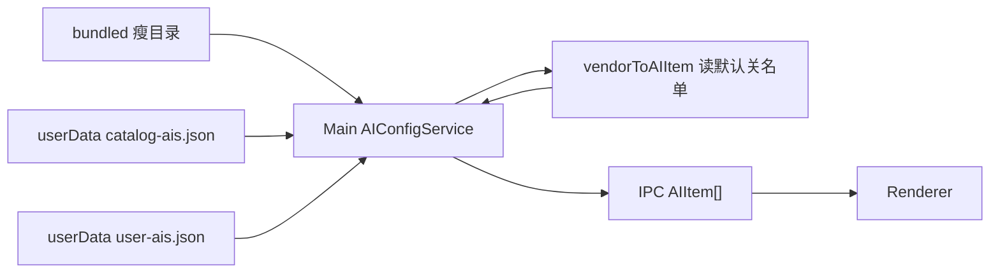

# 提案：AI 目录单一事实源

**状态：未落地。** 一次只做一批；做下一批前先读该批「范围 / 不改 / 完成标准」。落地完成后把规范迁入 [`architecture/ai-config.md`](./architecture/ai-config.md)，本文改为过时并链过去。

## 方向纠偏（2026-08-28）

此前把「供应商目录」和「运行时默认 AI 列表」做成了**同一份全字段 `AIItem[]`**。所以才会出现：

- `default-chatgpt-001` 这种假实例号（把目录行当成第一号种子页）
- JSON 里塞 `disabled` / `proxy_mode` / `preloadOnStartup` / `url_override`
- 用 Map / first-wins 从「实例袋」里取 family 默认 URL
- `Catalog.ais: AI.AIItem[]`，validate 去校验实例字段，merge 把目录当整表覆盖

用户要的唯一事实源是：**扁平的 AI 供应商 / family 目录**（有哪些供应商）。页实例行为（UA、partition、WebAuthn、默认是否启用、默认代理、是否预加载）**内置在 App 的 TS 里**，按 family 特化。远程/JSON 不能发明新 family 行为。

不要删改下面的历史执行记录假装一开始就对。批次 1 的**路径**（JSON 搬家 + main fs 读）仍对；**schema 错了**，本轮已改。批次 2「URL 不再硬编码」仍对，但官方 URL 在**目录行**上，不是派生 Map，也不是把 user 实例当目录。批次 3 的校验/merge 语义按新模型重写。

一句话（纠偏后）：`default-ais.json` 是供应商目录唯一事实源；App 把它映射成默认页实例；renderer 只走 IPC 拿 `AIItem[]`；仓库打一份、[ChatAIO-Releases](https://github.com/Kane-Kuroneko/ChatAIO-Releases) 再挂一份可独立更新的 **Ed25519 签名**瘦目录；Settings 手动检查，**预览 diff 后确认再智能合并**。

不要在一批里同时搬文件、删并行源、接远程、做验签、改 Settings。那会把上下文撑爆。

## 怎么执行

工作分支：`feat/ai-catalog-single-source`。中途停工时，下一个人只读「当前进度」+ 该批完成标准 + 该批执行记录。

### 批次状态（硬闸）

| 状态 | 含义 | 下一步 |
|------|------|--------|
| 未开始 | 还没动 | 上一批必须已是「已确认」 |
| 进行中 | 正在改代码/文档 | 做完后立刻进入 review，不要开下一批 |
| **已完成，待校验** | agent 已自审，文档已更新 | **停下来等用户确认**。未确认不得开下一批，也不得擅自 commit |
| 已确认 | 用户点头 | 才能开下一批 |
| 需返工 | 用户否决或 review 发现问题 | 修完再标回「已完成，待校验」 |

每批执行完必须走完这四步，缺一不可：

1. **只动该批「范围」**，「不改」里的文件碰都不要碰。
2. **跑该批完成标准**（测试、grep、手动路径）。
3. **agent 自审**（见下），把该批标题状态改成 **已完成，待校验**，并填写「执行记录」。
4. **停下来等用户确认。** 用户说「这批 OK / 确认 / 继续下一批」之后，才把状态改成「已确认」并开下一批。

可同一 PR 里连续提交，但提交按批切开；**确认 ≠ 授权 commit**，commit 仍要用户另说。

### 每批 review 必须覆盖

- **行为**：完成标准是否真过；用户可见路径有没有变（本批不该变的，必须没变）。
- **方向**：有没有越出「范围 / 不改」；有没有把下一批的事提前做了。
- **Bug / 债**：回归、漏改、静默失败；本批允许留下的债必须写进「本批已知债」，不要口头带过。

当前进度：**批次 5 已完成，待校验。** 用户确认前不开后续收尾（把本文标成已落地并只留 `ai-config.md` 为现行规范）。

| 批次 | 层 | 交付 | 依赖 | 状态 |
|------|----|------|------|------|
| 0 | docs | 本文 + 索引 | 无 | 已确认（目标模型已按供应商目录重写；旧「catalog = 全字段 AIItem」否决） |
| 1 | data + main 加载 | JSON 搬家、瘦 schema、main 用 fs 读 bundled | 0 | 与本轮一并按正确模型落地 |
| 2 | main + renderer 读路径 | 删并行 URL 表；renderer 不再 import 目录 | 1 | 与本轮一并按正确模型落地（官方 URL 在目录行上，不是派生 Map） |
| 3 | main 纯函数 | 供应商目录校验 + 目录行→种子实例 merge + region + 单测 | 2 | 与本轮一并落地 |
| 4 | main 安全 + 脚本 | Ed25519 验签模块 + 发布脚本（payload = 瘦目录） | 3 | **已确认** |
| 5 | ipc + Settings UI | 手动检查、预览、确认写入 | 3 + 4 | **已完成，待校验** |

批次 3 不依赖远程，App 升级带新 bundled 时也能复用 merge。批次 4 不接 UI，可先本地签一条假数据验证。批次 5 才碰用户可见行为。

## 目标架构（各批共用，改代码时对照）

三层，不要再发明第四层。**目录层和实例层不是同一种东西。**

| | 供应商目录 `default-ais.json` / `catalog-ais.json` | 用户运行时 `user-ais.json` / Settings `AIs` |
|--|--|--|
| 是什么 | 有哪些供应商 | 用户打开的页（可同 family 多实例） |
| id | 供应商 UUID | 实例 id（官方种子页可用供应商 UUID，用户加页用新 UUID） |
| 字段 | `id` + `family` + `label` + `url` + `region` | 完整 `AI.AIItem` |
| 谁改 | 发版 / 签名目录更新 | 用户 |

1. **Bundled catalog**：安装包内 `statics/ai-catalog/default-ais.json`，离线兜底。瘦供应商列表。
2. **Catalog cache**：`userData/catalog-ais.json`，用户确认过的已验签**瘦目录**。
3. **User AIs**：`userData/user-ais.json`，用户整表（继续 `replaceAllAIs`，本提案不改成纯 delta）。

Runtime 目录 = bundled 与 cache 里 `revision` 较高者（仍是供应商行）。第一启动：App 把目录行 **映射** 成运行时 `AIItem`（补上内置默认：proxy `follow_global_setting`、preload `false`、`url_override` `null`、`disabled` **读** [`src/shared/statics/ai-family-disabled-by-default.ts`](../src/shared/statics/ai-family-disabled-by-default.ts)——typed 常量、无函数；映射写在 service/mapping 里，不和名单定义混文件）。Effective AIs = 映射后的种子页与 user 表按供应商 UUID 合并。只在 main 的 `AIConfigService` 里算；renderer 只拿 IPC 下发的 `AIItem[]`（那是实例，不是目录）。

**IPC 形状（选 A，不改 preload 名）：** `get-default-ais` 仍返回映射后的默认实例 `AIItem[]`。语义 = App 用内置策略把供应商变成默认页。Settings / Guiding / ManageAIs 加站吃的是实例。目录瘦身只在 main。

**基数：**

- Catalog（bundled / cache）= 每个 family 至多一行供应商（`custom` 不是供应商；生产目录不含 `dev-proxy-test`）。
- 同一 family 永远同一个供应商 UUID（merge 稳定）。不要 `default-*-001`。
- Family 官方 URL = 该供应商行上的 `url`。`custom` 为 `''`。
- 用户多实例只活在 `user-ais.json` 整表；第二个 ChatGPT 是新实例 id，目录更新碰不到它。
- 三路 merge 按 **供应商 UUID** 对齐「官方那一行」和用户表里同一 id 的种子页。
- 派生索引若出现，只能是函数内临时，不得写入 `AIConfigService` 字段。
- 重复 `id` 或重复 `family` → 整份 catalog 非法。

远程只作为 **cache 的输入**，不是第四事实源。启动不拉网。

## 已拍板（各批不要重开讨论）

- 文件放 [`statics/ai-catalog/`](../statics/)（已有 extraResources 打包 `statics/`），不放 `src/shared`。
- 远程用现成 ChatAIO-Releases，滚动 tag `ai-catalog`，不新开仓，不挂源码仓 GitHub Pages。
- **已发布版本 = GitHub Release 资产，不是 Releases 仓工作区里的一份拷贝。** 本仓 `statics/ai-catalog/` 是下一版草稿 / 安装包兜底；`yarn publish:ai-catalog` 把签过名的 JSON+sig 推到 tag `ai-catalog` 才是已装 App 去拉的那份。不要只把文件 commit 进 ChatAIO-Releases 目录当下载源（raw.githubusercontent 会限流、换行不稳，host 白名单也对不上）。不必再往 Releases 仓树里同步一份；发 Release 就是同步。Git 归档若以后要，另加，不进本批。
- **签名不加密**。目录是公开 URL；密钥打进安装包的加密是安全剧场。Ed25519 签 **文件原始 UTF-8 字节**，sidecar `default-ais.json.sig`，公钥进 App，私钥只在本机或 Releases 仓库 secret。签名对象是瘦供应商 JSON，不是 `AIItem[]`。
- Family 行为（UA、partition、WebAuthn、默认是否启用、默认代理、是否预加载）留在 TS。远程不能发明新 family；未知 family → 整份 catalog 非法；host 不在白名单 → 该行 family 降为 `custom`（不丢行）。
- `dev-proxy-test` 只在 `dev()` 注入，生产和远程目录都不带。
- 检查更新：Settings → Manage AIs；验签后出 diff，确认才写盘。
- 现有 `reorder-ais` / 立即持久化顺序契约不动。改配置后仍跑 `yarn test:ai-order`。
- Catalog 每 family 至多一行供应商；官方 URL 在该行上。
- 跨进程仍是实例：`get-default-ais` / `get-ais` 返回 `AIItem[]`。不要为了瘦目录去改 IPC schema。
- 重复 id / 重复 family 的 catalog 整份非法。
- `region`：`{ available, forbidden }`，ISO 大写 2 位；forbidden 优先；空 = 不限制。运行时按实例回查目录行，不把 region 拷进 `AIItem`。

## 已否决（不要再做回去）

- 把 `default-ais.json` 做成带齐 `AI.AIItem` 的种子实例袋 / 「运行时默认 AI 列表」。
- 目录 id 用 `default-chatgpt-001` 这种假实例号。
- 在目录 JSON 里存 `disabled`、`url_override`、`proxy_mode`、`from_server_list_proxy`、`preloadOnStartup`、`user_fill_proxy`。
- `Catalog.ais: AI.AIItem[]`。
- 建 `Map<AIFamily, string>`、按 family 取第一条实例 url（first-wins）。
- 把派生 URL Map 挂在 `AIConfigService` 字段上。
- 把 catalog 当整表覆盖 user-ais。
- 把 user 实例当目录。
- `validateCatalog` 去校验实例的 proxy / preload。
- 把 `dev-proxy-test` 写进生产目录 JSON。
- 测试锁 Map、锁 `default-*-001`、把实现函数名当契约、把 mapping utility 路径当契约。
- 把 `FAMILY_DISABLED_BY_DEFAULT` 写进供应商 JSON，或定义在 utility / 映射函数同一个文件里。默认关是 App 策略，单独 typed 信息文件（与 `AI-family.ts` 同类）。

---

## 批次 0 — 文档与分支

**状态：已确认**  
**层**：docs  
**目标**：后人能按批开工，不必从聊天里挖决策。

### 范围

- 本文件
- [`AGENTS.md`](../AGENTS.md) 索引
- [`architecture/ai-config.md`](./architecture/ai-config.md) 顶部指向本文（不改现行双层描述）

### 不改

任何 `src/`、`statics/` 业务文件、IPC、测试。

### 步骤

1. 分支 `feat/ai-catalog-single-source`（已切）。
2. 写入本提案。
3. 索引。

### 完成标准

- 从 [`AGENTS.md`](../AGENTS.md) 能点到本文。
- `ai-config.md` 标明「目标模型见提案」，避免按过时 delta 描述实现。

### 执行记录（2026-08-26）

改动（尚未 commit）：

- 新文件：本提案
- [`AGENTS.md`](../AGENTS.md)：症状表 + 「其它」表各加一条索引
- [`architecture/ai-config.md`](./architecture/ai-config.md)：顶部加「改造中，现行实现仍以本文为准」
- [`fixme.md`](../fixme.md) P2-01 / P2-02：指向本提案（原范围未写，属于索引延伸）

自审：

- **行为**：完成标准两条都过。从 AGENTS 能点到本文；`ai-config.md` 明确现行双层仍有效、目标模型见提案。无 `src/` / IPC / 测试改动。
- **方向**：文档与分批闸门一致；本轮只补「每批做完 → review → 待校验 → 停等确认」，没有提前做批次 1。
- **Bug / 债**：无运行时行为。`fixme.md` 略超出原「范围」三文件，但只加指针、未改问题正文。未 commit（需用户另说）。

用户已于 2026-08-26 确认。下一批：批次 1。

---

## 批次 1 — Bundled 加载路径

**状态：已确认**（路径对；当时 schema 把目录写成 `AIItem[]`，**已否决**，由方向纠偏改成瘦供应商行）  
**层**：data + main 读盘  
**目标**：目录文件有固定位置和 schema；**只有 main** 用 fs 读 bundled。

### 范围（只这些）

- 新增 `projects/ChatAIO/statics/ai-catalog/default-ais.json`（从 `src/shared/statics/default-ais.json` 挪过来）
- 删除旧路径 `src/shared/statics/default-ais.json`
- [`src/Main/services/settings/ai-config-service.ts`](../src/Main/services/settings/ai-config-service.ts)
- 新增小工具，建议：`src/Main/services/settings/ai-catalog-path.utility.ts`（dev / packaged 路径）
- 若 webpack 有 json import 声明，只改 main 侧不再 `import default-ais.json`

### 不改

- `ai-family-defaults.ts`、`AI-family.ts`、`AI-Views/data.ts`、ManageAIs、GuidingView
- 任何 IPC schema、Settings UI
- 远程 URL、签名、`user-ais.json` 格式（除读到的 catalog `version` 字段迁移）
- `electron-builder.yml` 的 extraResources（已复制整个 `statics/`）

### Schema（纠偏后，取代当时「ais 保持现有 AIItem 字段」）

根对象：

- `schemaVersion`：整数，现为 `1`
- `revision`：整数（目录条目/形状变更 +1；瘦身本记为 `2`）
- `ais`：供应商行数组，每行只有 `id`（UUID）、`family`、`label`、`url`、`region`
- `region`：`{ available: string[], forbidden: string[] }`，ISO 3166-1 alpha-2 大写（如 `CN`、`US`）。拼写是 **forbidden**，不是 forbiden
- 去掉从未 bump 的 `"version": "1.0.0"` 字符串

当时步骤里「ais 保持现有 AIItem 字段」**已否决**，不要再抄回去。

### region 语义（与现有阻断共存）

- `available` 非空：仅这些地区可用；空 = 不按白名单限制
- `forbidden`：这些地区禁用（即使在 available 里也禁——forbidden 优先）
- 缺省 / 两数组都空 = 不限制
- catalog.region = **该供应商服务覆盖**。App 用它决定该页是否显示本地阻断页（`evaluateVendorRegionAccess`，实例按 id/family 回查目录行）。
- `ai-region.ts` 仍是 GuidingView 国内/国际**产品**分组，不是国家列表，不能从 JSON 派生。
- 不要把 Google MakerSuite 资格门、`available-regions` 重定向和这个混在一起。现有阻断是本地 `data:text/html`，目标 URL 不变。
- 不要在 TS 再维护一份平行国家表；欧美供应商默认 `forbidden` 写在 JSON 里。

`user-ais.json` 本批仍可带任意 `version` 字符串；不要做 delta 改造。

### 步骤

1. 复制 JSON 到 `statics/ai-catalog/`，补 `schemaVersion` / `revision`，删 `version`。
2. 写 `resolveBundledCatalogPath()`：packaged → `process.resourcesPath/statics/ai-catalog/default-ais.json`；dev → 相对项目 `statics/ai-catalog/default-ais.json`。启动读失败则抛错并 log，不要静默空列表。
3. `AIConfigService` 构造里 `JSON.parse(fs.readFileSync(...))`，校验 `schemaVersion === 1` 且 `ais` 为数组。
4. 全仓搜 `default-ais.json`，确认只剩新路径。
5. 手动：dev 启动 Settings → Manage AIs 列表与改前一致。

### 完成标准

- 源码中没有 `src/shared/statics/default-ais.json`。
- main 不再 webpack-import 该 JSON。
- `yarn test:ai-order` 绿。
- （纠偏后追加）目录文件没有实例字段；无 user-ais 时 effective 的 disabled 来自 App 内置表。

### 本批已知债（留给批次 2；历史）

`AI_FAMILY_DEFAULT_URLS` 与 JSON 里的 url 仍重复。本批允许，避免一次改太多调用点。

### 执行记录（2026-08-26）

改动（当时尚未 commit；后以 `f63ded6f0` 提交）：

- 新文件 `statics/ai-catalog/default-ais.json`：`schemaVersion: 1`、`revision: 1`，去掉 `"version": "1.0.0"`；**当时 20 条 ais 仍是全字段 AIItem**（含 `default-*-001` 与 disabled/proxy）——这是后来被否决的 schema
- 删除 `src/shared/statics/default-ais.json`
- 新增 `src/Main/services/settings/ai-catalog-path.utility.ts`（复用 `getStaticsDir`）
- `AIConfigService` 改为 `fs.readFileSync` + `JSON.parse`；缺文件 / 解析失败 / schema 不对会 throw + log；不再 webpack-import JSON
- 读 user-ais 时忽略旧 `version`；下次写入不再抄 catalog semver
- `ai-config.md` / `fixme.md` P2-01 路径改到新位置（原范围未写，属事实路径同步）

自审：

- **行为**：完成标准前三条过（旧路径已删、无 webpack import、ais 字段与改前相同）。`yarn test:ai-order` 15/15 绿。未在本机启动 Electron 点 Manage AIs——请确认启动后列表与改前一致。
- **方向**：未改 `AI_FAMILY_DEFAULT_URLS` / `AIData` / IPC / Settings UI。未接远程或签名。
- **Bug / 债**：打包路径依赖现有 extraResources 复制整个 `statics/`，本批未改 electron-builder。catalog 缺失会在 `getAIConfigService()` 首次调用时抛错（按设计，不静默空列表）。下次保存 user-ais 会丢掉文件里的 `version` 字段。**事后债：schema 把目录当成了 AIItem 种子袋。**

用户已于 2026-08-28 确认批次 1，随后开批次 2。

---

## 批次 2 — 本地唯一事实源

**状态：已确认**  
**层**：main 派生 + renderer 断 import  
**目标**：改默认 URL 只改目录 JSON 该供应商行；renderer 不读目录文件、不读 `ai-family-defaults.ts`。

### 范围

- [`ai-config-service.ts`](../src/Main/services/settings/ai-config-service.ts) 的 `normalizeAI`
- [`ai-family-defaults.ts`](../src/shared/statics/ai-family-defaults.ts)：**删除或改成 main-only 派生函数**（若 renderer 仍 import 则本批未完成）
- [`AI-Views/data.ts`](../src/Main/reaxels/Views/AI-Views/data.ts)：删 `AIData` 域名表；`getBrowserNameByFamily` 改为约定（`chatgpt` → `chatgpt_window`，`meta-ai` → `meta_ai_window`）
- [`AI-Views/index.ts`](../src/Main/reaxels/Views/AI-Views/index.ts)、[`Guiding-View/index.ts`](../src/Main/reaxels/Views/Guiding-View/index.ts)：用 `ai.url`，禁止 `getAIDomainByFamily` 回退
- [`ManageAIs/index.tsx`](../src/Views/SettingsView/components/ManageAIs/index.tsx)：默认 URL 来自 `get-default-ais`（映射后的默认实例）/ 当前 settings 里同 family 的 `url`
- 全仓 grep `getAIDomainByFamily`、`AI_FAMILY_DEFAULT_URLS`、`AIData`

### 不改

- 新 IPC（用已有 `get-ais` / `get-default-ais` / `fetch-settings`）
- 远程、签名、merge 算法
- `AI-family.ts` 能力列表（family 联合类型仍是代码；远程不能扩 family）
- [`ai-region.ts`](../src/shared/statics/ai-region.ts)（按 family 分组，不是目录）
- 预加载 / partition / UA 补丁逻辑（继续按 family 特化）

### 步骤（纠偏后）

1. Family 官方 URL：查已加载 runtime catalog 该 family 那一行供应商的 `url`；`custom` 为 `''`。不要建 `Map<AIFamily, string>`，不要「每个 family 取第一条实例 url」。
2. `normalizeAIItem(ai, catalogVendors)` 函数内 find；未知 family → `custom`。空 url 用该供应商行补。
3. 删掉 ManageAIs 对 `ai-family-defaults` 的 import；加站时用 `get-default-ais` 下发的默认实例。
4. 删除 `AIData` 大表。
5. grep 清零后跑 Manage AIs 加一个 ChatGPT family、一个 custom。

当时落地曾写成「catalog 加载后建 Map、每 family 第一条」——**已否决**，不要再做。

### 完成标准

- grep 无 `AI_FAMILY_DEFAULT_URLS`、无 renderer import `default-ais` / `ai-family-defaults`。
- 只改 JSON 里某供应商 `url`，重启后 Settings、新建同 family、打开 view 三者一致。
- `yarn test:ai-order` 绿。

### 执行记录（2026-08-28）

改动（后以 `87000cc5f` 提交）：

- 删除 `src/shared/statics/ai-family-defaults.ts`
- **当时**新增 main-only `ai-family-url-map.utility.ts`：catalog 加载后命令式建 `Map`（每 family 第一条 url）——这步 **已否决**
- 删除 `AI-Views/data.ts` 的 `AIData` 域名表；`getBrowserNameByFamily` 改为 `family` 里 `-` → `_` 再加 `_window`
- `AI-Views` / `Guiding-View` 只用 `ai.url`，禁止 `getAIDomainByFamily` 回退
- ManageAIs 删掉 `ai-family-defaults` import；加站/重置 URL 走已有 `get-default-ais`
- 产品契约测试 `tests/ai-catalog-defaults.test.ts`
- 落盘契约抽到 `src/Types/AICatalog.d.ts`（当时仍写成 `Catalog.ais: AI.AIItem[]`——schema 错，方向纠偏已拆 `Vendor` vs `UserAIs`）

自审：

- **行为**：代码 grep 无 `AI_FAMILY_DEFAULT_URLS` / `getAIDomainByFamily` / `AIData` 标识符；无 renderer import `default-ais` / `ai-family-defaults`。`yarn test:ai-order` 绿。未在 Electron UI 点 Manage AIs。
- **方向**：未新增 IPC；未做远程、签名。默认 URL 没有放进 renderer `createReaxable`。
- **Bug / 债**：当时 `dev-proxy-test` 仍在 catalog JSON（已拍板只在 `dev()` 注入，纠偏已从生产目录拿掉）。`getBrowserNameByFamily` 目前无调用点。

用户已于 2026-08-28 确认批次 2，随后开批次 3。

**纠偏（2026-08-28，Map）：** 批次 2 落地时把 catalog 当成可 1:N 实例袋，用 first-wins 建 Map 并挂在 `AIConfigService` 上。已删除该 utility。不要把当时的 Map 步骤当成现行架构。

---

## 批次 3 — 校验与三路 merge（不联网）

**状态：已完成，待校验**（含方向纠偏：校验供应商目录，merge 是目录行 → 种子实例）  
**层**：main 纯函数 + tests  
**目标**：把「目录怎么信、怎么和用户表合」写成可测函数。本批 **不 fetch**。

### 范围

- `src/Main/services/settings/` 下 validate / merge / 映射函数（不进 renderer）；默认关名单是独立纯数据，不定义在 utility 里
- `tests/ai-catalog-merge.test.ts`、`tests/ai-catalog-defaults.test.ts`
- `AIConfigService.getEffectiveAIs` 改为调用 merge
- 可选：若存在 `userData/catalog-ais.json` 且 `revision` ≥ bundled 且通过校验，则用它当 catalog；**没有该文件时行为与只有 bundled 相同**
- 更新 [`architecture/ai-config.md`](./architecture/ai-config.md)

### 不改

- Settings UI、新 IPC、网络、密钥
- 不把 `user-ais.json` 改成 delta 模型
- 不改 `get-default-ais` 的返回类型（仍是 `AIItem[]`）

### 校验规则（`validateCatalog`）

校验的是 **供应商目录**，不是 `AIItem` 的 proxy/preload：

- `schemaVersion` 必须 = App 认识的版本（现为 `1`）；更高则拒绝（给批次 5 的「请升级 App」留口）
- `revision` 为正整数
- `ais.length` 与体积上限（建议文件 ≤ 256KB，条数上限例如 200）
- 每行：`id` 为 UUID、`family` 属于 TS 联合类型、`url` 为 `http:`/`https:`（`custom` 允许空）、`label` 为字符串、`region` 为 `{ available, forbidden }`（ISO 大写 2 位；缺省视为空；拼成 `forbiden` 或非法码 → 整份非法）
- host 白名单：family → 允许 hostname 列表；不匹配则该行 **family 降为 `custom`**（不要丢行）
- **重复 `id` 或重复 `family` → 整份 catalog 非法**
- 未知 family → 整份非法（不能发明新 family 行为）
- 生产构建：丢掉误入的 `dev-proxy-test`；该 family 只由 App 在 `dev()` 注入
- 本批白名单写死在 TS，与现有官方入口主机一致

### 三路 merge

记号：`base` = 上次已采用**供应商目录**（无 cache 时 = 当前 bundled），`theirs` = 新目录，`ours` = 当前 user 表（无 user 文件则 ours = 目录行映射成的默认实例）。

按 **供应商 UUID** 对齐官方种子页：

- **新增**：`theirs` 有、`ours` 无、且 id 不在 `deletedIds` → 把该供应商行映射成种子实例后 appended
- **目录改字段**：同 id 且 `ours.field === base.field` → 可更新为 `theirs.field`（只 `url` / `label`）
- **跳过**：用户改过的 url、label；任意 `url_override`；`id` 以 `custom-` 开头；用户自己加的新 id（同 family 也碰不到）
- **目录删除**：`base` 有、`theirs` 无 → 不自动从 ours 删，diff 标 `catalogDropped`
- **disabled / proxy / preload**：不是目录字段，merge 不改。第一启动的 disabled 只来自 App 纯数据名单 `ai-family-disabled-by-default.ts`（映射函数读取，不在 mapping 文件里定义）

`getEffectiveAIs` 在「无新目录事件」时仍是：user 整表 + 追加 user 没有且未删除的**种子页**（由当前目录映射）。本批不要悄悄改顺序语义。

### 步骤

1. 目录行 ≠ `AIItem`。提供 `vendorToAIItem(vendor, builtinDefaults)`（命令式）；`disabled` 读独立名单，不把名单写进 mapping 文件。
2. 把 `getEffectiveAIs` 抽成纯函数；测试锁业务不锁实现。
3. 接入 cache 读取（文件缺失 = 无 cache）。
4. 改 `ai-config.md`：写明 user 文件是整表 + `deletedIds`；目录是瘦供应商列表。

### 完成标准

- 单测覆盖：目录文件无实例字段；有 region；每 family 一行；重复 family/id 非法；无 user-ais 时 id/url/label/disabled 符合「目录 + 默认禁用表」；用户改过 url 的种子页不覆盖；用户加的同 family 新 id 不被误伤；forbidden 地区阻断（含 forbidden 优先）。
- 不启动 App 也能跑这组测试。
- `yarn test:ai-order`、`yarn test:ai-catalog` 绿。

### 执行记录（2026-08-28）

初版（未 commit）：仍把 catalog 当 `AIItem[]` 校验/merge，并曾允许重复 family first-wins。

**方向纠偏（同日，未 commit）：**

- `default-ais.json` 改为瘦供应商列表（UUID + family + label + url，`revision: 2`）；`dev-proxy-test` 移出生产目录
- `AICatalog.Vendor` vs `UserAIs`；删除 `Catalog.ais: AI.AIItem[]`
- `vendorToAIItem` + family 默认禁用表（当时仍写在 mapping utility 里）；`dev()` 注入 proxy 测试供应商
- validate 只认供应商行；merge 按供应商 UUID 对齐种子页，不改 disabled
- IPC 仍返回映射后的 `AIItem[]`
- 测试按新业务锁重写

**数据 vs 映射（2026-08-29 / 提交 2026-08-31）：** 默认关名单从 utility 抽到 `src/shared/statics/ai-family-disabled-by-default.ts`（typed 常量、无函数）。`vendorToAIItem` 只读该名单。不要把 mapping 文件路径当契约，也不要把名单写回 `default-ais.json`。

---

## 批次 4 — 签名与发布（无 UI）

**状态：已确认**  
**层**：crypto + scripts  
**目标**：能对**瘦目录 JSON** 原文签名/验签；能把文件推到 Releases tag `ai-catalog`。Settings 仍没有入口。

### 范围

- 新增 `projects/ChatAIO/statics/ai-catalog/ed25519.pub`（公钥，可提交）
- 新增建议 `src/Main/services/settings/ai-catalog-sign.utility.ts`（只 verify；sign 放脚本）
- 新增 `projects/ChatAIO/scripts/publish-ai-catalog.ts`（或 `scripts/sign-ai-catalog.ts` + publish）
- 单测：好签名通过、改 JSON 一个字节失败、缺 sig 失败
- 私钥：环境变量例如 `CHATAIO_CATALOG_ED25519_PRIVATE_KEY`，**禁止进 git**。默认文件路径在用户目录 `~/.chataio/ai-catalog-ed25519.key`（可用 `CHATAIO_CATALOG_ED25519_PRIVATE_KEY_FILE` 覆盖）。仓库内若误放 `statics/ai-catalog/ed25519.key` 仍被 `.gitignore` 挡住。

### 不改

- Settings、IPC、`AIConfigService` 的 fetch
- 不要引入 minisign / tweetnacl；用 Node `crypto.verify`（算法 `null` + Ed25519 密钥）
- 不要把签名对象改回全字段实例列表

### 步骤

1. 一次性 `crypto.generateKeyPairSync('ed25519')`，公钥 PEM 进 `ed25519.pub`，私钥交给维护者。
2. 签名消息 = `default-ais.json` 的原始 buffer（含换行）；`.sig` 为 raw 签名的 base64 一行或裸 binary，脚本与 verify 约定一种并写进注释。
3. `gh release upload` 到 `Kane-Kuroneko/ChatAIO-Releases` tag `ai-catalog`（没有则建），文件：
   - `default-ais.json`（瘦供应商目录）
   - `default-ais.json.sig`
   使用 clobber 覆盖旧资源。**创建/更新时必须 `--latest=false`**，不能让目录 Release 成为 GitHub Latest（electron-updater 只认 Latest 上的 `latest.yml`）。
4. App 内 URL 常量（本批可先写在 sign 工具旁，批次 5 才 fetch）：
   - `https://github.com/Kane-Kuroneko/ChatAIO-Releases/releases/download/ai-catalog/default-ais.json`
   - 同上 `.sig`
5. host 钉死：只允许该 owner/repo 的 github / objects.githubusercontent.com。

### 完成标准

- 无网络：对 fixture 验签单测绿。
- 有 `gh` 权限时：脚本能上传；本机可用公钥验刚传的文件。
- 仓库里搜不到私钥。
- 签的是瘦目录，文件里没有 proxy/disabled/preload。

### 执行记录（2026-08-31）

- `statics/ai-catalog/ed25519.pub`：Ed25519 公钥 PEM（可提交）
- `default-ais.json.sig`：对当前瘦 JSON **原始字节** 的 raw 64 字节签名，标准 base64 一行
- `ai-catalog-sign.utility.ts`：只 `verify`；远程 URL 常量；host 白名单。不 fetch，不进 renderer
- `scripts/sign-ai-catalog.ts` / `publish-ai-catalog.ts`：sign 用 env 或用户目录 `~/.chataio/ai-catalog-ed25519.key`；publish 先验签再 `gh release upload --clobber`
- 私钥路径：`CHATAIO_CATALOG_ED25519_PRIVATE_KEY` 或 `~/.chataio/ai-catalog-ed25519.key`（不进仓库；工程内误放的 `ed25519.key` 仍 gitignore）
- 单测：好签名过、改一字节失败、缺 sig 失败、bundled .sig 对得上仓库 JSON、错误 owner URL 拒绝
- 仓库根 `.gitattributes` 把 catalog JSON / `.sig` / `.pub` 锁成 `eol=lf`。签名对象是工作区原文字节；Windows `core.autocrlf` 若把 JSON 变成 CRLF，换机验签会失败。`yarn sign:ai-catalog` 遇到 CR 直接拒绝。
- **未**把验签接到 `AIConfigService` 启动路径；**未**跑 `gh release upload`（需本机 gh 权限）
- 仓库内 grep 无私钥 PEM

用户已于 2026-08-31 确认并提交。下一批：批次 5。

---

## 批次 5 — Settings 手动更新

**状态：已完成，待校验**  
**层**：ipc + Settings UI + main 编排  
**目标**：用户能检查**供应商目录**更新，看 diff，确认后写 cache + 合并 user-ais，并刷新 views。远程只拉 ChatAIO-Releases tag `ai-catalog` 的 Release 资产。

### 范围

- [`IpcSchema.d.ts`](../src/Types/IpcSchema.d.ts)、[`preload.ts`](../src/preload.ts)
- [`Settings/index.ts`](../src/Main/reaxels/Settings/index.ts) 注册 RPC
- 新增 main：`checkAiCatalogUpdate` / `applyAiCatalogUpdate`（fetch → verify → `previewCatalogMerge`；apply 才写盘）
- [`ManageAIs/index.tsx`](../src/Views/SettingsView/components/ManageAIs/index.tsx) 按钮 + Modal
- i18n 各语言包（至少 zh-CN / en 与现有 Settings 一致的几份）
- 写盘后走现有 `syncRuntimeViews`（rebuildMenu + sync AI views）
- 把 [`ai-config.md`](./architecture/ai-config.md) 补上远程层；本文状态改为已落地或迁走

### 不改

- 启动时自动 fetch
- electron-updater / About 里的安装包更新（目录更新不是 App 更新）
- menubar / FloatingView / WebContentsView 生命周期
- 排序 RPC
- `get-ais` / `get-default-ais` 的返回类型（仍是实例）

### IPC（仅本批新增）

- `check-ai-catalog-update` → `{ status, bundledRevision, cacheRevision, remoteRevision?, diff?, errorCode? }`  
  只读：拉瘦目录 JSON+sig、验签、算 preview；**不写盘**。同一时刻只保留一份 pending payload（内存），apply 必须对得上这次 check（传入的 `revision` 一致），防止 TOCTOU。
- `apply-ai-catalog-update(revision)` → `{ success, errorCode?, settings? }`  
  把 pending 写入 `catalog-ais.json`，user 表按**当前**磁盘整表重算 merge（种子页按供应商 UUID 合，用户加页不动），然后 sync views。

Fetch 失败 / 验签失败 / schema 过高：`status: 'error'`，UI 展示，不写 cache。

### UI

Settings → Manage AIs 工具条：「检查 AI 目录更新」。Modal 分块：将新增供应商 / 将改官方 URL 或 label / 已跳过（用户改过种子页）/ 目录已移除（需手动删）。确认后 apply；取消只关 Modal（pending 留到下次 check 再清）。

### 步骤

1. 先 IPC + 假 pending（dev 可用本地文件当 remote）打通 preview。
2. 再换成 Releases URL。
3. 确认后检查：新供应商种子页出现在菜单；改过 URL 的种子页不变；用户加的同 family 第二页不变；deleted 项不复活。

### 完成标准

- 离线点检查：明确失败，不改磁盘。
- 篡改 JSON 或 sig：拒绝。
- 确认合并后重启，cache revision 保持，user 定制仍在。
- `yarn test:ai-order` 绿。

### 执行记录（2026-08-31）

- 远程发布目标写进已拍板：本仓 JSON = 草稿；ChatAIO-Releases **Release 资产** = 已发布版本。不往 Releases 仓目录再拷一份。
- `createCatalogUpdateCycle`：pending 在实例上，不是模块全局。失败的 check 不清上一份成功 pending；`up-to-date` 才清。apply 先 `previewApply`（不消耗），写盘成功再 `commit`。
- ours 用 `getEffectiveAIs()`，不是 `user.ais ?? getDefaultAIs()`。IPC `diff` 是 `CatalogUpdateDiff`，不下发 `nextAis`。
- `adoptRemoteCatalog` 先写 user 再写 cache。本地预览 env 直接读盘，不伪装 GitHub URL。
- check/apply 在 runtime 串行；fetch 前占 `checkId`，慢的旧请求不能盖掉新 pending。
- Settings 业务在 `reaxel_SettingsView`（`checkAiCatalog` / `applyAiCatalog`）；`CatalogUpdate.tsx` 只渲染。
- IPC：`check-ai-catalog-update`（只读）、`apply-ai-catalog-update(revision)`。apply 成功后 `syncRuntimeViews`，settings 由 IPC 层附带。
- 单测锁：更高 revision 才 available；effective 里已有种子不当新增；public diff 无 nextAis；失败二次 check 保留 pending；错 revision 不消耗 pending；用户改过的 URL / 自加页 / deleted 不被盖；体积超限是 `invalid-catalog`。
- 文档：`docs/features/ai-catalog-manual-update.md`；`ai-config.md` 补远程层与 ours=effective。

自审：

- **行为**：上列契约由单测锁住。未在本机 Electron 点 Manage AIs 走一遍真 GitHub。
- **方向**：没自动 fetch；没改 `get-ais` / `get-default-ais` / 排序；没碰 menubar / FloatingView。apply 比原提案多了 `revision` 参数，为的是 TOCTOU。
- **Bug / 债**：GitHub 下载走 Electron defaultSession（系统代理），不套用 App 内全局代理。尚未 `yarn publish:ai-catalog`。取消 Modal 只清 UI preview，main pending 留到下次成功 check 或 up-to-date。

---

## 明确不做（整份提案）

- 把配置仓拆到第三个 GitHub 仓库。
- YAML。
- 加密目录正文。
- 远程 JSON 增加新 `AI_family` 行为。
- 本阶段把 `user-ais.json` 改成纯 delta（P2-02 的实现项）；只把**文档**改成承认整表模型。
- 自动后台检查更新。
- 为目录更新去改 AI 页闪白 / menubar / preload park。
- 把已否决的 schema（全字段 AIItem 目录、Map/first-wins）再做回去。
- 在 TS 再维护一份与 catalog.region 平行的国家列表（含硬编码 `DEFAULT_SENSITIVE_REGION_COUNTRY_CODES`）。
- 把 catalog.region 和 Google MakerSuite 资格门、`available-regions` 重定向混在一起。

## 与现有文档

- 现行运行时仍以 [`ai-config.md`](./architecture/ai-config.md) 为准，直到对应批次改完并回写。
- 并行源问题见 [`fixme.md`](../fixme.md) P2-01：批次 2 已消化本地 URL 表；方向纠偏后目录是供应商列表，不是默认实例袋。
- 排序不变量见 [`features/ai-list-reorder.md`](./features/ai-list-reorder.md)。
- 设计文档约定见 [`agent/feature-design-and-comments.md`](./agent/feature-design-and-comments.md)。
