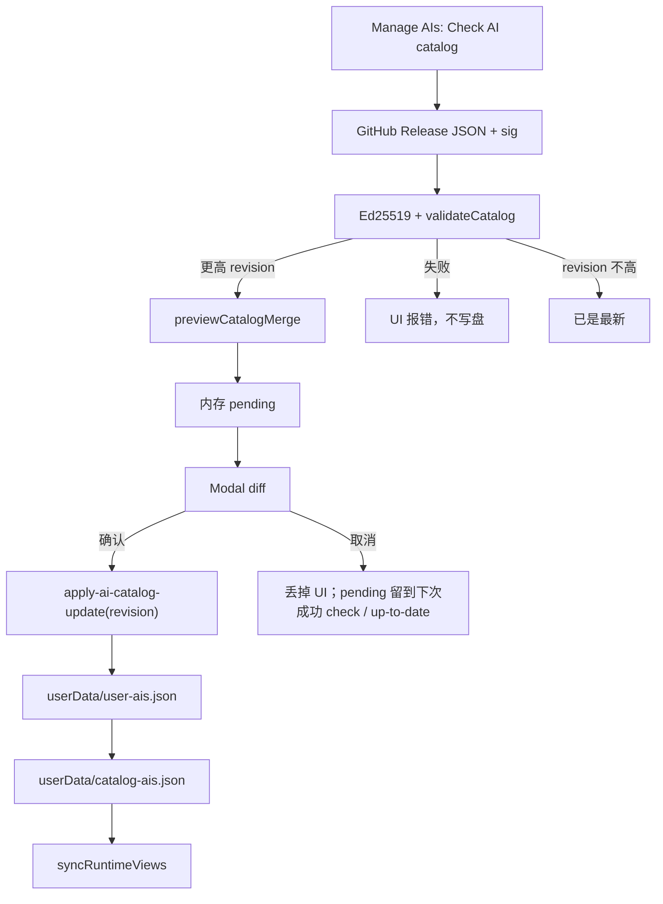

# AI 目录手动更新

Settings → Manage AIs 可以检查**供应商目录**更新。远程是 [ChatAIO-Releases](https://github.com/Kane-Kuroneko/ChatAIO-Releases) 滚动 tag `ai-catalog` 的 **GitHub Release 资产**，不是 Releases 仓工作区里的一份拷贝。

本仓 `statics/ai-catalog/` 是下一版草稿 / 安装包兜底。`yarn publish:ai-catalog` 把签过名的 JSON+sig 推上 tag 之后，已装 App 才拉得到。目录更新不是 App 安装包更新（About 里那条是 electron-updater）。ChatAIO-Releases 的 `ai-catalog` tag **禁止**标成 GitHub Latest，否则 updater 会去拉 `.../download/ai-catalog/latest.yml` 并 404。`yarn publish:ai-catalog` 必须 `--latest=false`。

## 不变量

1. **启动不拉网。** 只有用户点「检查 AI 目录更新」才 fetch。
2. **确认前不写盘。** check 只验签 + preview；cache `catalog-ais.json` 和 user 表只在 apply 之后改。
3. **pending 同一时刻一份，活在 `AIConfigService` 的 cycle 实例上，不是模块全局。** apply 必须带上这次 check 的 `remoteRevision`；对不上或没有 pending → 拒绝。**失败的 check（网络 / 验签 / schema）不清上一份成功 pending**；`up-to-date` 才清；新的 `available` 覆盖。写盘成功才 `commit`。重叠的 check 串行，只有最新一次能改 pending。
4. **跨进程仍是实例。** check 下发的 diff 是种子页 `AIItem` 的 preview，不是瘦目录原样。`get-ais` / `get-default-ais` 返回类型不变。
5. **用户改过的种子页、`url_override`、`custom-` id、用户自加的同 family 第二页，目录更新碰不到。** 目录删行不自动从 user 表删，diff 标「ChatAIO已停止维护，但已存在的本地数据仍会被保留」。
6. **region 只活在目录上。** 只改 region、页字段没变时仍要 apply（把 cache 写成新 revision），否则覆盖判定不更新。
7. **Settings 有未 Apply 的改动时先保存或放弃。** 目录合并写的是磁盘上的 user 表，不能盖掉编辑器里没保存的页。

## 入口与数据流

远程 URL（host 钉死，见 `ai-catalog-sign.utility.ts`）：

- `https://github.com/Kane-Kuroneko/ChatAIO-Releases/releases/download/ai-catalog/default-ais.json`
- 同上 `.sig`

dev / 维护者可用 `CHATAIO_CATALOG_REMOTE_JSON` + `CHATAIO_CATALOG_REMOTE_SIG` 指向本地已签名文件：**直接读盘，不走 URL 白名单、不伪装成 GitHub URL**。不要拿这个当用户功能。

## IPC

- `check-ai-catalog-update()` → `{ status, bundledRevision, cacheRevision, remoteRevision?, diff?, errorCode? }`
- `apply-ai-catalog-update(revision)` → `{ success, errorCode?, settings? }`

`status`: `up-to-date` | `available` | `error`。`errorCode`: `network` | `forbidden-url` | `verify-failed` | `invalid-catalog` | `schema-too-new` | `no-pending`。

check 的 `diff` 是 `CatalogUpdateDiff`（added / updated / skipped / catalogDropped / **availability**），**不下发 `nextAis` / 目录正文**。ours 用 `getEffectiveAIs()`（含已 compose 进列表、但还不在 `user-ais.json` 的官方种子页），不要只用 `user.ais`。apply **先写 user 再写 cache**。

Modal 面向用户写「列表发生了什么」：新增页、名称/网址、能用的地区（国家名，不是 ISO 码）、将沿用自定义配置的、ChatAIO 已停止维护但仍保留本地数据的。页字段和地区都没变时，明确说经比对没有新增和修改的AI页面；应用更新后仅会添加新AI供应商，不会改变已存在的配置。不要用「保持列表为最新」这种空话。

切入 Manage AIs **不**发检查请求。Settings 切过的页留在树上藏起来，避免表格 + DnD 每次重挂载。

## 关键文件

| 路径 | 职责 |
|------|------|
| [`src/Main/services/settings/utils/ai-catalog-update.utility.ts`](../../src/Main/services/settings/utils/ai-catalog-update.utility.ts) | 验签、preview、`createCatalogUpdateCycle`（pending 在实例上） |
| [`src/Main/services/settings/ai-config-service.ts`](../../src/Main/services/settings/ai-config-service.ts) | ours=`getEffectiveAIs`；peek → 写盘 → commit |
| [`src/Main/services/settings/utils/ai-catalog-update-runtime.utility.ts`](../../src/Main/services/settings/utils/ai-catalog-update-runtime.utility.ts) | `net.fetch` 或本地读盘；check/apply 串行 |
| [`src/Main/reaxels/Settings/index.ts`](../../src/Main/reaxels/Settings/index.ts) | IPC；apply 成功后 `syncRuntimeViews` |
| [`src/Views/SettingsView/reaxels/settings-view/index.ts`](../../src/Views/SettingsView/reaxels/settings-view/index.ts) | `checkAiCatalog` / `applyAiCatalog`；preview 在 `catalog_update` |
| [`src/Views/SettingsView/components/ManageAIs/CatalogUpdate.tsx`](../../src/Views/SettingsView/components/ManageAIs/CatalogUpdate.tsx) | 只渲染；不编排 IPC |
| [`tests/ai-catalog-update.test.ts`](../../tests/ai-catalog-update.test.ts) | 业务契约（不打 GitHub） |

## 禁止项

- 启动自动 fetch；不要和 About 的安装包更新混入口。
- 不要在切入 Manage AIs 时自动 check 目录。
- 不要把瘦目录放进 Settings store。
- 不要用 Releases 仓 git 树或 raw.githubusercontent 当 App 下载源。
- **不要把 `ai-catalog` Release 标成 GitHub Latest**（会抢走安装包的 `latest.yml`）。
- 不要为了目录更新改 menubar / FloatingView / AI 页生命周期。
- 不要改 `get-ais` / `get-default-ais` / `reorder-ais` 的返回形状。

## 与现有文档

- 三层模型和 merge 规则：[`../architecture/ai-config.md`](../architecture/ai-config.md)、[`../feature-proposal--ai-catalog-source.md`](../feature-proposal--ai-catalog-source.md)
- 排序仍立即写盘：[`ai-list-reorder.md`](./ai-list-reorder.md)
