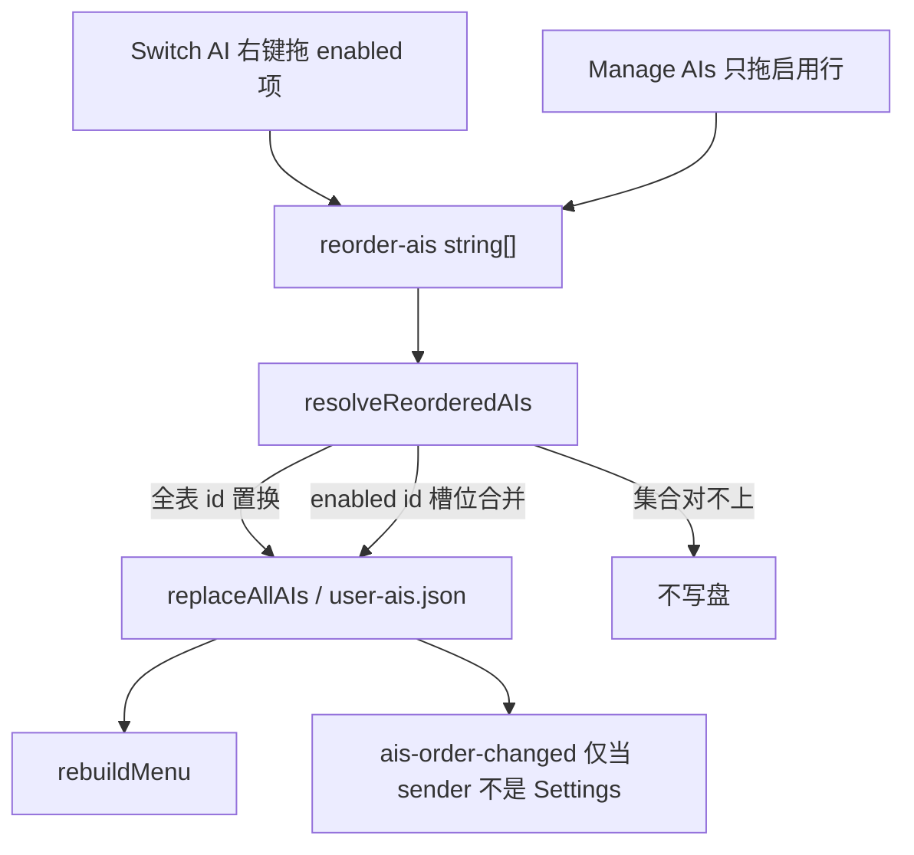

# AI 列表排序

Switch AI 菜单与 Settings → Manage AIs 共用一套**立即持久化**的顺序模型。顺序就是 `user-ais.json` 里 `ais` 数组下标，没有独立 `order` 字段。

改交互或 `reorder-ais` 前先读本文，并跑 `yarn test:ai-order`（在 `projects/ChatAIO`）。

## 不变量

1. **菜单顺序 = 持久化 `AIs` 数组顺序**，disabled 项不出现在 Switch AI。
2. **排序松手即写盘**。Settings 拖拽不进表底 dirty；启用 / 预加载 / 待删除走表底 Save；弹窗改字段当场 persist。页脚不管 AIs。见 [`manage-ais-save-scopes.md`](./manage-ais-save-scopes.md)。
3. **左键切 AI，右键拖排序**。Application / View 菜单、Switch AI 底栏 Prev/Next 不参与拖拽。中区 Current AI 精简下拉同样走这条手势（无 footer）。
4. **禁止**为排序改 menubar `-webkit-app-region: drag` 或 FloatingView `forward: true`。排序只发生在 Dropdown 窗口或 Settings 表内。
5. Renderer → Main 的 id 列表必须 `cloneForIPC`。

## 两条入口

| 入口 | 手势 | payload | 写盘结果 |
|------|------|---------|----------|
| Switch AI | 右键按住，移动 ≥ 8px | 当前 enabled id 序列 | disabled 下标不动，enabled 按菜单新序填回 |
| Manage AIs | 只拖启用行（未启用禁拖） | 本地先按启用槽位合并，再送**已提交**全表 id（disabled 仍在原下标；含待删除，不含未 Apply 新建项） | 与 Switch AI 相同：disabled 钉住原下标 |

全部 enabled 时两种 payload 集合相同，结果一致。

表内**看见的顺序**（启用置顶、列筛选）不是持久化序，见 [`manage-ais-table-ux.md`](./manage-ais-table-ux.md)。

例：磁盘 `[A, B(disabled), C, D]`，菜单或表内重排 enabled 为 `[D, C, A]` → `[D, B(disabled), C, A]`。

## IPC

- RPC `reorder-ais(orderedIds: string[]) → { success, error? }`
- MTR `ais-order-changed(orderedIds)`：把 menubar 新序同步进已打开的 Settings store
- **不要**在 Settings 自己调用 `reorder-ais` 后再 echo 回 Settings：会盖掉未保存新建项，或打断连续拖拽

## Settings dirty

`isDirty()`（页脚）对 runtime 配置做 `snapshotRuntimeSettingsForDirty`（无 AIs、无测试 URL）。`isAIsDirty()`（表底）对 `AIs` 做 `snapshotAIsForDirty`（去掉待删除行，顺序不计）。只改顺序不会点亮表底 Save；改名走弹窗即时写盘，也不点亮；启用禁用 / 待删除仍表底 dirty。页脚 Discard / 退出只 reload runtime；表底 Undo 只 reload AIs。详见 [`manage-ais-save-scopes.md`](./manage-ais-save-scopes.md)。

## 测试锁定的契约

`yarn test:ai-order` 按**用户可见结果**锁下面几条，不锁内部「槽位合并 / 全表置换」函数切分，也不锁 dirty 是否按 id 排序：

1. Switch AI 只给 enabled id → disabled 下标不动，字段跟着 id 走。
2. Settings persist 仍给已提交全表 id（含钉在原位的 disabled、含待删除、不含未 Apply 新建项）→ 整表按该序落盘。表内拖拽本身不再移动 disabled 下标，见 [`manage-ais-table-ux.md`](./manage-ais-table-ux.md)。
3. payload 集合对不上（含「enabled 里夹了 disabled 但不是全表」）→ 不写盘。
4. 未 Apply 新行误进 payload → 拒写；过滤后再套回本地，新行仍在原槽。
5. 顺序变化不 dirty；启用 / 待删除点亮表底 Save；改名走弹窗即时写盘。页脚 Apply 不因 AIs 变亮。
6. Settings 自己是 `reorder-ais` 的 sender 时不 echo `ais-order-changed`。

左键切页、右键拖、footer 钉死是 DropdownView 手势，本 suite 不覆盖。

## 关键文件

| 路径 | 职责 |
|------|------|
| [`src/shared/utils/merge-enabled-ai-order.utility.ts`](../../src/shared/utils/merge-enabled-ai-order.utility.ts) | 写盘 / dirty / echo / Settings payload 的产品契约函数 |
| [`src/Main/services/settings/ai-config-service.ts`](../../src/Main/services/settings/ai-config-service.ts) | `reorderEnabledAIs` |
| [`src/Main/reaxels/Settings/index.ts`](../../src/Main/reaxels/Settings/index.ts) | IPC、rebuildMenu、按需 echo |
| [`src/Views/DropdownView/App.tsx`](../../src/Views/DropdownView/App.tsx) | 右键 sensor、AI / footer 分区 |
| [`src/Views/DropdownView/right-click-mouse-sensor.utility.ts`](../../src/Views/DropdownView/right-click-mouse-sensor.utility.ts) | 只激活 `button === 2` |
| [`src/shared/utils/manage-ais-table.utility.ts`](../../src/shared/utils/manage-ais-table.utility.ts) | Manage AIs 展示序 / 列筛选 / 拖启用项→槽位映射 |
| [`src/Views/SettingsView/reaxels/settings-view/index.ts`](../../src/Views/SettingsView/reaxels/settings-view/index.ts) | `persistCommittedAIOrder` / `applyExternalEnabledAIOrder` |
| [`src/Views/SettingsView/components/ManageAIs/index.tsx`](../../src/Views/SettingsView/components/ManageAIs/index.tsx) | 表内拖启用项；展示序与筛选不写盘 |
| [`tests/ai-list-reorder.test.ts`](../../tests/ai-list-reorder.test.ts) | 产品契约回归（不是内部 helper 快照） |
| [`tests/manage-ais-table-ux.test.ts`](../../tests/manage-ais-table-ux.test.ts) | 表内展示序 / 钉位拖拽 |

## 禁止项

- 不要用 HTML5 `draggable` 或默认 `PointerSensor` 做 Switch AI 排序（只认左键）。
- 不要让 Settings 拖拽只改 store 等表底 Save：会和 menubar 立即写盘打架。
- 不要把未 Apply 的新建 AI id 送进 `reorder-ais`。
- 不要把待删除行从 Settings 排序 payload 里滤掉：它们仍在磁盘上，滤掉会退化成菜单槽位合并。
- 不要在 Manage AIs drop 时对整表 `arrayMove`：会挤走未启用项。表内映射见 [`manage-ais-table-ux.md`](./manage-ais-table-ux.md)。
- 不要为排序给 Dropdown 加 `app-region: drag`。
- 不要把测试写成内部 helper（`mergeEnabledAIOrder` / `isIdPermutation`）的黄金输出快照。
