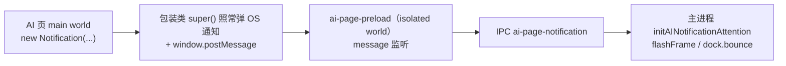

# AI 页通知 → 任务栏闪烁 / dock 弹跳

AI 页（WCV 内的第三方网页，如 ChatGPT 任务完成提醒）通过 HTML5 `Notification` API 发通知时，除了原生 OS 通知照常弹出，应用还要「引起注意」：

- **Windows / Linux**：主窗未聚焦时 `mainWindow.flashFrame(true)` 闪任务栏图标；主窗重获焦点即 `flashFrame(false)` 停止。
- **macOS**：`app.dock.bounce('informational')` 弹一次 dock。
- 主窗**已聚焦**时不做任何事（用户正看着应用，不打扰）。

这是第一阶段的最小实现。更完整的通知聚合 / 角标计数 / 应用内通知中心后续再做。

## 数据流

1. **main world 包装**：`ai-page-preload.ts` 的 `installNotificationForwarding` 用 `contextBridge.executeInMainWorld`（与浏览器身份伪装同一模式）把 `window.Notification` 换成继承原生的子类——`super()` 仍执行，OS 通知不受影响；构造时把裁剪过的 `{ title, body }` 经 `window.postMessage` 发出。类名对齐为 `Notification` 降低指纹面。
2. **跨 world 通道**：contextIsolation 下 main world 拿不到 `ipcRenderer`，`postMessage` 是跨 world 的标准通道（同 Chrome content script 模式）。preload 的 `installNotificationRelay` 校验 `event.source === window` 与 payload 形状后走 IPC。
3. **主进程**：[`src/Main/services/ai-notification/index.ts`](../../src/Main/services/ai-notification/index.ts) 的 `initAINotificationAttention`（在 `runtime.ts` 启动时注册）监听 `ai-page-notification`，按平台闪任务栏 / 弹 dock。

## 关键文件

| 路径 | 职责 |
|------|------|
| [`src/ai-page-preload.ts`](../../src/ai-page-preload.ts) | main world Notification 包装 + postMessage relay |
| [`src/Main/services/ai-notification/index.ts`](../../src/Main/services/ai-notification/index.ts) | IPC 监听、`flashFrame` / `dock.bounce`、聚焦即停 |
| [`src/Types/IpcSchema.d.ts`](../../src/Types/IpcSchema.d.ts) | `ai-page-notification` RendererToMainEvent |
| [`src/Main/runtime.ts`](../../src/Main/runtime.ts) | 启动时 `initAINotificationAttention()` |

## 约束与注意

- **不要吞掉原生通知**：包装类必须 `super(title, options)`，OS toast 行为与改动前一致。
- **payload 在 preload 侧裁剪**（title ≤ 200、body ≤ 500），主进程仍做入站运行时校验（IPC 边界规则）。
- **只有 AI WCV 挂 `ai-page-preload`**，Settings / Prompt / menubar 不会误报。
- 只有 `flashFrame(true)` 之后主窗的第一次 `focus` 会 `flashFrame(false)`；不闪时不注册监听，避免泄漏。
- 通知权限沿用 Electron 默认（permission request 默认放行），本功能不改 permission handler。
- 该链路无法用 Playwright E2E 断言 OS 级闪烁；验证方式：AI 页 DevTools 里执行 `new Notification('test')`，主窗失焦时任务栏应闪烁。

## 后续（暂不做）

- 通知点击聚焦对应 AI 页、角标未读计数、应用内通知列表。
- per-AI 通知开关（Settings）。
