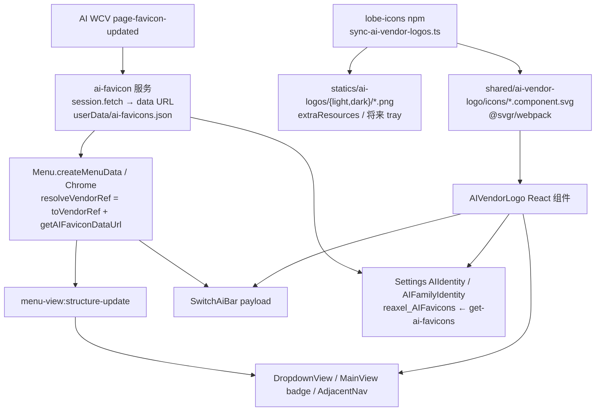

# AI 供应商 logo 辨识重构（label 去厂商名）

分支：`refactor/ai-vendor-logo-identity`（基于 `main` 的 `0d382628c`）。

**一句话**：页实例的 `label` 只当用户自己的名字；厂商辨识一律靠供应商 logo（内置 family 打包 SVG，custom 走 favicon / 域名首字母）。UI 形态是 `<logo> label`，不再写 `ChatGPT-Jack`。

接续工作先读本文「进度」与「尚未做完」两节。

已与用户逐项确认（2026-09-09）。

---

## 产品决策（已确认，不要再改方向）

| 议题 | 决策 |
|------|------|
| 同供应商多页怎么区分 | **不是去掉 name**。原来 `chatgpt-Jack` → `<GPT logo> Jack`。label 仍是用户标识。 |
| `AIItem.label` | **保留且可编辑**。数据层不删字段。 |
| 空 label | **落盘不允许空。** Add / Clone 输入框不预填，默认名当 placeholder，空着保存则写入该默认名。Edit 清空仍 `message.error('AI name is required')` 留窗不写盘。 |
| 老数据 | **不迁移、不清洗**。种子页 `ChatGPT`、用户写的 `chatgpt-Jack` 照原样显示，由用户自己改。展示时也不自动剥前缀。 |
| logo 来源 | 打包 [lobe-icons](https://github.com/lobehub/lobe-icons) 静态 SVG/PNG（MIT）。不要运行时拉 CDN、不要目录 JSON 下发 URL。 |
| custom family | 抓该站点 favicon；失败或缺省 → 域名 / label 首字母圆形占位。 |
| 范围 | Web 自绘 UI 全覆盖（menubar Switch AI、Current AI 中区、Prev/Next、SwitchAiBar、Settings 表/弹窗/代理树、GuidingView）。tray 原生菜单**当前没有** Switch AI 列表，本次无落点；PNG 已进 `statics/ai-logos/`，将来加 tray 子菜单时用 `nativeImage.createFromPath`。 |

默认名：从 `ChatGPT-Anselm` 改成纯人名池（`Anselm`…）。池子用尽才退回 `ChatGPT 2`（唯一还会出现厂商名的兜底）。

种子页映射 `vendorToAIItem` 仍拷目录 `vendor.label`（通常是品牌名）。这与「不迁移」一致：新用户第一次启动仍看到 `ChatGPT` 这类名，靠 logo 辨识即可。

---

## 不变量

1. **身份仍是 `AI.AIItem.id`**，不是 family、不是 label。logo 只是展示。
2. **落盘 label 必填、非空 trim**。Add / Clone 空输入视为采用 placeholder 默认名；Edit 清空仍 `AI name is required`，与 URL 校验同层。
3. **内置 19 family 只用打包 SVG**。不要给它们塞 favicon；`toVendorRef` 对 bundled family 丢弃 favicon 参数。
4. **custom / `dev-proxy-test` / 未同步的新 family** 才走 favicon → 首字母。
5. **不要复用 `MenuView.Item.icon` 放 logo**。它是 emoji 槽，且 Switch AI 项带 `loadState` 时渲染端不画 `icon`。独立字段 `vendor?: AI.VendorRef`。
6. **favicon 只在主进程用该 AI 页自己的 `session.fetch` 下载**（代理 / cookie 与页面一致）。渲染端禁止直接请求外网 favicon。
7. **lobe-icons 只经 `scripts/sync-ai-vendor-logos.ts` 入库**，不要手拷 svg/png。
8. **不要为 logo 改 FloatingView `forward` 或 menubar drag region**（见 [`menubar-drag-investigation.md`](../issues/menubar-drag-investigation.md)）。
9. **跨 IPC 的数组 / 对象仍 `cloneForIPC`**。`VendorRef` 是可序列化的纯数据。
10. **下拉几何单一数据源**：logo 槽宽度走 [`dropdown-geometry.ts`](../../src/shared/dropdown-geometry.ts) 的 `DROPDOWN_VENDOR_SLOT`，主进程估宽 / badge 锚定 / DropdownView less 共用，禁止 less 另写一套魔法数。

---

## 数据契约

```ts
// src/Types/SettingsTypes/AI.d.ts
AI.VendorRef = {
	family: AIFamily;
	faviconUrl?: string | null;  // 仅无打包 logo：主进程缓存的 data: URL
	url?: string;                // 仅无打包 logo：首字母兜底取字（override 优先）
};
```

生成器：`toVendorRef(ai, faviconUrl)`（[`vendor-logo.utility.ts`](../../src/shared/ai-vendor-logo/vendor-logo.utility.ts)）。

跨 IPC 携带点：

| 类型 | 字段 | 用途 |
|------|------|------|
| `MenuView.Item` | `vendor?` | Switch AI 子菜单、Current AI 下拉（同一批 items） |
| `MenuView.TopLevelItem` | `adjacentVendor?` | 中区 Prev / Next |
| `MenuView.Chrome` | `currentContextVendor?` | 中区 Current AI badge；Settings 打开时为 `null` |
| `FloatingView.SwitchAiBarItem` | 已有 `family`；补 `faviconUrl?` / `url?` | 浮层卡片 |
| IPC RPC `get-ai-favicons` | `void → Record<aiId, dataUrl>` | Settings 拉 custom favicon 全表 |

---

## 数据流



favicon 细节：

1. `trackAIViewFavicon(view, ai)`：仅 `hasBundledVendorLogo()===false` 时挂 `page-favicon-updated`。
2. 取第一张 `http(s)` favicon，用 **该 view 的 session** `fetch`，≤128KB，转 `data:image/...;base64,...`。
3. 内存 `Map` + 落盘 `userData/ai-favicons.json`（启动读回；损坏当空表）。
4. `onAIFaviconChange` → `runtime.ts` 里 `reaxel_Menu().scheduleMenuUpdate()`，让菜单 / badge 拿到新图。
5. `delete-ai` 调 `forgetAIFavicon(id)`。
6. Settings 侧 `reaxel_AIFavicons.ensureLoaded()` 一次性 RPC；**打开 Settings 期间主进程新抓到的 favicon 不会即时推到表里**（关再开或下次进 Manage AIs 才刷新）。菜单路径不受此限。

已知缺口（非阻塞，接续可补）：`pickFaviconUrl` 目前丢掉 `data:` favicon；若站点只给 data URL，会一直走首字母。

---

## 资源映射

family → lobe-icons 文件名（无扩展名）。有 `-color` 优先彩色，否则单色 `fill=currentColor`：

| family | lobe 源 | 备注 |
|--------|---------|------|
| chatgpt | `openai` | 单色 |
| grok | `grok` | 单色 |
| gemini | `gemini-color` | |
| deepseek | `deepseek-color` | |
| perplexity | `perplexity-color` | |
| claude | `claude-color` | |
| manus | `manus` | 单色 |
| aistudio | `aistudio` | 单色 |
| copilot | `copilot-color` | |
| meta-ai | `metaai-color` | |
| poe | `poe-color` | |
| mistral | `mistral-color` | |
| doubao | `doubao-color` | |
| qianwen | `qwen-color` | |
| kimi | `kimi-color` | |
| chatglm | `chatglm-color` | |
| yuanbao | `yuanbao-color` | |
| hailuo | `hailuo-color` | |
| yiyan | `wenxin-color` | 文心 / 一言 |

`custom` / `dev-proxy-test` **不在此表**。升级 lobe-icons 后重跑：

```bash
yarn tsx projects/ChatAIO/scripts/sync-ai-vendor-logos.ts
```

webpack：`*.component.svg` → `@svgr/webpack`（`engine/webpack/base.conf.ts`）；普通 `.svg` / `.png` → `asset/resource`。`global.d.ts` 已声明 `*.component.svg`。

---

## 展示点（目标态）

| 展示点 | 文件 | 形态 |
|--------|------|------|
| Switch AI 子菜单 / Current AI 下拉 | `DropdownView/App.tsx` | `menu-item__vendor`（16px）在 label 前；`data-vendor` |
| 中区 Current AI badge | `CurrentContextBadge` | 14px logo + 渐变文字（logo **不**参与渐变） |
| 中区 Prev / Next | `AdjacentNavButton` | 14px `adjacentVendor` + 相邻 label |
| SwitchAiBar 卡片 | `SwitchAiBar/index.tsx` | 22px logo + label；**去掉** `__family` 小字 |
| Manage AIs 表 | `ManageAIs` + `AIIdentity` | name 列 = logo+label；family 列 = 小 logo + `AIFamilyDisplayName`（去掉彩色 Tag） |
| Edit / Add / Clone 弹窗 | `EditAIModal` | family Select option 带 logo+显示名；name Input 可加 prefix logo；Add/Clone 默认名当 placeholder 不预填；Edit 空 name 拦保存 |
| 代理 bypass TreeSelect | `GlobalNetProxy` | family 组 / 页节点用 `AIFamilyIdentity` / `AIIdentity` |
| GuidingView 勾选列表 | `AIPages` | Checkbox 文案前 logo；custom 卡走 custom + 首字母 |
| Catalog 更新预览 | `CatalogUpdate.tsx` | 瘦预览带 `AI_family`；`CatalogPreviewIdentity` → `AIIdentity` |

Settings 打开时 badge 文案是 `Settings`、`currentContextVendor` 为 `null`，不画 AI logo。

---

## 关键文件

| 路径 | 职责 |
|------|------|
| [`scripts/sync-ai-vendor-logos.ts`](../../scripts/sync-ai-vendor-logos.ts) | npm 包 → 仓库 svg/png |
| [`src/shared/ai-vendor-logo/index.tsx`](../../src/shared/ai-vendor-logo/index.tsx) | `AIVendorLogo` |
| [`src/shared/ai-vendor-logo/vendor-logo.utility.ts`](../../src/shared/ai-vendor-logo/vendor-logo.utility.ts) | `hasBundledVendorLogo` / `toVendorRef` / `vendorFallbackText`（无 React） |
| [`src/shared/utils/default-ai-name.utility.ts`](../../src/shared/utils/default-ai-name.utility.ts) | `buildDefaultAIName` / `AI_NAME_POOL`（从 SettingsView reaxel 抽出） |
| [`src/shared/statics/AI-family.ts`](../../src/shared/statics/AI-family.ts) | `AIFamilyDisplayName` |
| [`src/shared/dropdown-geometry.ts`](../../src/shared/dropdown-geometry.ts) | `DROPDOWN_VENDOR_LOGO_SIZE` / `DROPDOWN_VENDOR_SLOT` |
| [`src/Main/services/ai-favicon/index.ts`](../../src/Main/services/ai-favicon/index.ts) | 抓取 / 缓存 / 订阅 |
| [`src/Main/reaxels/Menu/index.ts`](../../src/Main/reaxels/Menu/index.ts) | `resolveVendorRef`、structure / chrome 带 vendor |
| [`src/Main/reaxels/Views/index.ts`](../../src/Main/reaxels/Views/index.ts) | SwitchAiBar payload 带 favicon/url |
| [`src/Main/reaxels/Views/utils/initWebContentsView.ts`](../../src/Main/reaxels/Views/utils/initWebContentsView.ts) | `useAIView` 里 `trackAIViewFavicon` |
| [`src/Main/runtime.ts`](../../src/Main/runtime.ts) | `onAIFaviconChange` → `scheduleMenuUpdate` |
| [`src/Views/SettingsView/components/AIIdentity/index.tsx`](../../src/Views/SettingsView/components/AIIdentity/index.tsx) | Settings 组合件 |
| [`src/Views/SettingsView/reaxels/ai-favicons/index.ts`](../../src/Views/SettingsView/reaxels/ai-favicons/index.ts) | Settings 端 favicon 镜像 |
| [`src/Types/IpcSchema.d.ts`](../../src/Types/IpcSchema.d.ts) | `get-ai-favicons` |
| [`tests/ai-vendor-logo-identity.test.ts`](../../tests/ai-vendor-logo-identity.test.ts) | 纯函数门禁 |
| `projects/ChatAIO/package.json` `test` | 已把上述单测挂进 `yarn test` |
| 根 `package.json` | `@lobehub/icons-static-svg` / `-static-png`（workspace `-W`） |

---

## 尚未做完（按此顺序接续）

实现已覆盖主路径。

1. **手工冒烟（e2e 盖不到）**  
   - 深/浅色主题：单色 logo（chatgpt/grok/manus/aistudio）跟随文字色。  
   - SwitchAiBar current 卡是深色渐变底，单色 logo 应浅色可读。  
   - custom 页打开后过几秒菜单项从首字母变成 favicon。  
   - Edit 空 name Enter 不关窗；Add / Clone 空着保存用 placeholder 默认名。

Settings 打开期间 favicon 更新仍是一次性 RPC（关再开才刷新表）；菜单路径走 `onAIFaviconChange`。Guiding 阶段没有 AI WCV，custom 一律首字母。

---

## 禁止项

- 不要把 logo 塞进 `MenuView.Item.icon`。
- 不要迁移 / 清洗既有 label；不要在渲染时剥厂商前缀。
- 不要让**落盘** label 可为空（Add/Clone 输入框可以空，保存时必须写入默认名或用户名）。
- 不要在渲染端直接请求外网 favicon。
- 不要为 logo 改 FloatingView `forward` / menubar drag region。
- 不要手拷 lobe-icons 文件；改映射只改 `sync-ai-vendor-logos.ts` 再跑脚本。
- 不要把 `AIVendorLogo` 的 SVG 组件 import 进主进程（主进程用 PNG 路径或只传 `VendorRef`）。
- 不要把列筛选改成按显示名筛：筛选仍走 `label` / `AI_family` 原字段。

---

## 与现有文档的关系

- [`ai-config.md`](../architecture/ai-config.md)：目录 / 页实例不变；只改 label **语义**。
- [`menubar-current-ai-dropdown.md`](./menubar-current-ai-dropdown.md)：badge 锚定仍是 **文字** 左缘；inset 计入 `DROPDOWN_VENDOR_SLOT`。
- [`manage-ais-save-scopes.md`](./manage-ais-save-scopes.md)：弹窗即时写盘不变；落盘 name 非空；Add/Clone 用 placeholder 默认名。
- [`floating-view-card-ux-optimization.md`](./floating-view-card-ux-optimization.md)：卡片内容从「label + family 小字」改为「logo + label」。
- [`e2e-playwright.md`](./e2e-playwright.md)：下拉可见性必须看 BrowserWindow。

---

## 进度

- [x] 用户确认设计
- [x] `yarn add -W @lobehub/icons-static-svg @lobehub/icons-static-png`
- [x] `sync-ai-vendor-logos.ts` 已跑（19 svg + 38 png）
- [x] `AIVendorLogo` / `vendor-logo.utility` / `AIFamilyDisplayName` / `global.d.ts`
- [x] 类型：`VendorRef` + MenuView / FloatingView / IPC
- [x] 主进程 favicon 服务 + `useAIView` 挂点 + `get-ai-favicons` + `runtime` 订阅
- [x] Menu structure / chrome 带 vendor
- [x] SwitchAiBar payload + 卡片 UI
- [x] DropdownView / CurrentContextBadge / AdjacentNavButton + less
- [x] Settings 表、弹窗、GlobalNetProxy、i18n、`reaxel_AIFavicons`、`AIIdentity`
- [x] GuidingView AIPages
- [x] 默认名抽出 `default-ai-name.utility.ts`（去厂商前缀）
- [x] 下拉宽度 / badge inset 计入 logo 槽
- [x] 单测 + 部分 e2e 断言；e2e 下拉可见性改问主进程窗口
- [x] CatalogUpdate 预览行加 logo（瘦预览补 `AI_family`）
- [x] `manage-ais-save-scopes.md` 补 name 必填；`pickFaviconUrl` 接受 `data:image/`
- [x] tsc + `yarn build:webpack` + 全量 e2e（SettingsView tsc 两个既有 Table 泛型红线与本次无关；单元 134、e2e 46 均绿）
- [x] 自 review 后提交
