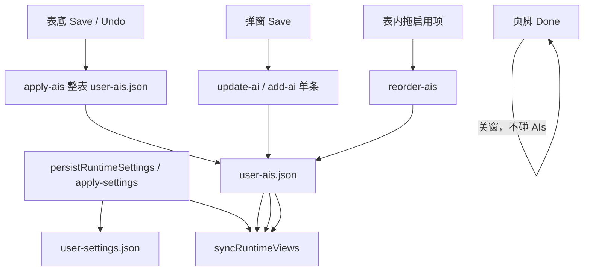

# Manage AIs 与 Settings 页脚的两套提交

Settings 页脚不再为 runtime 或 AI 表 dirty。**运行设置（General / Networks / Startup AI Page / About）即时写盘**（`persistRuntimeSettings` → `apply-settings`）。Manage AIs 表底仍有自己的保存 / 撤销；编辑弹窗的保存当场写盘并生效，不走表底二次 Apply。

「重置所有 AI 页面」藏在表底 **Advanced** 下拉里，不当作主路径。

换皮与 scoped shadcn 见 [`settings-ui-shadcn.md`](./settings-ui-shadcn.md)。

## 不变量

1. **两套提交互不点亮表底。** 运行设置不再点亮页脚 Apply（页脚只剩 **Done**）。表底 `isAIsDirty()` 只看 `Data.AIs` + `pendingDeleteAIIds`（行顺序不计，与 [`ai-list-reorder.md`](./ai-list-reorder.md) 同一套 `snapshotAIsForDirty`；对象键顺序也不计，走 `fingerprintAIsDirtyState`，避免弹窗 merge `{...persisted, disabled}` 误点亮 Save）。
2. **页脚 Done / 关窗不写、不丢 AI 表草稿。** `apply-settings` 不再 `replaceAllAIs`。关窗不 reload AIs。
3. **表底 Save** 走 `apply-ais`：把当前表（去掉待删除行）整表写盘并 `syncRuntimeViews`。**表底 Undo Changes** 只 `get-ais` 灌回表格，不动主题 / 代理等。
4. **编辑弹窗 Save 当场 persist。** Edit → `update-ai`（**不带 `disabled`**，启用列仍归表底）；Add / Clone → `add-ai`。成功后只把这一条并进 committed 快照，其它行未保存的 Enabled / Preload / 待删除仍 dirty。
5. **弹窗 Cancel** 只丢弹窗草稿，不改 store、不写盘。
6. **弹窗内任意文本输入框按 Enter 即触发 Save**（与点 Save 按钮等价；**custom URL 必填**、**Edit 时 AI name 必填**等校验不过则报错留在弹窗）。Add / Clone 打开时 **不把默认名写进 input**，只作 placeholder；`label` trim 后为空则写入当前 family 下一个未占用默认名（`buildDefaultAIName`），不报 `AI name is required`。Edit 清空 name → `AI name is required`，不写盘、不关窗（厂商靠 logo 辨识，落盘名字仍不能空，见 [`ai-vendor-logo-identity.md`](./ai-vendor-logo-identity.md)）。排除 Select 搜索框（Enter 是选中选项）与 radio/checkbox；输入法合成态的 Enter 不算。URL 处于行内编辑态时，Enter 先按 suffix Save 规则提交草稿再保存，避免静默丢弃未提交的 URL。实现：`EditAIModal` 的 `<Form onKeyDown>`，`handleSave` 保存前从 store 重取 `fields`（不能用渲染闭包旧引用）。
7. **Clone 的新条目插到母项下方**（真实序），不是表底：`changeCloneAIModalVisible` 记录 `clone_source_id`，`add-ai` IPC 带 `options.insertAfterId`，主进程 `aiConfigService.addAI` 按母项下标 splice；`commitOneAIAfterPersist` 同步在本地 store 同位插入。普通 Add 仍追加表底。母项被并发删除时退回追加表底。
8. **拖拽排序仍松手即写盘**（`reorder-ais`），不计表级 dirty。
9. **Startup AI Page 单选项在 Manage AIs 页上，但是 runtime 配置**，即时 `persistRuntimeSettings`，不走表底。
10. **目录检查 / 应用**：`isDirty() || isAIsDirty()` 都挡住。合并写的是磁盘 user 表，不能盖掉表内未保存行，也不能在 Settings 草稿未落盘时改目录。
11. **Renderer → Main 的 AI 数组必须 `cloneForIPC`。**

## 入口与数据流

| 手势 | 写谁 | 何时生效 |
|------|------|----------|
| General / Networks / Startup 单选 | `user-settings.json` | 控件变更后立刻（队列） |
| Enabled / Preload 列、待删除 | `user-ais.json` 整表 | 表底 Save |
| 弹窗改名 / URL / 代理 / 弹窗内 Preload | `user-ais.json` 单条 | 弹窗 Save |
| 拖启用项 | 只改顺序 | 松手 |
| 重置所有 AI 页面 | Advanced → 确认 | 立刻（清会话 + 默认表） |

## 关键文件

| 路径 | 职责 |
|------|------|
| [`src/Views/SettingsView/reaxels/settings-view/index.ts`](../../src/Views/SettingsView/reaxels/settings-view/index.ts) | `isDirty` / `isAIsDirty` / `applyAIs` / `reloadAIs` / `persistAIFromModal` / `commitOneAIAfterPersist` |
| [`src/Views/SettingsView/components/ManageAIs/index.tsx`](../../src/Views/SettingsView/components/ManageAIs/index.tsx) | 表底按钮组、Advanced、弹窗即时保存；Startup 单选 `data-testid=startup-ai-page-*`（E2E 点 wrapper，不要 `check()`） |
| [`src/Views/SettingsView/App.tsx`](../../src/Views/SettingsView/App.tsx) | 页脚 **Done** 关窗；runtime 已即时写盘；可提示未保存的 AI 表草稿 |
| [`src/Main/reaxels/Settings/index.ts`](../../src/Main/reaxels/Settings/index.ts) | `apply-settings` 不写 AIs；`apply-ais` |
| [`e2e/tests/settings-ais-save-scopes.spec.ts`](../../e2e/tests/settings-ais-save-scopes.spec.ts) | 主进程探针：`apply-settings` 不写 AIs；`apply-ais` / `update-ai` |
| [`e2e/tests/settings-ais-save-scopes-ui.spec.ts`](../../e2e/tests/settings-ais-save-scopes-ui.spec.ts) | Settings WCV Page：点 Enabled 只点亮表底 Save |

## 禁止项

- 不要让页脚 Done / `apply-settings` 把表内未保存的 Enabled / 删除一并写盘。
- 不要让弹窗 Save 带上当前行未提交的 `disabled`（启用列与弹窗解耦）。Main `update-ai` 也会丢掉 payload 里的 `disabled`，防止漏传。
- 不要在弹窗 Save 成功后 `updateSnapshot()` 整表重算 committed：会把其它行的 toggle 当成已保存。
- 不要用整页 `reloadSettings` 当表底 Undo：会串掉 AI 草稿；runtime 已即时写盘，也不要靠 Discard 回滚主题。
- 不要把「重置所有 AI 页面」放回表底主按钮。
- 不要在 Add / Clone 打开时把默认名写进 name input（只当 placeholder；空着保存再写入）。
- 不要为这套交互改 FloatingView `forward`。
- 不要为了点 Settings 把生产 WCV 改成 BrowserWindow。Settings Page 用 `openSettingsFromApplicationMenu`。

## 测试分层

不变量 1–4 按层拆，不要一条 E2E 既当单元又当手势：

| 层 | 覆盖 | 文件 |
|----|------|------|
| 纯函数 | 指纹、单条提交不洗净表草稿 | [`tests/settings-dirty-scopes.test.ts`](../../tests/settings-dirty-scopes.test.ts) |
| 主进程 | `apply-settings` 忽略 AIs；`apply-ais` / `update-ai` 落盘 | [`e2e/tests/settings-ais-save-scopes.spec.ts`](../../e2e/tests/settings-ais-save-scopes.spec.ts) |
| Settings DOM | Done vs 表底、弹窗 Save/Cancel、Undo、主题即时落盘、Startup、目录挡板、Add / Clone（含空名用 placeholder）、待删除 | [`e2e/tests/settings-ais-save-scopes-ui.spec.ts`](../../e2e/tests/settings-ais-save-scopes-ui.spec.ts)、[`e2e/tests/settings-ais-pending-delete.spec.ts`](../../e2e/tests/settings-ais-pending-delete.spec.ts)、[`e2e/tests/settings-exit-without-save.spec.ts`](../../e2e/tests/settings-exit-without-save.spec.ts) |

顺序与环切见 [`e2e-playwright.md`](./e2e-playwright.md)「当前用例」。入口：`openSettingsFromApplicationMenu` / `openSwitchAiMenu`。

## 与现有文档的关系

- [`ai-list-reorder.md`](./ai-list-reorder.md)：顺序仍即时写盘；条目字段 dirty 改由表底 / 弹窗分担。
- [`manage-ais-table-ux.md`](./manage-ais-table-ux.md)：置底仍看上次**表底 Save**（及弹窗/排序已提交）的 `disabled`，不是 runtime 即时写盘。
- [`ai-catalog-manual-update.md`](./ai-catalog-manual-update.md)：挡板改为 Settings **或** AI 表任一 dirty。
- [`settings-exit-discard-and-prompt-scrollbar.md`](./settings-exit-discard-and-prompt-scrollbar.md)：Done 关窗不丢已写盘 runtime；**也不** reload AI 表。
- [`settings-ui-shadcn.md`](./settings-ui-shadcn.md)：scoped shadcn / 即时写盘 / 页脚收缩。
