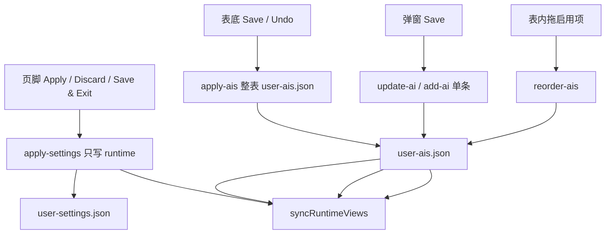

# Manage AIs 与 Settings 页脚的两套提交

Settings 页脚不再为 AI 表 dirty。Manage AIs 表底有自己的保存 / 撤销；编辑弹窗的保存当场写盘并生效，不走表底二次 Apply。

「重置所有 AI 页面」藏在表底 **Advanced** 下拉里，不当作主路径。

## 不变量

1. **两套 dirty 互不点亮。** 页脚 `isDirty()` 只看 appearance / networks / system / `startup.aiPageLoadMode`（不含 `proxy_test_urls`、不含 `AIs`）。表底 `isAIsDirty()` 只看 `Data.AIs` + `pendingDeleteAIIds`（行顺序不计，与 [`ai-list-reorder.md`](./ai-list-reorder.md) 同一套 `snapshotAIsForDirty`；对象键顺序也不计，走 `fingerprintAIsDirtyState`，避免弹窗 merge `{...persisted, disabled}` 误点亮 Save）。
2. **页脚 Apply / Discard / Save & Exit / Exit Without Save 不写、不丢 AI 表草稿。** `apply-settings` 不再 `replaceAllAIs`。Discard / 退出只 reload runtime 配置。
3. **表底 Save** 走 `apply-ais`：把当前表（去掉待删除行）整表写盘并 `syncRuntimeViews`。**表底 Undo Changes** 只 `get-ais` 灌回表格，不动主题 / 代理等。
4. **编辑弹窗 Save 当场 persist。** Edit → `update-ai`（**不带 `disabled`**，启用列仍归表底）；Add / Clone → `add-ai`。成功后只把这一条并进 committed 快照，其它行未保存的 Enabled / Preload / 待删除仍 dirty。
5. **弹窗 Cancel** 只丢弹窗草稿，不改 store、不写盘。
6. **拖拽排序仍松手即写盘**（`reorder-ais`），不计表级 dirty。
7. **Startup AI Page 单选项在 Manage AIs 页上，但是 runtime 配置**，走页脚 dirty，不走表底。
8. **目录检查 / 应用**：`isDirty() || isAIsDirty()` 都挡住。合并写的是磁盘 user 表，不能盖掉表内未保存行，也不能在 Settings 草稿未落盘时改目录。
9. **Renderer → Main 的 AI 数组必须 `cloneForIPC`。**

## 入口与数据流

| 手势 | 写谁 | 何时生效 |
|------|------|----------|
| General / Networks / Startup 单选 | `user-settings.json` | 页脚 Apply |
| Enabled / Preload 列、待删除 | `user-ais.json` 整表 | 表底 Save |
| 弹窗改名 / URL / 代理 / 弹窗内 Preload | `user-ais.json` 单条 | 弹窗 Save |
| 拖启用项 | 只改顺序 | 松手 |
| 重置所有 AI 页面 | Advanced → 长按确认 | 立刻（清会话 + 默认表） |

## 关键文件

| 路径 | 职责 |
|------|------|
| [`src/Views/SettingsView/reaxels/settings-view/index.ts`](../../src/Views/SettingsView/reaxels/settings-view/index.ts) | `isDirty` / `isAIsDirty` / `applyAIs` / `reloadAIs` / `persistAIFromModal` / `commitOneAIAfterPersist` |
| [`src/Views/SettingsView/components/ManageAIs/index.tsx`](../../src/Views/SettingsView/components/ManageAIs/index.tsx) | 表底按钮组、Advanced、弹窗即时保存 |
| [`src/Views/SettingsView/App.tsx`](../../src/Views/SettingsView/App.tsx) | 页脚只绑 `isDirty`；Discard 只 reload runtime |
| [`src/Main/reaxels/Settings/index.ts`](../../src/Main/reaxels/Settings/index.ts) | `apply-settings` 不写 AIs；`apply-ais` |
| [`e2e/tests/settings-ais-save-scopes.spec.ts`](../../e2e/tests/settings-ais-save-scopes.spec.ts) | 主进程探针：`apply-settings` 不写 AIs；`apply-ais` / `update-ai` |

## 禁止项

- 不要让页脚 Apply 把表内未保存的 Enabled / 删除一并写盘。
- 不要让弹窗 Save 带上当前行未提交的 `disabled`（启用列与弹窗解耦）。Main `update-ai` 也会丢掉 payload 里的 `disabled`，防止漏传。
- 不要在弹窗 Save 成功后 `updateSnapshot()` 整表重算 committed：会把其它行的 toggle 当成已保存。
- 不要用整页 `reloadSettings` 当表底 Undo 或页脚 Discard：会串掉另一套草稿。
- 不要把「重置所有 AI 页面」放回表底主按钮。
- 不要为这套交互改 FloatingView `forward`。

## 与现有文档的关系

- [`ai-list-reorder.md`](./ai-list-reorder.md)：顺序仍即时写盘；条目字段 dirty 改由表底 / 弹窗分担。
- [`manage-ais-table-ux.md`](./manage-ais-table-ux.md)：置底仍看上次**表底 Save**（及弹窗/排序已提交）的 `disabled`，不是页脚 Apply。
- [`ai-catalog-manual-update.md`](./ai-catalog-manual-update.md)：挡板改为 Settings **或** AI 表任一 dirty。
- [`settings-exit-discard-and-prompt-scrollbar.md`](./settings-exit-discard-and-prompt-scrollbar.md)：Exit Without Save 仍丢 runtime 草稿；**不再** reload AI 表。
