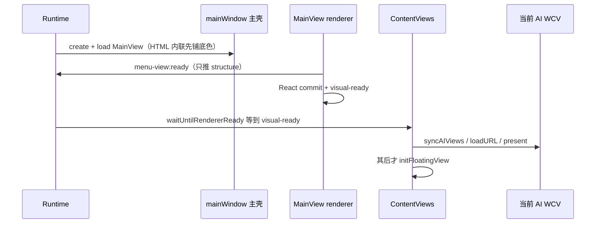

# 冷启动 menubar 白屏检测器

冷启动时 menubar 会白好几秒才画出菜单项，看起来像在等当前前台 WCV。本功能分两层，**不要混用**：

| 层 | 职责 | 通道 | 关掉会怎样 |
|----|------|------|------------|
| **门闩（产品）** | 菜单项非零 layout 之后才 `initRuntimeViews` / `loadURL` / `initFloatingView` | `menu-view:visual-ready` | Phase 5 超时 15s 仍续行 |
| **观测** | JSONL 时间线 + `verdict`，核对门闩有没有再次绑错 | `menubar:boot-probe` + 主进程 milestone | 启动行为不变 |

`menu-view:ready` 只推 structure/theme，**不是**已绘，也**不是** Phase 5 门闩。

不 remount、不踢绘、不 `capturePage`。观测器不是 `present` / `loadURL` 的前置条件。

日志：

| 环境 | 路径 |
|------|------|
| unpackaged | `<cwd>/logs/menubar-cold-start.jsonl` |
| packaged | `%APPDATA%/<app>/logs/menubar-cold-start.jsonl` |

控制台会打 `[MenubarColdStart] jsonl → ...` 和封链时的 `severity / suspects`。

## 不变量

1. **`menu-view:ready` ≠ 已绘**。MainView 在 `createRoot` 之前就发 ready（给 structure 推送用）。Phase 5 若等这个信号，会在菜单项 layout 之前放行当前 AI WCV。
2. **用户看见菜单项的时刻是 `renderer-visual-ready`**（`.main-view-root` 里已有 `.main-view-bar-item` / badge 且非零尺寸），不是 `did-finish-load`，也不是 ready。
3. **当前 WCV** = 快照里 `visible === true` 的内容层。预加载页也记 `wcv-created` / loading 计数，以免误把后台 load 当成前台。
4. **禁止**为了这份日志调用 `capturePage`、改 FloatingView `forward`、或把主壳裁剪关掉。
5. 检测器会话只覆盖冷启动窗口（约 12–15s），写出 `verdict` 后停止 100ms 快照。

## 为什么会白

旧路径（已改）：`menu-view:ready` 在 React commit 前发出 → Phase 5 立刻 `loadURL` 当前 WCV，且 Phase 3 同时拉 FloatingView。dev 下三条 localhost/远程加载抢 GPU，36px 条停在默认白直到 webpack 主包跑完。

现行门闩：



代码锚点：`src/Views/MainView/index.tsx` 仍在 `root.render` 前发 `menu-view:ready`（给 structure）；`waitUntilRendererReady` 等的是 `menu-view:visual-ready`。`runtime.ts` 不再在 Phase 3 预热 overlay。

## 里程碑

| name | 含义 |
|------|------|
| `boot-start` / `phase-0`…`phase-5-*` | runtime 启动契约 |
| `window-show` | 窗口已可见（默认 `show:true`，往往早于 HTML） |
| `phase-2-load-start` / `phase-2-dev-retry` | MainView `loadURL`；dev webpack 重试 |
| `wc-event` `menubar`：`did-start-loading` / `dom-ready` / `did-finish-load` | 主壳导航 |
| `menu-view-ready` / `renderer-ready-sent` | IPC ready（≠ 绘出；只推 structure） |
| `structure-sent` / `renderer-structure-applied` | 菜单数据到达 React store |
| `renderer-create-root` / `renderer-app-layout` / `renderer-chrome-commit` | React 挂上 `.main-view-root` |
| `renderer-first-paint` / `renderer-fcp` | PerformanceObserver paint |
| `renderer-visual-ready` | 菜单项已有非零 layout |
| `renderer-longtask` | visual 前主线程长任务 |
| `wcv-created` / `wcv-load-attempt` / `wcv-present` | 内容 WCV 创建、开始 load、present |
| `wc-event` `wcv`：`did-start-loading` / `did-finish-load` | 当前/预加载页导航 |
| `clip-applied` | 主壳是否裁到 36px |
| `snapshot` | 100ms：两边 `isLoading`、bounds、是否盖住 menubar、PID |
| `verdict` | 封链裁决 |

## 裁决

`computeMenubarColdStartVerdict`（纯函数，测试锁契约）：

| `severity` | 何时 |
|------------|------|
| `conflict` | Phase5 / 当前 WCV `loadURL` / FloatingView 早于 `renderer-visual-ready`，或两边同时 `isLoading` ≥200ms，或 WCV 盖住条带 |
| `warn` | 首绘 ≥1.5s，或 wait 超时，或 webpack 重试，或 visual 前 longtask 较多；但没有 WCV 重叠 |
| `ok` | 首绘够快，且 WCV 在 visual 之后才 load |

`suspects` 还会标 `ready-before-visual`（门闩用错信号）、`window-shown-before-menubar-dom`、`shell-not-clipped`、`structure-late`。后几条单独出现不升 `warn`。

读日志：

```bash
yarn --cwd projects/ChatAIO test:menubar-boot
yarn --cwd projects/ChatAIO analyze:menubar-boot
# 或
yarn --cwd projects/ChatAIO analyze:menubar-boot -- path/to/menubar-cold-start.jsonl
```

## 关键文件

| 路径 | 职责 |
|------|------|
| [`src/shared/menubar-cold-start-monitor.ts`](../../src/shared/menubar-cold-start-monitor.ts) | 协议 + 裁决 |
| [`src/Main/reaxels/Views/Main-View/menubar-cold-start-monitor.retexel.ts`](../../src/Main/reaxels/Views/Main-View/menubar-cold-start-monitor.retexel.ts) | 主进程采样 / JSONL |
| [`src/Views/MainView/utils/menubar-cold-start-probe.utility.ts`](../../src/Views/MainView/utils/menubar-cold-start-probe.utility.ts) | renderer paint / layout |
| [`src/Main/runtime.ts`](../../src/Main/runtime.ts) | Phase 埋点 |
| [`src/Main/runtime.ts`](../../src/Main/runtime.ts) | Phase 5 等 visual-ready；不再提前 initFloatingView |
| [`src/Views/MainView/index.tsx`](../../src/Views/MainView/index.tsx) | `menu-view:ready` 仍早于 render（只推 structure） |
| [`src/Types/IpcSchema.d.ts`](../../src/Types/IpcSchema.d.ts) | `menu-view:visual-ready` 门闩；`menubar:boot-probe` 观测 |
| [`engine/index.template.html`](../../engine/index.template.html) | MainView 内联底色，早于 webpack 主包 |
| [`tests/menubar-cold-start-verdict.test.ts`](../../tests/menubar-cold-start-verdict.test.ts) | 裁决回归 |

## 禁止项

- 不要用 `capturePage` 当「是否白屏」的证据（会踢 compositor）。
- 不要把观测器的 `instrument` 做成 `present` / `loadURL` 的前置条件。
- 不要把 Phase 5 门闩挂回 `menubar:boot-probe` 或 `menu-view:ready`。门闩只认 `menu-view:visual-ready`。
- 不要为了让 ready「更准」而推迟 `menu-view:ready`：structure 还靠它推。
- 不要在 menubar visual-ready 之前 `initFloatingView` / `loadURL` 当前 AI。Dropdown 预热同样推迟。
- `nativeTheme` / Settings 不得在 `initRuntimeViews` 之前 `syncAIViewsWithConfig`（会提前创建当前 WCV）。
- Windows FloatingView 仍禁止 `forward: true`（[`menubar-drag-investigation.md`](../issues/menubar-drag-investigation.md)）。

## 与现有文档的关系

- 不取代 [`ai-view-white-screen-monitor.md`](./ai-view-white-screen-monitor.md)（那是回前台调度链）。
- 不取代 [`menubar-platform-paths.md`](../architecture/menubar-platform-paths.md)（平台菜单内容）。
- 启动阶段契约仍以 `runtime.ts` 顶部注释为准；本文只增加观测。

## 实测（2026-09-01，dev / win32）

`projects/ChatAIO/logs/menubar-cold-start.jsonl` 连续两次冷启动（`boot-mtinzlq8`、`boot-mtinzrnx`），封链均为 `severity=ok`，`reason=visual-and-phase5`。

| 量 | 第一次 | 第二次 | 含义 |
|----|--------|--------|------|
| `showToVisualMs` | 528 | 516 | 窗口露出到菜单项 layout，约 0.5s，不再是数秒 |
| `phase5ToVisualMs` | −17 | −19 | Phase 5 在 visual-ready **之后**才放行 |
| `wcvLoadToVisualMs` | −181 | −186 | 当前/预加载 WCV 的 `loadURL` 晚于 visual 约 180ms |
| `overlapLoadingMs` | 0 | 0 | menubar 与前台 WCV 没有同时 `isLoading` |
| `suspects` | `ready-before-visual`、`window-shown-before-menubar-dom` | 同左 | IPC ready 仍故意早发；窗口默认 `show:true`。**不升 conflict** |

冲突项（`phase5-before-visual` / `wcv-load-before-visual` / `wcv-loading-overlaps-menubar-paint` / `overlay-before-visual` / `wcv-covers-menubar`）均未出现。`gate=visual-ready`，wait 未超时。FloatingView（`phase-3-overlay-warm`）在 `wcv-present` 之后。

残留：`clip-applied` 在本机仍 `ok:false`（主壳 `instanceof WebContentsView` 探测失败），早期 snapshot 会把整窗 contentView 标成 `coversMenubar`。这不影响裁决：`visibleWcvBounds.y === 36`，且 WCV load 发生在 visual 之后。
