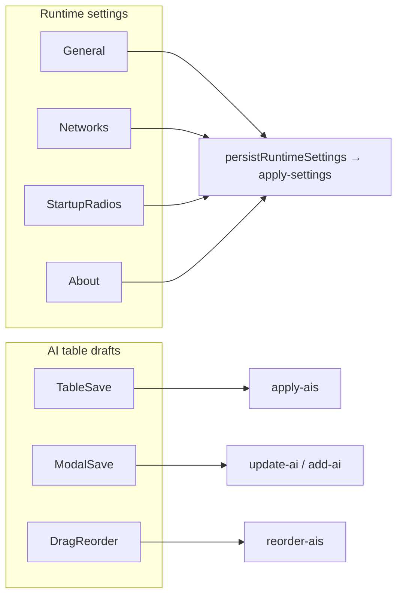

# ChatAIO Settings / View：antd → scoped shadcn

ChatAIO renderer 不再使用 antd。Settings / Prompt / Guiding 走 **本子工程 scoped Tailwind 3 + 手工 shadcn 原语**；运行设置即时写盘；Manage AIs 表仍是独立 Save/Undo。FloatingView **不**引入 Tailwind Preflight。

## 不变量

1. **只动 ChatAIO renderer。** PostCSS / Tailwind 只出现在本工程 `partial.webpack-conf.ts` 的 renderer，`include` 限定 Settings / Prompt / Guiding / `Views/shared`。不改 `engine/webpack/base.conf.ts`。其它子工程（LTS / War3 / AI-WebTools）继续用根依赖里的 antd。
2. **ChatAIO `src` 零 `from 'antd'` / `@ant-design/*`。** 组件在 `#Views/shared/ui`，不要塞进 `#shared` 数据类型层。
3. **运行设置即时写盘。** General / Networks / About 相关项、以及 Manage AIs 上的 Startup AI Page，走 `persistRuntimeSettings()` → 既有 RPC `apply-settings`（patch 后同一套 `applySettings`）。**不要**用页脚 Apply 攒草稿。
4. **Manage AIs 表 dirty 仍独立。** 表底 Save/Undo、弹窗当场 persist、拖拽松手 `reorder-ais`、列筛选 portal、catalog 仅 preview/apply 锁 chrome。表格是 HTML + dnd-kit，**不上 TanStack Table**。
5. **GPU 写盘后若 `restartRequired`，Dialog 提示，不静默。**
6. **FloatingView 禁止 Tailwind Preflight，禁止 `forward: true`。** overlay toast 自写，走既有 `global-message:show`。
7. 主题解析同时写 `data-chataio-theme` 与 html/class `.dark`（shadcn `darkMode: ['selector', '.dark']`）。
8. IPC / park / 目录检查不 `await` 内存 session `clearCache` —— 这些不因换皮而改变。
9. **色盘只写 `globals.css`。** 暖纸色 + 浅墨 primary（`--primary`），不用饱和蓝。Tailwind 走 `bg-primary` / `text-foreground`；Less 走 `hsl(var(--primary))` 或 `--settings-*` / `--guide-*` / `--prompt-*` 别名。Prompt 的琥珀强调可以单独留。实心按钮只留给提交类动作。
10. **Overlay 动画只写 `globals.css`。** Dialog 遮罩 fade、面板 pop、Sheet 短位移、Popover/Select/Dropdown 轻 pop，一律 `--overlay-in: 110ms` / `--overlay-out: 80ms`。这是 renderer CSS，**不**跟 Windows DWM /「视觉效果 → 动画效果」走；关掉系统动画时弹窗仍要有反馈。进/出场必须用**不同** `animation-name`。**不要**写 `animation-fill-mode`（Presence 1.1 出场自己设 `forwards`；`both`/`backwards` 会让 `animationend` 对不上、节点卸不掉）。居中 Dialog 的 pop 把 `translate(-50%,-50%)` 写进 keyframes，不要再给 Content 加 Tailwind `-translate-*`。

## 入口与数据流

用户关 Settings（页脚 **Done** 或关窗）不再 Discard runtime：那些字段已经落盘。AI 表草稿仍不随关窗丢弃（与旧「页脚不碰 AIs」一致）。

## 关键文件

| 路径 | 职责 |
|------|------|
| [`partial.webpack-conf.ts`](../../partial.webpack-conf.ts) | renderer `enforce: 'pre'` 的 postcss-loader；不叠第二套 style 链、不扫 swiper |
| [`tailwind.config.cjs`](../../tailwind.config.cjs) / [`postcss.config.cjs`](../../postcss.config.cjs) | `content` 只扫本工程 View；路径相对本文件（`content.relative` + `__dirname`），不要相对仓库根 cwd |
| [`src/Views/shared/ui/globals.css`](../../src/Views/shared/ui/globals.css) | **唯一主题色盘**（`--primary` 等）+ overlay 进出场 token / keyframes；Tailwind `theme.extend.colors` 映射到这些变量 |
| [`src/Views/shared/ui/`](../../src/Views/shared/ui) | shadcn 原语、`cn`；颜色只引用上面的 token。Dialog/Sheet/Popover/Select/Dropdown/Tooltip 只挂 `overlay-*` class，不要在业务页再写一套动画 |
| [`src/Views/SettingsView/App.tsx`](../../src/Views/SettingsView/App.tsx) | 侧栏 / Done 页脚 / 重启 Dialog / sonner |
| [`src/Views/SettingsView/reaxels/settings-view/index.ts`](../../src/Views/SettingsView/reaxels/settings-view/index.ts) | `persistRuntimeSettings` 队列 |
| [`src/Views/SettingsView/components/ManageAIs/index.tsx`](../../src/Views/SettingsView/components/ManageAIs/index.tsx) | 表 + 弹窗换皮，save scope 不拆 |
| [`src/Views/FloatingView/components/OverlayToast.tsx`](../../src/Views/FloatingView/components/OverlayToast.tsx) | overlay 自绘 toast |
| [`e2e/support/settings-ui.ts`](../../e2e/support/settings-ui.ts) | Done / `.manage-ais-table` / `data-row-key` |

## 禁止项

- 不要把 Tailwind 加进 webpack 全局 engine，也不要让 Life's-Too-Short 等工程吃到 ChatAIO 的 PostCSS。
- 不要 `npx shadcn@latest add` 直出（2 空格、顶部 import）。手工拷贝并改成本仓规范。
- 不要给 FloatingView 引入 `globals.css` Preflight。
- 不要把 FloatingView 改成 `setIgnoreMouseEvents(true, { forward: true })`。见 [`menubar-drag-investigation.md`](../issues/menubar-drag-investigation.md)。
- 不要为 Manage AIs 引入 TanStack Table。
- 不要让 `apply-settings` 写回未保存的 AI 表草稿。
- 不要在 Settings / Prompt / Guiding 的 Less 里再抄一份主色 hex；结构色别名 `globals.css` 的 token。FloatingView 除外。
- 不要再用 `--ant-*` 或 `rgba(0,0,0,…)` 当弱化字色。antd 卸掉后这些 token 不存在，深色模式会掉回黑字。弱化色用 `text-muted-foreground` / `hsl(var(--muted-foreground))`。
- 页脚按钮组必须 `ml-auto` 钉右边。不要把 `mr-auto` 插在 Clean Start 和 Done 中间：AI 表 dirty 时提示一出现会把干净启动顶到左边。
- 不要给 overlay 接 `tailwindcss-animate` 或超过 ~120ms 的弹簧。时长只改 `--overlay-in` / `--overlay-out`。
- 不要用 `prefers-reduced-motion` 把弹窗动画整段掐掉：Windows 关掉「动画效果」会命中该媒体查询，用户仍应看到 110ms 的遮罩/弹出。
- 不要给 overlay 写 `animation-fill-mode`（含 `both` / `backwards` / `forwards`），也不要用 `transition` 做出场（Presence 1.1 只等 `animationend`）。
- 不要给 `overlay-pop` 再加 Tailwind `-translate-x/y-1/2`：会和 pop 的 `transform` keyframes 抢居中。
- Sheet 打开不要让带 Tooltip 的按钮吃到 Radix autofocus。默认会聚焦第一颗可聚焦控件，「复制版本号」会一直挂着。SheetContent 已把 autofocus 收到面板上。

## 与现有文档的关系

- 两套提交：[`manage-ais-save-scopes.md`](./manage-ais-save-scopes.md)（页脚 Apply 已收缩为即时写盘 + Done）。
- 关窗与表草稿：[`settings-exit-discard-and-prompt-scrollbar.md`](./settings-exit-discard-and-prompt-scrollbar.md)。
- 表展示序 / 筛选 / 滚动：[`manage-ais-table-ux.md`](./manage-ais-table-ux.md)。
- E2E 选择器：[`e2e-playwright.md`](./e2e-playwright.md)。
