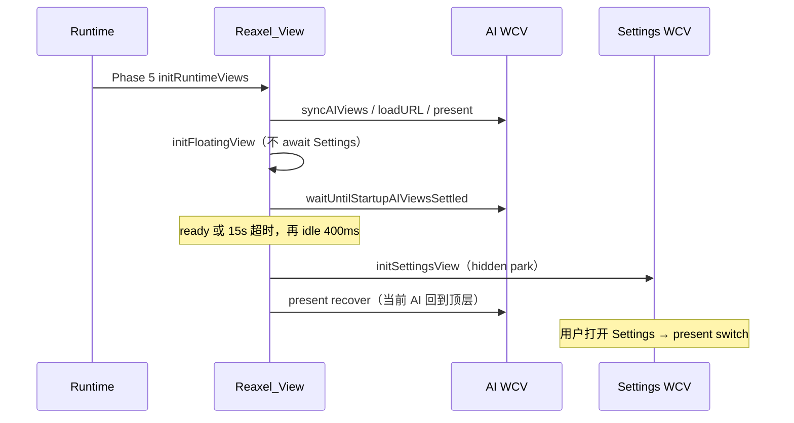

# SettingsView 预加载

首次打开 Settings 会新建 `WebContentsView` 再拉 webpack / React，体感明显停一下。冷启动把 Settings **挪到启动 AI 页之后**再 preload，打开时只做 present。

## 一句话结论

Settings WCV 在 **启动 AI 页 `ready`（或 15s 超时）后再创建**；未首展保持 `attach + 全尺寸 + hidden`。不要跟当前 AI / 预加载 AI 的 `loadURL` 抢同一段 GPU/网络。

## 不变量

1. **晚于 AI page**。`initRuntimeViews` 先 `onReadyLoadAIView` + present 当前 AI + FloatingView；Settings 只在 `waitUntilStartupAIViewsSettled` 之后（再 idle 400ms）创建。
2. **未首展禁止 `removeChildView`**。detach 会饿死 webpack load（与 AI 预加载 v5 相同）。
3. **未首展禁止盖下 `visible=true`**。Settings 是本地 React，不需要 SPA hydrate；盖下露出会多一层合成，还可能闪出 Settings UI。
4. **`initWebContentsView` 会 `addChildView` 到顶层**。preload 创建后必须 `present('recover')` 把当前 AI 抬回来；Settings `did-stop-loading` 时若仍未打开，再 recover 一次（webpack 完成时可能抢焦点）。禁止为此 `present('switch')`（darwin 会 remount 当前 AI）。
5. **用户先打开则跳过 preload 调度**。`initSettingsView` 幂等；`openSettings` / 菜单入口仍是同步创建 + `settingsViewOpened`。
6. **不要**把 Settings preload 提前到 menubar visual-ready 或 AI `loadURL` 之前。
7. **不要**为了这份能力改 FloatingView `forward`、踢绘、或 `backgroundThrottling:false`。

## 入口与数据流

`waitUntilStartupAIViewsSettled` 只认 `runtimeView.ready`（`did-stop-loading` / `did-fail-load`）。**不能**把「尚未 `loadURL`、`isLoading()===false`」当成结束。

超时仍 preload，避免某个 AI 永远 load 卡住 Settings。

## 打开之后

第一次 `present('switch')` 把已 park 的 Settings 置顶并 `setVisible(true)`，然后 `hasPresented=true`。再关掉 Settings 时按已首展闲置页硬 detach；再次打开只 remount 已有 WCV，不再走 webpack 冷启动。

默认仍停在 General。Manage AIs 表仍是第一次点进才挂载，那一下卡顿见 [`settings-menu-switch-perf.md`](./settings-menu-switch-perf.md)。本文不预挂那张表。

## 关键文件

| 路径 | 职责 |
|------|------|
| [`src/Main/reaxels/Views/index.ts`](../../src/Main/reaxels/Views/index.ts) | `scheduleSettingsViewPreloadAfterAIPages`；Settings 未首展 park / recover |
| [`src/Main/reaxels/Views/Settings-View/index.ts`](../../src/Main/reaxels/Views/Settings-View/index.ts) | 创建 WCV；`hasPresented`；未打开时 refreshBounds 走 park |
| [`src/Main/reaxels/Views/AI-Views/index.ts`](../../src/Main/reaxels/Views/AI-Views/index.ts) | `waitUntilStartupAIViewsSettled` |
| [`src/Main/runtime.ts`](../../src/Main/runtime.ts) | Phase 6 契约注释；`openSettings` 仍同步打开 |

## 禁止项

- 不要在 `syncAIViewsWithConfig` 里顺便 `initSettingsView`。
- 不要把未首展 Settings 当成 AI：AI 在 load 中可以盖下可见，Settings 不行。
- 不要等 Settings `did-stop-loading` 才允许用户打开；打开路径必须立刻 present，load 未完就露出。
- 不要为消首次进 Settings 的延迟去预挂 Manage AIs 全表。

## 与现有文档的关系

- AI 预加载 park / 禁止 detach：[`ai-view-preload-first-switch-flash.md`](../issues/ai-view-preload-first-switch-flash.md)
- menubar 先于内容 WCV：[`menubar-cold-start-monitor.md`](./menubar-cold-start-monitor.md)
- Settings 侧栏切到 Manage AIs 的表卡顿（另一件事）：[`settings-menu-switch-perf.md`](./settings-menu-switch-perf.md)
