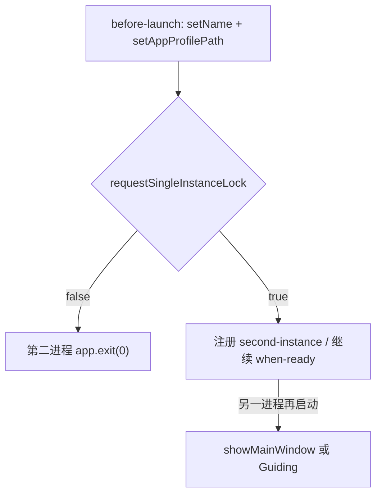

# 单实例：第二次启动唤起已有窗口

同一份 userData 只跑一个 ChatAIO。再开一次不新建进程，而是把已有 **MainWindow**（藏到托盘时也一样）或首启 **GuidingView** 拉到前台。

## 不变量

1. **锁跟 userData 走**。`requestSingleInstanceLock` 必须在 `setAppProfilePath()` 之后。因此：生产 `ChatAIO`、开发 `ChatAIO-dev`、E2E `mkdtemp` 互不抢锁。
2. **抢不到锁立刻 `app.exit(0)`**，不要再走 `when-ready` / 建窗。不要弹「只允许开一例」错误框。
3. **主实例**听 `second-instance`：优先 `showMainWindow()`（restore + show + focus + moveTop）；没有主窗则找无 parent、非 alwaysOnTop 的用户窗（Guiding）。不要用 `isSkipTaskbar()`（API 不存在）。
4. macOS 从 Finder 再开一次走系统单实例；命令行再开仍靠本锁。`activate`（Dock 点击）仍按原逻辑恢复窗口。

## 入口

## 关键文件

| 路径 | 职责 |
|------|------|
| [`src/Main/services/single-instance/index.ts`](../../src/Main/services/single-instance/index.ts) | 抢锁、`second-instance` 唤起 |
| [`src/Main/before-launch.ts`](../../src/Main/before-launch.ts) | path 设完立刻抢锁；失败则 exit |
| [`src/Main/when-ready.ts`](../../src/Main/when-ready.ts) | 非主实例不 `whenReady` 建窗 |
| [`src/Main/foundation/debug/app-data-path/index.ts`](../../src/Main/foundation/debug/app-data-path/index.ts) | 生产 / `-dev` / E2E 目录 |

## 禁止项

- 不要在 `app.whenReady()` 里才 `requestSingleInstanceLock`（邻工程 War3 那写法会竞态建窗）。
- 不要用全局命名互斥让生产和开发互相杀掉。
- 不要把 DropdownView / FloatingView 当成要唤起的用户窗（运行时看 parent / alwaysOnTop，不要调用 `isSkipTaskbar()`）。

## 与现有文档

- 点 X 退不退进程：[`close-without-tray-process-lingers.md`](../issues/close-without-tray-process-lingers.md)。单实例不代替那条退出契约；它只避免僵尸进程叠实例。
