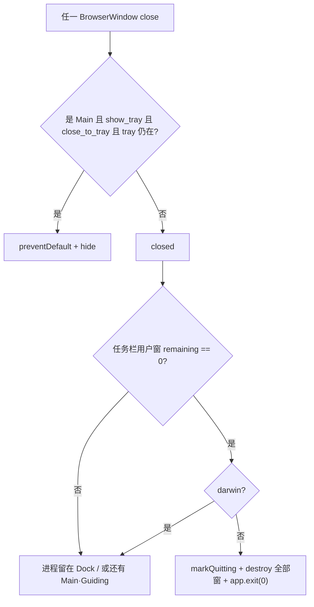

# 禁用托盘后点 X，进程不退出

Windows 生产包在 `show_tray: false`（或 `close_to_tray: false`）时点标题栏 X，窗口消失，但 `ChatAIO.exe` 主进程仍在。无托盘、无任务栏窗口，用户再开一次就叠一层实例。本机 2026-09-04 实测：`user-settings.json` 已是 `show_tray: false`，同时存在 **4 个** `ChatAIO.exe` 主进程，其中只有 1 个有窗口，最早的僵尸从 9 月 1 日活到排查当天。

## 一句话结论

关主窗时 Electron **不会**在还有其它 `BrowserWindow` 时发出 `window-all-closed`。ChatAIO 的 DropdownView 是无 `parent` 的常驻隐藏窗，FloatingView 在 Windows 上用 opacity 保活；点 X 只拆了主窗，进程被这两扇窗钉住。修复：主窗真正 `closed` 后在 Windows/Linux 上直接 `app.exit(0)`，不再把退出寄托在 `window-all-closed`。

## 不变量

1. **hide 到托盘**仅当 `show_tray && close_to_tray && tray 实例仍在`（Settings 两层勾选；不是只看 show_tray）。缺任一条件，主窗 X 必须结束进程（Windows/Linux）。
2. **每扇 BrowserWindow** 都绑 `close` / `closed`（`browser-window-created`）。`close` 上只有 **Main** 会 hide；其它窗不 preventDefault。
3. **「还有没有其它窗口」只算用户窗**（Main / Guiding）。DropdownView、FloatingView 是辅助窗，**不算**还活着的实例。Electron **没有** `isSkipTaskbar()`（只有构造项 `skipTaskbar` 和 `setSkipTaskbar`）；运行时用 `getParentWindow()`（Floating）和 `isAlwaysOnTop()`（Dropdown / Floating）排除辅助窗。主窗关了且没 hide 时 `remainingUserFacingCount === 0`，即使辅助窗还在也直接 `app.exit`。
4. **macOS** 点红绿灯只关窗，进程留在 Dock；退出走 Cmd+Q / 菜单 Quit。
5. **真正退出**必须先标 `__chatAIOQuitting`，再 `destroy` 所有 `BrowserWindow`（含隐藏窗），再 `app.exit`。对隐藏窗用 `destroy` 而不是 `close`（[electron#39588](https://github.com/electron/electron/issues/39588)）。
6. 禁止把「所有窗口关了就会退」当成事实。`window-all-closed` 只是兜底。

## 为什么会出现（提交回溯）

| 提交 | 日期 | 做了什么 | 和本 bug 的关系 |
|------|------|----------|-----------------|
| `172458763` | 2026-06-11 | 主窗 `close`：仅当 `show_tray && close_to_tray` 时 `preventDefault` + `hide` | 托盘关着时会让主窗真关，当时几乎只有这一扇窗，Windows 默认还能退 |
| `eee927c30` | 2026-06-20 | 补 `window-all-closed`：非 darwin 则 `app.quit()` | 为 macOS 留 Dock；Windows 仍假设「主窗关了 = 没有窗口了」 |
| `c9ee156c6` | 2026-07-13 | 自定义 menubar：**DropdownView 做成独立 `BrowserWindow`，无 parent，`menu-view:ready` 就 preload** | **根因**。隐藏下拉窗一直活着，`window-all-closed` 再也不会在关主窗时触发 |
| `e64abe39c` / `e86299c5b` | 之后 | preload 推迟到 visual-ready | 只改了启动抢载，**没改「关主窗要退出」** |

FloatingView 一直有 `parent: mainWindow`，理论上随父窗一起关；Windows 上它还会 `showInactive` + opacity 0。即便子窗偶发没拆干净，DropdownView 单独就足够钉死进程。

社区同类：[electron#39588](https://github.com/electron/electron/issues/39588)（隐藏窗导致 `window-all-closed` 不发）、[electron#9862](https://github.com/electron/electron/issues/9862)（打包后关窗进程残留）。

## 入口与数据流

关主窗时 **不要**等 `window-all-closed`。DropdownView 在 menubar visual-ready 后就会创建且默认 `show: false`，它一直算作未关闭窗口。

## 关键文件

| 路径 | 职责 |
|------|------|
| [`src/Main/services/app-quit/index.ts`](../../src/Main/services/app-quit/index.ts) | 每扇窗 close/closed；用户窗清零则 Windows/Linux `exitChatAIOProcess` |
| [`src/Main/services/app-quit/should-minimize-to-tray.utility.ts`](../../src/Main/services/app-quit/should-minimize-to-tray.utility.ts) | hide-to-tray 纯判定 |
| [`src/Main/services/app-quit/should-exit-after-window-closed.utility.ts`](../../src/Main/services/app-quit/should-exit-after-window-closed.utility.ts) | 用户窗清零是否 exit |
| [`src/Main/before-launch.ts`](../../src/Main/before-launch.ts) | `browser-window-created` 注册 close 生命周期；`before-quit` 仍 destroy 剩余窗 |
| [`src/Main/reaxels/Views/Main-View/index.ts`](../../src/Main/reaxels/Views/Main-View/index.ts) | DropdownView 无 parent；主窗 closed 时 destroy 下拉窗 |
| [`src/Main/services/tray/index.ts`](../../src/Main/services/tray/index.ts) | 托盘 Quit 同样 destroy 全部窗再 `app.exit` |

## 禁止项

- 不要只靠 `app.on('window-all-closed', app.quit)` 结束 Windows 进程。
- 不要给 DropdownView 加 `parent: mainWindow` 来「顺便修好退出」——下拉需要独立 focus/blur，且 Windows 子窗会搅 menubar 拖拽。
- 不要在 `show_tray === false` 或 `close_to_tray === false` 时仍 `preventDefault` hide。
- 不要把 FloatingView 的 Windows opacity 保活改回 `hide()` 来修退出（见 [floating-view-missing-after-background.md](./floating-view-missing-after-background.md)）。
- 不要把 Dropdown / Floating 算进「还有窗口所以不退」。用户窗清零就必须退（Windows/Linux）。
- 不要调用不存在的 `win.isSkipTaskbar()`。Electron 只有 `setSkipTaskbar`。
- 叠实例另见 [single-instance.md](../features/single-instance.md)：第二次启动应唤起已有主窗，不是再开一个僵尸。

## 怎么测（能测，但不是现在这套 E2E）

**能测。** 不需要新框架，也不该去扫全机 `ChatAIO.exe` / `electron.exe`。缺的是一层 **进程生命周期集成测试**：仍用 Playwright 的 `_electron.launch`，但 **禁止**走默认 fixture 的 teardown。

### 现有两层为什么盖不住

| 层 | 实际在测什么 | 为什么漏掉本 bug |
|----|----------------|------------------|
| `yarn test` 纯函数 | hide-to-tray / 用户窗清零是否该 exit | 不启 Electron，看不到 Dropdown 钉死 `window-all-closed` |
| 默认 `yarn test:e2e` | 壳层 UI、写盘探针 | [`closeChatAio`](../../e2e/support/launch.ts) **先 `app.exit(0)` 再 `process.kill(pid)`**。僵尸会被杀掉，断言永远绿。E2E 不变量也写了「不 `taskkill /im electron.exe`，只杀本次 pid」——那是防误杀本机包，不是在验产品退出 |

Playwright 官方自己测退出走的是：对主窗 `close()` / 应用自己 `app.quit()`，然后等 `electronApp.on('close')` **和** `electronApp.process().on('exit')`（见 [electron-app.spec.ts](https://github.com/microsoft/playwright/blob/main/tests/electron/electron-app.spec.ts)）。AFFiNE / orca 在此之上再对 **本次 pid 的进程树** 做超时 `taskkill /T /F /PID`，失败才算测挂，而不是先杀再当成功。

### 推荐三层（综合集成 = 第 3 层）

1. **纯函数**（已有）：`close-without-tray-process-lingers.test.ts`。改判定时先红。
2. **默认 E2E**：继续测菜单、Settings；**不要**把「点 X 进程没了」塞进默认 fixture。
3. **生命周期套件**（未写，建议 `e2e/tests/app-lifecycle.spec.ts`，**自己 launch / 自己收尾**）：

**用例 A — 关主窗必须整棵进程树退出（本 bug）**

1. `launchChatAio({ mode: 'returning-user' })`（seed 已是 `show_tray: false`）。
2. 等到 MainView ready，并且 `windows()` 里能看到 `DropdownView`（证明「会钉死 window-all-closed 的隐藏窗」已经在）。
3. 记下 `const proc = electronApp.process(); const pid = proc.pid`。
4. **不要** `app.exit`。主进程 `evaluate`：对无 parent、非 alwaysOnTop 的那扇用户窗 `.close()`（或点标题栏 X，Windows overlay 点不准就用 evaluate）。不要调用 `isSkipTaskbar()`。
5. 等 `proc` 的 `exit` / `electronApp` 的 `close`，超时（建议 8–10s）则 **测试失败 = 仍是僵尸**。
6. 再扫 **这棵树**：Windows `Get-CimInstance Win32_Process` 里 `ProcessId=pid` 或 `ParentProcessId=pid` 应为 0。GPU / renderer 是子进程，主进程退了它们应跟着没。
7. 收尾：若仍活着，**先让测试红**，`finally` 里才 `taskkill /T /F /PID <本次pid>`，避免 CI 泄漏。禁止 `/IM electron.exe`、禁止杀 `ChatAIO.exe` 生产包。

**用例 B — 同一 userData 第二次启动应退出并唤起第一扇**

1. 实例 A：`electron.launch` + 固定 `CHATAIO_E2E_USER_DATA_DIR`。
2. 实例 B：**不要**再 `_electron.launch`（抢不到锁会立刻 `app.exit`，Playwright 往往还没 attach 就死）。用 `spawn(electron.exe, [chatAioRoot], { env: 同一 userData })`，等 B 的 `exit`，期望很快结束（code 0）。
3. A 仍活：`process.kill(pidA, 0)` 不抛；`evaluate` 里 `mainWindow.isVisible()` / `isMinimized()` 恢复为前台。
4. 两套 launch 必须 **同一个** userData。默认 `mkdtemp` 会让锁互不冲突，测不出单实例。

**用例 C（可选）— 托盘 hide**：另 seed `show_tray+close_to_tray`。`close()` 之后 **pid 必须还在**，且 `isVisible()===false`。无托盘的 CI 会话可能 `initTray` 失败，`trayActive===false` 会走退出路径，这条适合本机有桌面的 job，不要当 Linux xvfb 必过。

### 进程列表怎么拿（只动本次 pid）

- Node：`electronApp.process().pid` + `proc.exitCode !== null` 是主信号。
- Windows 树：`Get-CimInstance Win32_Process | ? { $_.ProcessId -eq $pid -or $_.ParentProcessId -eq $pid }`。不要 `Get-Process ChatAIO`（会误伤本机安装包；E2E 镜像名是 `electron.exe` 不是 `ChatAIO.exe`）。
- 断言「死」：`process.kill(pid, 0)` 抛 `ESRCH`，**并且** 树上无子 pid。只信主 pid 不够：历史上主进程藏了、子 renderer 还在。
- 清僵尸：仅 `taskkill /T /F /PID`。这是 **失败后的清理**，不能当前提。

### 不要做的

- 用默认 fixture 测退出（它会帮你杀进程）。
- `taskkill /IM electron.exe` / `/IM ChatAIO.exe`（E2E 不变量第 2 条；本机正在用的生产包会被干掉）。
- 对打包后的 `ChatAIO.exe` 做 Playwright attach 当日常门禁（本仓 E2E 约定 unpackaged `electron.exe` + `dist/`）。装包冒烟可以另开手工/夜间脚本，不是 `yarn test:e2e`。
- 在生命周期用例里 `drainMainFaults` 再 `evaluate`：进程已死后 context 必毁，应读 `e2e-faults.jsonl`。

### 和现有文档

- 单实例产品契约：[single-instance.md](../features/single-instance.md)。
- 默认 E2E 仍以 [e2e-playwright.md](../features/e2e-playwright.md) 为准；本节约束的是 **尚未落地的生命周期套件**。

## 与现有文档

- 不取代 [menubar-current-ai-dropdown.md](../features/menubar-current-ai-dropdown.md)（下拉产品契约）。
- 不取代 [floating-view-missing-after-background.md](./floating-view-missing-after-background.md)（overlay 显隐）。
- E2E 返回用户 seed 已是 `show_tray: false`（[e2e-playwright.md](../features/e2e-playwright.md)），但 fixture 用 `app.exit` 拆进程，**盖不住**本 bug；不要以为现有 E2E 已经测过点 X。
