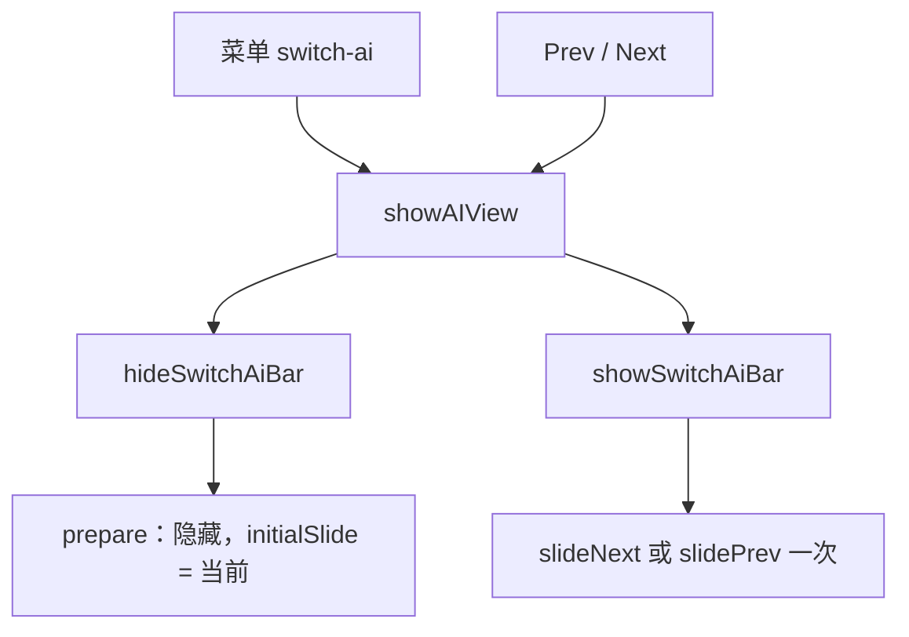

# FloatingView 轮播：绝对选中不弹出，顺序切换只滑一格

轮播只呈现 **相对一格**（Prev/Next）。菜单点名一个 AI 是 **绝对选中**：换中心页，把隐藏中的 Swiper 停到这张卡上，**不弹出轮播**。下一次顺序切换才从这张卡滑到相邻的一张。

## 不变量

1. **两种手势，两种呈现。**
   - `step`：可见。`direction` 来自 Prev/Next。只调用一次 `slideNext` 或 `slidePrev`。
   - `park`：不可见。下标或列表变了就换 Swiper 的 key，用 `initialSlide` 停在目标上。不播动画，不把 overlay 打开。
2. **菜单 `switch-ai` 禁止 `showSwitchAiBar`。** 它会把轮播叫出来。正确顺序是 `showAIView` → `hideSwitchAiBar` → `prepare`（configured 列表上的当前下标）。
3. **禁止 `slideTo` / `slideToLoop`。** loop 克隆节点没有 React 卡片内容。滑到克隆上，卡片是空的，随后的 `slideNext` 也接不上。
4. **禁止按环路距离连滑。** 6 张卡、视觉在 0、目标在 5 时旧公式是 5 格，卡片会从远处划过来。绝对选中先 park 到 4，顺序 next 才是从 4 到 5 的一格。
5. **park 用 configured 列表**（全部未禁用 AI），和 Prev/Next Page、菜单顺序同一套下标。已打开列表只留给 Prev/Next Opened 的 show。菜单选中期间抑制 `AIViews.length` 的静默 prepare，避免它用另一套下标把刚停好的位置盖掉。
6. 向前卡片向左，向后卡片向右。两张卡时方向听 Prev/Next 的 `direction`。

呈现判断在 `src/shared/switch-ai-bar-motion.utility.ts`。卡片顺序和动画步数在 `src/shared/carousel-op.utility.ts`，那是实现自己的规划，不能当作用例是否通过的依据。两个用户 case 的通过条件在 `src/shared/carousel-requirement.utility.ts`：只看条是否出现、中心卡是哪一张、顺序是不是启用列表、相邻一格有没有真正滑过去。单测 `tests/carousel-absolute-select.test.ts` 喂的是这些采样，不调用 `planCarouselFrame`。端到端 `e2e/tests/carousel-absolute-select.spec.ts` 在 FloatingView 里按同样的字段采样 DOM。`__CHATAIO_CAROUSEL_TRACE__` 只作失败附件。

## 平时日志

菜单选中、Prev/Next、关闭当前页都会写操作记录，不依赖 E2E：

- 文件：`performance-logs/carousel-ops.jsonl`（开发时在 ChatAIO 子工程根；打包后在 userData）
- 同时进 `perf-*.jsonl` 的 `phase: "carousel:op"`
- 渲染进程内存环：`window.__CHATAIO_CAROUSEL_TRACE__`（最近 120 条，E2E 读这个）
- 终端一行：`[Carousel] main|renderer kind gesture idx= anim= visible= faults=`

每条用户操作尽量有四段：

| kind | 谁写 | 看什么 |
|------|------|--------|
| `intent` | 主进程 | 手势是 menu-select 还是 step，命令是 `hide+prepare` 还是 `show`，configured 列表和下标 |
| `command` | 渲染进程 | 实际落到 store 的 prepare / show / hide |
| `frame` | SwitchAiBar | `animation` 是 `none` 还是一次 `slideNext`/`slidePrev`，`steps`，`fromIndex`→`toIndex`，`ringDistance` |
| `dom` | 提交后和 transitionEnd | 条是否 `switch-ai-bar--visible`，第一份 `--dup0` 的 id 顺序，`data-position=current` 的卡是否有 label |

`faults` 非空就是这条操作偏离契约。常见码：`menu-or-park-visible`（菜单把轮播叫出来）、`park-animated` / `park-steps`、`step-not-adjacent`（从旧卡连滑）、`step-count`、`render-order`、`current-card-empty`、`current-only-duplicate`。

## 2026-09-22 实测

`e2e/tests/carousel-absolute-select.spec.ts` 两条都卡在顺序切换，不是菜单停靠：

- 菜单点 Echo：主进程 `hide+prepare`，configured 6 张，下标 4，渲染进程没有 `show`。DOM 隐藏且第一份顺序就是这 6 张。
- 紧接着 Next AI Page：主进程 intent 是从 4 到 5 的 `slideNext`。渲染进程却先收到已打开列表的 `prepare`（3 张，下标 2），把 Swiper 按列表长度重建停过去。随后的 `show`（6 张，下标 5）再次因长度变化重建，游标被写成目标，**没有 `gesture: step` 帧，也没有 `slideNext`**。
- 从 Alpha 直接 Next 到 Bravo 是同一条：先 `prepare` 2 张，再 `show` 6 张，动画帧缺失。
- 这次顺序切换之后再菜单点回 Alpha：`hide` + `prepare`，6 张不变，停靠帧是 1→0、`animation: none`，没有 `show`。菜单点上一个这条本身没有把轮播叫出来。

所以「菜单后再顺序切」看起来像从别的列表跳到目标，而不是从刚停住的那张滑到相邻一张。需求判定看采样：可见时中心必须先是刚选中的那张，再滑到相邻一张，顺序不能中途换成更短的列表。实现规划函数回放这条竞态时仍会返回 step，不能拿来当通过条件。

## 用户看到的两条

| 操作 | 错误呈现 | 2026-09-22 实测 |
|------|----------|----------------|
| 菜单点很远的 AI，再顺序切下一格 | 视觉还在旧卡，下一格按环路连滑 | 菜单不弹出，隐藏列表停在选中项。下一格被已打开列表的 prepare 插队，show 时按长度重建，没有 slideNext |
| 菜单再点上一个 | 轮播被叫出来，或按 `next` 绕远路跳走 | 菜单是 hide + prepare，列表仍是 6 张，停靠 1→0，不 show、不滑。前面的顺序切换仍然没有 step 帧 |

## 为什么上次的改法会空卡

把菜单做成了 `show`，再用 `slideTo` / `getSlideIndexByData` 对齐。Swiper 在 `loop` 下克隆出来的 slide 不在 React 列表里，没有 label / logo。对齐落在克隆上，卡片内容空，下一步动画也断。

停靠改成隐藏时重建：`initialSlide` 指向第一份真实卡片，克隆只在随后的 `slideNext` / `slidePrev` 里由 Swiper 自己维护。

## 数据流

## 关键文件

| 路径 | 职责 |
|------|------|
| `src/shared/switch-ai-bar-motion.utility.ts` | `idle` / `park` / `step` |
| `src/shared/carousel-op.utility.ts` | 卡片重复序、一格动画、故障码、操作落盘 |
| `src/Views/FloatingView/utils/carousel-trace.utility.ts` | DOM 快照和渲染进程轨迹 |
| `src/Views/FloatingView/components/SwitchAiBar/index.tsx` | 隐藏时换 key 停靠；可见时只滑一格 |
| `src/Main/reaxels/Views/index.ts` | `selectAIFromMenu`：hide + prepare，不 show |
| `src/Main/reaxels/Views/Main-View/index.ts` | 菜单入口 |
| `src/Main/services/performance/switch-perf.ts` | `carousel-ops.jsonl` |
| `src/shared/carousel-requirement.utility.ts` | 两个 case 的用户可见判定 |
| `tests/carousel-absolute-select.test.ts` | 用采样判定，不回放规划函数 |
| `e2e/tests/carousel-absolute-select.spec.ts` | 真实菜单 / Next AI Page 的可见性、中心卡、顺序、过渡 |

## 禁止项

- 菜单选中后不要 `showSwitchAiBar`。
- 不要 `slideTo`、`slideToLoop`，也不要在一次 effect 里循环 `slideNext` / `slidePrev`。
- 不要在隐藏窗口里播 speed > 0 的过渡（合成器会直接跳到终态）。
- 不要用已打开列表的下标去对 configured 列表。

## 与现有文档

- [Swiper 迁移](../features/floating-view-swiper-migration.md)：相邻一格仍是一次 `slideNext` / `slidePrev`。
- [快速切换](../features/floating-view-rapid-switch-optimization.md)：连续的相邻步仍是短动画、从当前过渡改目标。
- [卡片错位复盘](../features/floating-view-card-ux-optimization.md)：pending 队列已不在。本次约束的是绝对选中不得驱动可见轮播。
