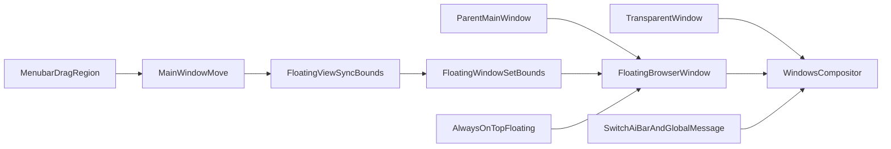

# ChatAIO Menubar 拖拽与 FloatingView 调查

## 1. 文档状态

- 问题：Web menubar 拖拽主窗口时出现抖动、闪烁、跟手性差和释放后粘滞。
- 已知对照：历史验证中摘除 `FloatingView` 后问题消失。
- 调查范围：围绕 `FloatingView` 的窗口几何、可见层、renderer 内容和窗口属性逐层隔离。
- 当前结论：已确认根因并修复。Windows 上 `setIgnoreMouseEvents(true, { forward: true })` 会干扰同应用主窗口拖动；改为 `{ forward: false }` 后用户确认恢复丝滑。
- 最终实现：保留 FloatingView 全部功能与窗口属性，只禁用不需要的 mouse forwarding。
- 状态：CONFIRMED。

## 1.1 最终根因与正式解决方案

### 根因

FloatingView 初始化时调用了：

```typescript
floatingWindow.setIgnoreMouseEvents( true , { forward : true } );
```

`ignore: true` 让 FloatingView 鼠标穿透；`forward: true` 又要求 Electron 在 Windows 上安装/启用鼠标消息转发，使被忽略窗口仍能收到 `mousemove` 等事件。该 forwarding 路径会与同一应用内另一个 BrowserWindow 的系统拖动消息竞争。

ChatAIO 的触发组合是：

```text
FloatingView BrowserWindow
  -> setIgnoreMouseEvents(true, { forward: true })
  -> Windows mouse forwarding hook 持续工作

mainWindow
  -> MainView 的 -webkit-app-region: drag
  -> 用户发起系统窗口拖动

两条 Windows 消息路径冲突
  -> 主窗口位置闪烁/错位
  -> 拖动抖动、跟手延迟
  -> 松开鼠标后出现粘滞或跳动
```

这不是 SwitchAiBar、Swiper、透明合成、`setBounds()`、`parent`、`alwaysOnTop` 或 `moveTop()` 单独导致的问题。关键条件是第二个 BrowserWindow 启用了 `{ forward: true }`；Electron 官方复现证明第二窗口即使 hidden，也可能影响另一个窗口拖动。

### 正式修复

```typescript
floatingWindow.setIgnoreMouseEvents( true , { forward : false } );
```

修复只关闭 mousemove forwarding，仍保留：

- FloatingView 全窗口鼠标穿透。
- SwitchAiBar 和 GlobalMessage 的视觉展示。
- `parent: mainWindow`、透明窗口、always-on-top 和 bounds 同步。
- FloatingView IPC 命令与生命周期。

当前 FloatingView renderer 根节点和所有内容本来就是 `pointer-events: none`，业务也不依赖 FloatingView 接收鼠标移动事件，因此 `forward: false` 没有已知功能损失。

### 禁止回退

- Windows 上禁止将 FloatingView 改回 `{ forward: true }`。
- 不要因为 FloatingView 需要“点击穿透”而误认为必须启用 forwarding；`ignore: true` 已实现穿透，`forward` 只控制被忽略窗口是否继续接收鼠标移动消息。
- 若将来确实新增依赖 FloatingView `mousemove` 的功能，不能直接全时启用 forwarding。优先重新设计交互；最低限度也必须在主窗口 `will-move` / `will-resize` 时切到 `{ forward: false }`，拖动结束后再恢复，并完整回归本问题。
- Electron 升级后也不能凭版本号删除保护；必须先用本文协议验证，因为 Electron 42 仍有同类问题报告。

### 证据链

1. C0：完全不初始化 FloatingView，拖拽恢复正常。
2. F1：禁用 `move -> syncBounds`，问题仍存在。
3. F2：FloatingView 创建但始终 hidden，问题仍存在。
4. F3：FloatingView renderer 为空，问题仍存在。
5. F5：逐项排除 transparent、alwaysOnTop、parent、backgroundThrottling。
6. F6.1：排除 titleBarOverlay 右侧拖拽安全区。
7. 社区检索命中 Electron #35030/#42772/#30808，与本项目触发条件完全一致。
8. F7：唯一改动 `forward: true -> false`，用户实测确认“恢复丝滑”。

### 回归检查

修改 FloatingView、menubar、窗口层级或 Electron 版本时至少验证：

- menubar 慢拖、快速短拖、贴边和跨屏拖动。
- SwitchAiBar 隐藏与显示期间拖动。
- AI 切换提示正常显示并自动隐藏。
- GlobalMessage 正常显示。
- FloatingView 不拦截主窗口和 AI 页鼠标操作。
- 最小化/恢复、隐藏/显示、最大化/还原后层级与对齐正常。

## 2. 症状和评分

每项采用 0–3 分，分数越高越严重：

- 抖动：0 无；1 偶发轻微；2 持续可见；3 严重跳动或回弹。
- 闪烁：0 无；1 偶发；2 持续可见；3 大面积或高频闪烁。
- 粘滞：0 跟手；1 轻微延迟；2 明显拖尾；3 松开后仍明显滞后。

结果必须分别记录三项分数，不能只写“正常”或“更严重”。

## 3. 当前架构与高嫌疑路径



纯 menubar 拖拽时仍然必经的 FloatingView 热路径：

```text
mainWindow 'move'
  -> syncBounds()
  -> mainWindow.getContentBounds()
  -> floatingWindow.setBounds(bounds, false)
```

FloatingView 同时具备以下窗口属性：

- `parent: mainWindow`
- `transparent: true`
- `alwaysOnTop: true` 及层级 `'floating'`
- `focusable: false`
- `setIgnoreMouseEvents(true, { forward: false })`（修复前为 `forward: true`，即根因）
- `backgroundThrottling: false`

SwitchAiBar 视觉隐藏时只将内容变为透明，实际 `BrowserWindow` 仍可能保持 visible 并参与合成。

## 4. 基线定义

### B0：源码原始行为

B0 以本轮调查开始时的 Git HEAD 行为为准：

- FloatingView 生命周期监听全部启用。
- MainView 的 `move -> hideDropdownView` 启用。
- 快捷键 focus/blur 生命周期注册与注销启用。
- `showMainWindow()` 中的 `mainWindow.moveTop()` 启用。
- FloatingView 正常初始化、显示、同步 bounds 和渲染内容。

### C0：已知良性对照

只阻止 `reaxel_FloatingView().initFloatingView()`，其余保持 B0。历史结果是拖拽问题消失，但需要按本文固定协议复核后才能成为本轮证据。

### 实验基线规则

- 每个实验都从 B0 生成，禁止在上一实验上继续叠加修改。
- 实验代码不提交，除非用户另行要求。
- 只恢复本调查引入的代码差异，不覆盖任何无关改动。
- 阴性实验记录完成后恢复 B0，再准备下一项。
- 阳性实验执行 B0 → 实验 → B0 → 实验的 A/B/A 复验。

## 5. 固定测试环境

首次 B0 测试时填写，后续若变化必须显式记录：

- OS：Windows 版本号。
- Electron 版本：
- 显示器数量：
- 主测试显示器缩放：100% / 125% / 150% / 其他。
- 主窗口尺寸和初始位置：
- GPU acceleration：开启 / 关闭。
- Dropdown：关闭。
- Prompt 左/右栏状态：
- 已启用 AI 数量：
- 构建方式：development / production。
- 录屏或截图路径（可选）：

## 6. 固定操作协议

每个实验必须冷启动并执行同一组动作：

1. 启动应用，等待主窗口、AI 页面和 FloatingView 加载完成。
2. 保持 Dropdown 关闭，不改变 Prompt 布局和窗口尺寸。
3. 等待 SwitchAiBar 自动隐藏，从 menubar 同一空白 drag 区慢拖 5 秒，重复 3 次。
4. 在同一区域快速短拖 10 次。
5. 执行贴边或跨屏拖动 3 次；单显示器环境记录为不适用。
6. 切换一次 AI，在 SwitchAiBar 可见的 2 秒内重复一次慢拖和一次快速拖动。
7. 分别记录“SwitchAiBar 隐藏”和“SwitchAiBar 可见”时的抖动、闪烁、粘滞评分。
8. 检查拖动结束后 FloatingView 内容是否与主窗口保持对齐。

禁止在菜单按钮、系统标题栏按钮或 Dropdown 上发起拖拽。

## 7. 独立实验矩阵

### B0：原始基线

- 唯一目的：确认生产逻辑仍稳定复现，并取得三项基准评分。
- 若 B0 不复现：停止改代码，先核查环境或复现条件。

### C0：摘除 FloatingView

- 唯一变量：不调用 `initFloatingView()`。
- 正结果：问题消失，确认 FloatingView 生态是必要条件。
- 负结果：问题仍在，推翻“FloatingView 是必要条件”的当前前提。

### F1：冻结 move 几何同步

- 唯一变量：不绑定 `mainWindow.on('move', syncBounds)`。
- 保留：resize/maximize/unmaximize、生命周期、renderer、IPC、窗口属性。
- 正结果：高频 `setBounds` 或 parent + 手动同步的双路径是主嫌疑。
- 负结果：move 几何同步不是主要触发器，进入 F2。
- 附加检查：拖动中和拖动结束后 overlay 是否仍与主窗口对齐。

### F2：保持创建但实际窗口始终 hidden

- 唯一变量：FloatingView `BrowserWindow` 不进入 visible 状态。
- 保留：窗口创建、加载、IPC、事件绑定和 bounds 同步。
- 正结果：可见透明窗口/compositor 层是必要条件。
- 负结果：仅初始化或事件副作用仍可能参与，进入 F3。

### F3：可见窗口但 renderer 为空

- 唯一变量：FloatingView renderer 只输出空透明根。
- 保留：BrowserWindow 可见和全部窗口属性。
- 正结果：SwitchAiBar、antd message 或 renderer 合成内容参与问题。
- 负结果：独立 BrowserWindow/窗口属性更可疑，进入 F5。

### F4：renderer 合成效果细分

仅在 F3 为正时执行，每项均从 B0 独立生成：

1. F4.1：只禁用 `backdrop-filter`。
2. F4.2：只禁用 CSS transition/animation。
3. F4.3：只用静态布局替代 Swiper。
4. F4.4：只移除阴影与渐变等重绘效果。

### F5：BrowserWindow 属性细分

仅在空 renderer 仍复现时执行，每项均从 B0 独立生成：

1. F5.1：只修改 `transparent`。
2. F5.2：只禁用 `alwaysOnTop`/`'floating'` 层级。
3. F5.3：只移除 `parent: mainWindow`。
4. F5.4：只恢复默认 `backgroundThrottling`。

若某个属性无法在不连带修改其他属性的情况下形成有效 Electron 配置，必须在实验记录中注明限制，不能把结果当作严格单变量证据。

### F6：低优先级放大器

仅在 F1–F5 均为阴性时执行，并继续保持单变量：

- FloatingView lifecycle 的 show/hide/restore。
- `showInactive()`。
- `moveTop()`。
- Dropdown 独立窗口层。
- Windows `titleBarOverlay` drag 安全区。
- GPU acceleration。

## 7.1 社区检索与外部证据

2026-07-10 暂停本地枚举式实验，检索 Electron 官方 issue 和近期社区复现。结论是 `setIgnoreMouseEvents(true, { forward: true })` 与本项目现象高度一致，应提升为最高优先级根因候选。

### Electron #35030

- 链接：https://github.com/electron/electron/issues/35030
- 标题：`setIgnoreMouseEvents with forward: true causes other windows to flicker while dragging [windows]`
- 官方复现条件：
  1. 创建普通窗口。
  2. 创建第二个 hidden 窗口，并调用 `setIgnoreMouseEvents(true, { forward: true })`。
  3. 拖动第一个窗口时出现位置闪烁和错位。
- 与本项目对应：
  - 普通窗口：`mainWindow`。
  - 第二窗口：`FloatingView BrowserWindow`。
  - 项目代码：`floatingWindow.setIgnoreMouseEvents(true, { forward: true })`。
  - 本地 C0：不创建 FloatingView 时问题消失。
  - 本地 F2：FloatingView 即使保持 hidden，问题仍存在。
- issue 因 stale 自动关闭，不代表已修复；2024-12 仍有用户确认遇到相同问题。

### Electron #42772

- 链接：https://github.com/electron/electron/issues/42772
- Electron 28/30/31 与 Windows 11 上复现。
- 报告明确指出：一个窗口使用 `setIgnoreMouseEvents(true, { forward: true })`，拖动另一个包含 `-webkit-app-region: drag` 的窗口会疯狂闪烁、抖动、错位。
- 报告者补充：原生标题栏拖动也可复现，说明问题不只属于 Web menubar CSS。
- 社区 workaround：
  - `forward: false` 可避免闪动。
  - 若必须保留 mousemove 转发，则在 `will-move` 期间切为 `{ forward: false }`，在 `moved` 或拖动空闲后恢复 `{ forward: true }`。

### Electron #30808

- 链接：https://github.com/electron/electron/issues/30808
- 状态：open、`platform/windows`、`status/confirmed`。
- `setIgnoreMouseEvents(true, { forward: true })` 的 Windows 转发实现长期存在不可靠、闪烁和事件振荡问题。
- 2026-06-11 的最新评论确认 Electron 42 仍存在；本项目实际安装 Electron 为 `41.0.3`，不能假设上游已经修复。

### 证据综合

- C0 正向且 F1/F2/F3/F5 全部阴性，与 #35030 的“第二窗口即使 hidden 仍影响另一窗口拖动”完全吻合。
- F2 的结果不再解释为“hidden 窗口仍参与视觉合成”；更合理的解释是 mouse forwarding hook 在窗口隐藏时依然干扰 Windows 拖动消息。
- 下一项必须直接验证 `forward: false`，优先级高于继续测试 `moveTop()`、GPU 或其它窗口属性。

## 8. 历史复合态归档

本轮开始时工作树同时存在以下四个关闭开关：

```text
[FloatingLifecycle, MoveDropdown, ShortcutLifecycle, MoveTop]
= [0, 0, 0, 0]
```

历史观察：

- 关闭 MainView move 链路后仍有 bug，体感更严重。
- 随后继续关闭快捷键生命周期后仍有 bug，体感较严重。
- FloatingView 生命周期和 `moveTop()` 也处于关闭状态。

证据限制：

- 四个变量没有在同一 B0 上分别验证。
- 后一步叠加了前一步改动，无法将结果归因到单一变量。
- 上述观察只能用于降低优先级，不能将任何链路标为“已排除”。

## 9. 每步执行记录模板

复制本节到“实际执行记录”，不得提前填写用户结果。

```text
Step ID:
状态: PREPARED / TESTED / INVALID / CONFIRMED
日期:
代码基线:
唯一变量:
开关/配置向量:
实际改动:
构建与静态检查:
测试环境变化:
SwitchAiBar 隐藏评分: 抖动 _ / 闪烁 _ / 粘滞 _
SwitchAiBar 可见评分: 抖动 _ / 闪烁 _ / 粘滞 _
对齐与功能异常:
用户原始反馈:
结论:
可信度:
下一步:
```

## 10. 实际执行记录

### HIST-0：历史复合态

- 状态：INVALID（可观察，但不可归因）。
- 唯一变量：不满足；四个变量叠加。
- 用户反馈：仍有 bug，部分阶段体感更严重。
- 结论：不得作为排除证据。
- 下一步：恢复 B0 后按固定协议重新建立基线。

### B0：原始基线

- 状态：TESTED（由后续多个 B0 单变量派生实验重复确认）。
- 日期：2026-07-10。
- 代码基线：`98379905cdcbf5ab7d2e0686b5c8ff0abdf3f17f`；四处历史诊断开关已精确撤销，相关源码与 Git HEAD 无差异。
- 唯一变量：无。
- 开关/配置向量：`[FloatingLifecycle, MoveDropdown, ShortcutLifecycle, MoveTop] = [1, 1, 1, 1]`。
- Electron：`^41.0.3`。
- 构建与静态检查：
  - `.\node_modules\.bin\tsc.cmd -p projects\ChatAIO\tsconfig.json --noEmit`：通过。
  - `yarn build:webpack`：通过。
  - `git diff --check`：通过。
- 用户反馈：后续 F1/F2/F3/F5/F6.1 均在恢复 B0 后继续复现拖拽问题。
- 结论：原始 `forward: true` 行为可稳定复现。
- 下一步：已完成，见 F7。

### C0：摘除 FloatingView 对照

- 状态：TESTED。
- 日期：2026-07-10。
- 代码基线：B0。
- 唯一变量：`shouldInitFloatingView = false`，仅阻止 `reaxel_FloatingView().initFloatingView()`。
- 开关/配置向量：`FloatingView` 未初始化，其余行为保持 B0。
- 实际改动：
  - `projects/ChatAIO/src/Main/reaxels/Views/index.ts`
  - 在 `initRuntimeViews()` 内部把 `reaxel_FloatingView().initFloatingView();` 包进单独开关。
- 构建与静态检查：
  - `.\node_modules\.bin\tsc.cmd -p projects\ChatAIO\tsconfig.json --noEmit`：通过。
  - `yarn build:webpack`：通过。
  - `git diff --check`：通过。
- 用户反馈：当前拖拽没有 bug。
- 结论：C0 再次确认“摘除 FloatingView 后问题消失”，支持 FloatingView 生态是必要条件。
- 下一步：恢复 B0 后继续 F1，仅验证 `mainWindow.on('move', syncBounds)`。

### F1：冻结 move 几何同步

- 状态：TESTED。
- 日期：2026-07-10。
- 代码基线：B0。
- 唯一变量：`shouldBindMoveSyncBounds = false`，仅阻止 `mainWindow.on('move', syncBounds)`。
- 开关/配置向量：保留 `resize/maximize/unmaximize`、生命周期、renderer 与窗口属性。
- 实际改动：
  - `projects/ChatAIO/src/Main/reaxels/Views/FloatingView/index.ts`
  - 在 `bindMainWindowEvents()` 中把 `mainWindow.on('move', syncBounds)` 包进独立开关。
- 构建与静态检查：
  - `.\node_modules\.bin\tsc.cmd -p projects\ChatAIO\tsconfig.json --noEmit`：通过。
  - `yarn build:webpack`：通过。
  - `git diff --check`：通过。
- 用户反馈：这次又有 bug。
- 结论：仅去掉 `move -> syncBounds` 不能消除拖拽问题，F1 阴性。
- 下一步：恢复 B0 后继续 F2，仅验证 FloatingView `BrowserWindow` 始终 hidden。

### F2：保持创建但实际窗口始终 hidden

- 状态：TESTED。
- 日期：2026-07-10。
- 代码基线：B0。
- 唯一变量：`shouldKeepFloatingViewHidden = true`，仅阻止 FloatingView 进入 visible 状态。
- 开关/配置向量：保留窗口创建、加载、IPC、事件绑定和 bounds 同步，但 `showInactive()` / `moveTop()` 不再使其可见。
- 实际改动：
  - `projects/ChatAIO/src/Main/reaxels/Views/FloatingView/index.ts`
  - 在 `showLayerWindow()` 与 `bringFloatingViewToTop()` 中加隐藏开关。
- 构建与静态检查：
  - `.\node_modules\.bin\tsc.cmd -p projects\ChatAIO\tsconfig.json --noEmit`：通过。
  - `yarn build:webpack`：通过。
  - `git diff --check`：通过。
- 用户反馈：有 bug。
- 结论：仅保持 hidden 的 FloatingView 仍不能消除拖拽问题，F2 阴性。
- 下一步：恢复 B0 后继续 F3，仅验证 FloatingView renderer 为空时的表现。

### F3：可见窗口但 renderer 为空

- 状态：TESTED。
- 日期：2026-07-10。
- 代码基线：B0。
- 唯一变量：FloatingView renderer 只输出空透明根。
- 开关/配置向量：保留 BrowserWindow 可见和全部窗口属性。
- 正结果：SwitchAiBar、antd message 或 renderer 合成内容参与问题。
- 负结果：独立 BrowserWindow/窗口属性更可疑，进入 F5。
- 实际改动：
  - `projects/ChatAIO/src/Views/FloatingView/App.tsx`
  - 移除 `SwitchAiBar` 渲染，只保留空的 `main.floating-view-root`。
- 构建与静态检查：
  - `.\node_modules\.bin\tsc.cmd -p projects\ChatAIO\tsconfig.json --noEmit`：通过。
  - `yarn build:webpack`：通过。
  - `git diff --check`：通过。
- 用户反馈：有 bug。
- 结论：仅移除 SwitchAiBar 渲染仍不能消除拖拽问题，F3 阴性。
- 下一步：恢复 B0 后进入 F5，先验证 `transparent`。

### F5：BrowserWindow 属性细分

- 状态：COMPLETED。
- 日期：2026-07-10。
- 代码基线：B0。
- 最终阳性实验：F7。
- F5.1 结论：仅关闭透明不能消除拖拽问题，阴性。
- F5.2 结论：仅关闭 alwaysOnTop / floating 不能消除拖拽问题，阴性。
- F5.3 结论：仅移除 parent 不能消除拖拽问题，阴性。
- F5.4 结论：仅恢复默认 backgroundThrottling 不能消除拖拽问题，阴性。
- 最终结论：常规 BrowserWindow 属性均非根因；F7 确认 `forward: true` 才是关键触发条件。

### F5.2：关闭 alwaysOnTop / floating 层级

- 状态：TESTED。
- 日期：2026-07-10。
- 代码基线：B0。
- 唯一变量：`shouldUseAlwaysOnTopFloatingWindow = false`，仅修改 FloatingView 的 `alwaysOnTop` / `floating` 层级。
- 保留：窗口创建、加载、IPC、事件绑定、renderer 内容、透明性和其它窗口属性。
- 正结果：说明置顶层级竞争是关键放大器。
- 负结果：说明层级不是主因，再继续测 `parent` / `backgroundThrottling`。
- 实际改动：
  - `projects/ChatAIO/src/Main/reaxels/Views/FloatingView/index.ts`
  - 只把 `alwaysOnTop : true` 和 `setAlwaysOnTop( true, 'floating' )` 切到可控开关。
- 构建与静态检查：
  - `.\node_modules\.bin\tsc.cmd -p projects\ChatAIO\tsconfig.json --noEmit`：通过。
  - `yarn build:webpack`：通过。
  - `git diff --check`：通过。
- 用户反馈：仍然有 bug。
- 结论：仅关闭 alwaysOnTop / floating 不能消除拖拽问题，F5.2 阴性。
- 下一步：恢复 B0 后进入 F5.3，只验证 `parent`。

### F5.3：移除 parent: mainWindow

- 状态：TESTED。
- 日期：2026-07-10。
- 代码基线：B0。
- 唯一变量：`shouldUseFloatingViewParent = false`，仅移除 FloatingView 的 `parent: mainWindow`。
- 保留：窗口创建、加载、IPC、事件绑定、renderer 内容、透明性、置顶和其它窗口属性。
- 正结果：说明父子窗口绑定或系统分组是关键放大器。
- 负结果：说明 parent 不是主因，再继续测 `backgroundThrottling`。
- 实际改动：
  - `projects/ChatAIO/src/Main/reaxels/Views/FloatingView/index.ts`
  - 只把 `parent : mainWindow` 改为条件注入，当前实验不注入 parent。
- 构建与静态检查：
  - `.\node_modules\.bin\tsc.cmd -p projects\ChatAIO\tsconfig.json --noEmit`：通过。
  - `yarn build:webpack`：通过。
  - `git diff --check`：通过。
- 用户反馈：仍然有 bug。
- 结论：仅移除 parent 不能消除拖拽问题，F5.3 阴性。
- 下一步：恢复 B0 后进入 F5.4，只验证 `backgroundThrottling`。

### F5.4：恢复默认 backgroundThrottling

- 状态：TESTED。
- 日期：2026-07-10。
- 代码基线：B0。
- 唯一变量：`shouldUseBackgroundThrottling = true`，仅修改 FloatingView 的 `backgroundThrottling`。
- 保留：窗口创建、加载、IPC、事件绑定、renderer 内容、透明性、置顶、parent 和其它窗口属性。
- 正结果：说明后台节流策略是关键放大器。
- 负结果：说明 `backgroundThrottling` 不是主因，F5 窗口属性链路可进一步降权。
- 实际改动：
  - `projects/ChatAIO/src/Main/reaxels/Views/FloatingView/index.ts`
  - 只把 `backgroundThrottling : false` 切到 `backgroundThrottling : shouldUseBackgroundThrottling`。
- 构建与静态检查：
  - `.\node_modules\.bin\tsc.cmd -p projects\ChatAIO\tsconfig.json --noEmit`：通过。
  - `yarn build:webpack`：通过。
  - `git diff --check`：通过。
- 用户反馈：仍然有 bug。
- 结论：仅恢复默认 backgroundThrottling 不能消除拖拽问题，F5.4 阴性。
- 下一步：恢复 B0 后进入 F6.1，只验证 `titleBarOverlay` 拖拽安全区。

### F6.1：标题栏拖拽安全区

- 状态：TESTED。
- 日期：2026-07-10。
- 代码基线：B0。
- 唯一变量：`TITLE_BAR_OVERLAY_SAFE_AREA_WIDTH = 140`，仅缩小 menubar 右侧可拖拽区域。
- 保留：FloatingView、窗口属性、IPC、renderer 和其它主窗口行为不变。
- 正结果：说明 Windows 顶部 caption / overlay 命中冲突是关键放大器。
- 负结果：说明标题栏安全区不是主因，再继续测 F6 的其它放大器。
- 实际改动：
  - `projects/ChatAIO/src/Views/MainView/App.tsx`
  - 仅为 `.main-view-bar__drag-layer` 增加右侧 safe area。
  - 备注：初版曾直接读取 `process.platform`，已改为基于 `store.platform` 推导，避免 renderer 侧运行时报错。
- 构建与静态检查：
  - `.\node_modules\.bin\tsc.cmd -p projects\ChatAIO\tsconfig.json --noEmit`：通过。
  - `yarn build:webpack`：通过。
  - `git diff --check`：通过。
- 用户反馈：bug 仍然存在。
- 结论：缩小右侧拖拽安全区不能消除拖拽问题，F6.1 阴性。
- 下一步：恢复 B0 后进入 F6.2，只验证 `moveTop()`。

### F6.2：FloatingView moveTop

- 状态：DEFERRED。
- 日期：2026-07-10。
- 代码基线：B0。
- 唯一变量：`shouldUseFloatingViewMoveTop = false`，仅禁用 FloatingView 的 `moveTop()`。
- 保留：`showInactive()`、窗口创建、加载、IPC、renderer 和其它主窗口行为不变。
- 正结果：说明顶层抢占 / 重新置顶是关键放大器。
- 负结果：说明 `moveTop()` 不是主因，再继续测 F6 的其它放大器。
- 实际改动：
  - `projects/ChatAIO/src/Main/reaxels/Views/FloatingView/index.ts`
  - 仅在 `bringFloatingViewToTop()` 中跳过 `floatingWindow.moveTop()`。
- 构建与静态检查：
  - `.\node_modules\.bin\tsc.cmd -p projects\ChatAIO\tsconfig.json --noEmit`：通过。
  - `yarn build:webpack`：通过。
  - `git diff --check`：通过。
- 用户反馈：未测试；根据用户要求先检索社区。
- 结论：未形成实验结论，不得记为阴性。
- 下一步：社区证据将 `setIgnoreMouseEvents(..., { forward: true })` 提升为最高优先级，F6.2 延后。

### F7：禁用 mouse forwarding

- 状态：CONFIRMED。
- 日期：2026-07-10。
- 代码基线：B0。
- 唯一变量：将 `setIgnoreMouseEvents(true, { forward: true })` 改为 `{ forward: false }`。
- 保留：FloatingView 创建、可见性、renderer、bounds 同步、parent、透明、置顶、生命周期和主窗口行为全部保持 B0。
- 外部依据：
  - Electron #35030：hidden 第二窗口启用 forwarding 后，拖动第一窗口闪烁错位。
  - Electron #42772：Windows 上 forwarding 与 `-webkit-app-region: drag` 组合导致疯狂闪烁抖动，`forward: false` 可规避。
  - Electron #30808：Windows forwarding 问题为 confirmed，Electron 42 仍可复现。
- 实际改动：
  - `projects/ChatAIO/src/Main/reaxels/Views/FloatingView/index.ts`
  - 仅将 `forward : true` 改为 `forward : false`。
- 构建与静态检查：
  - 已确认全部源码实验差异只有 `forward : true -> false` 一行。
  - `.\node_modules\.bin\tsc.cmd -p projects\ChatAIO\tsconfig.json --noEmit`：通过。
  - `yarn build:webpack`：通过。
  - `git diff --check`：通过。
- 用户反馈：恢复丝滑了。
- 结论：`forward: true` 是本问题根因；`forward: false` 是当前业务下的最小正式修复。
- 可信度：高。此前多个 B0 派生实验持续复现，F7 仅一行差异即消除问题，且与 Electron 官方社区复现完全一致。
- 下一步：保留 `forward: false`，将本问题加入所有 Agent 编码规范入口并执行完整功能回归。

## 11. 构建与诊断原则

- 每个源码变体运行 ChatAIO 定向 TypeScript 检查和 `yarn build:webpack`。
- 预存错误和本轮新增错误分别记录；预存错误不能被误报为实验失败。
- 第一轮行为隔离不加入高频日志。
- 只有体感结果含糊时才加入低开销聚合计数：累计 move 次数和 `setBounds` 总耗时，在拖动空闲后一次性输出。
- 禁止每次 move 都 `console.log`，避免诊断本身改变时序。

## 12. 阳性结果确认与回归

任一实验出现明显改善后：

1. 恢复 B0，确认问题重新出现。
2. 再应用同一实验，确认改善再次出现。
3. 形成最小候选修复，不混入其它优化。
4. 验证窗口移动后的 overlay 对齐。
5. 验证最小化/恢复、隐藏/显示、最大化/还原。
6. 验证跨屏和不同 DPI。
7. 验证 AI 切换提示、GlobalMessage 和 IPC 队列。
8. 验证退出时 FloatingView 清理。
9. 未经用户确认，不将状态改为“已解决”。

## 13. 重点文件

- [projects/ChatAIO/src/Main/reaxels/Views/FloatingView/index.ts](../../src/Main/reaxels/Views/FloatingView/index.ts)
- [projects/ChatAIO/src/Main/reaxels/Views/Main-View/index.ts](../../src/Main/reaxels/Views/Main-View/index.ts)
- [projects/ChatAIO/src/Main/reaxels/Views/index.ts](../../src/Main/reaxels/Views/index.ts)
- [projects/ChatAIO/src/Main/mainWindow.ts](../../src/Main/mainWindow.ts)
- [projects/ChatAIO/src/Views/FloatingView/index.less](../../src/Views/FloatingView/index.less)
- [projects/ChatAIO/src/Views/FloatingView/components/SwitchAiBar/index.tsx](../../src/Views/FloatingView/components/SwitchAiBar/index.tsx)

